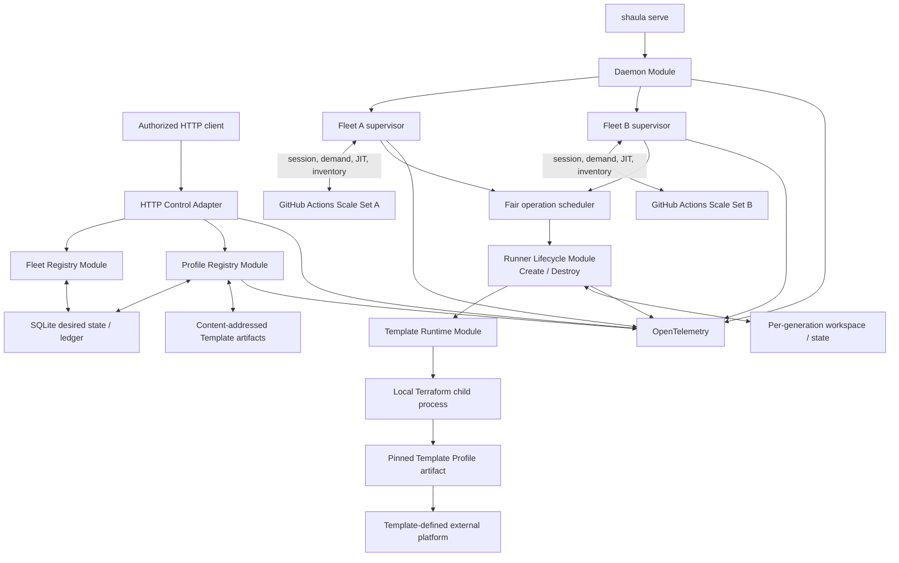
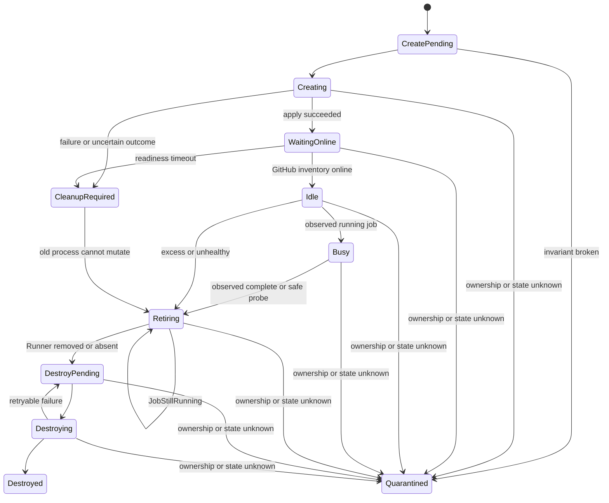

# Shaula v1 Multi-Fleet Runner Scale Set Controller Specification

- Status: Draft
- Date: 2026-09-04
- GitHub target: `github.com`
- Supported scopes: organization and repository
- Supported GitHub authentication: GitHub App (preferred) and PAT
- Native platform clients: none
- v1 bundled Template Platforms: Kubernetes and Docker
- Lifecycle primitives: Create and Destroy only
- Observability: Day 0 OpenTelemetry
- Production implementation: pure Rust multi-crate workspace
- Rust stack: Tokio, clap, axum, SeaORM/SQLite, serde, reqwest and Rust OpenTelemetry

本文定义 Shaula v1 的产品边界和系统行为。关键词 MUST、MUST NOT、SHOULD、SHOULD NOT、MAY 表示规范强度；实现包布局、具体类型名和私有函数不属于本规范。

## 1. Outcome

一个 `shaula serve` daemon 管理多个相互隔离的 Fleet。每个 Fleet 固定绑定一个 organization 或 repository GitHub Target、一个 GitHub Actions Scale Set、一个 GitHub Auth Profile 和一个精确的 Template Profile Revision，并拥有独立的 Rust protocol-adapter session/listener、Assigned Demand、容量状态和 Runner 生命周期。

Fleet、Template Profile 和 GitHub Auth Profile 都通过同一 HTTP control plane 管理；SQLite 中的不可变 Revision、desired head、observed state、Change、outbox 和 audit 是唯一运行时真相源。Template artifact 通过 digest HTTP 发布到 content-addressed artifact store。Fleet/Profile resource mutation 只提交 durable desired state，GitHub、Profile validation 和 IaC 副作用都在提交后异步发生；artifact streaming 与 atomic publication 遵循独立的高权限上传契约。

Shaula 原生只是一个 pure-Rust daemon。生产路径使用 Tokio、clap、axum、SeaORM/SQLite、serde、reqwest 和 Rust OpenTelemetry；`shaula-scaleset` crate 实现 GitHub Scale Set wire protocol。它拥有 HTTP/SQLite、artifact/workspace、容量协调、本地 IaC subprocess、崩溃恢复和 OpenTelemetry，但不链接 production Go、Kubernetes 或 Docker client，不构造平台请求，也不解释 Pod、Secret、container 等平台对象。Kubernetes 和 Docker 是 v1 随附的 Terraform Template Profiles；新增平台应交付 Profile artifact 与验收，而不是扩展核心生命周期 Interface。

每个 Runner Generation 固定一份不可变 Template Profile Revision、artifact、输入、Workspace 和 IaC state。基础设施生命周期只有 Create 和 Destroy，没有 Update。JobStarted、JobCompleted 和进程内 wakeup 都可能丢失；最新 Assigned Demand、GitHub Runner inventory、持久化 intent/operation、outbox 扫描和 retirement reaper 共同提供 level-triggered 最终收敛，而不是完整事件重放。

OpenTelemetry tracing、metrics 和日志关联是 Day 0 Interface。HTTP commit、Profile validation/activation、Auth rollout、Fleet session、reconcile、Runner lifecycle、IaC subprocess、recovery 和 reaper 从首次实现开始就必须可观察。

详细契约：

- [Fleet HTTP Control-Plane Specification](0002-fleet-http-control-plane.md)
- [Kubernetes Runner Resource Specification](0003-kubernetes-runner-resource.md)
- [Docker Runner Resource Specification](0006-docker-runner-resource.md)
- [Template Profile Runtime Specification](0004-template-profile-runtime.md)
- [Profile HTTP Control-Plane Specification](0005-profile-http-control-plane.md)
- [Rust Workspace Architecture Specification](0007-rust-workspace-architecture.md)

相关 Architecture Decision Records：

- [ADR-0001: One daemon supervises multiple isolated homogeneous Fleets](../ard/0001-one-daemon-supervises-multiple-isolated-fleets.md)
- [ADR-0002: Run immutable Runner lifecycles as local subprocesses](../ard/0002-run-immutable-runner-lifecycles-as-local-subprocesses.md)
- [ADR-0003: Treat Scale Set messages as reconciliation hints](../ard/0003-treat-scale-set-messages-as-reconciliation-hints.md)
- [ADR-0004: Allow bootstrap secrets in provisioning state](../ard/0004-allow-bootstrap-secrets-in-provisioning-state.md)
- [ADR-0005: Manage Fleet desired state through HTTP and SQLite revisions](../ard/0005-manage-fleet-desired-state-through-http-and-sqlite.md)
- [ADR-0006: Realize each Kubernetes Runner Generation as one Pod and one bootstrap Secret](../ard/0006-realize-each-kubernetes-runner-generation-as-one-pod-and-one-bootstrap-secret.md)
- [ADR-0007: Use target-bound GitHub auth profiles with GitHub App preferred and PAT supported](../ard/0007-use-target-bound-github-auth-profiles.md)
- [ADR-0008: Keep platform capabilities in Terraform Template Profiles](../ard/0008-keep-platform-capabilities-in-terraform-template-profiles.md)
- [ADR-0009: Manage Template and GitHub Auth Profiles through HTTP and SQLite](../ard/0009-manage-profile-resources-through-http-and-sqlite.md)
- [ADR-0010: Build a pure-Rust multi-crate daemon and use scaleset as an oracle](../ard/0010-build-a-pure-rust-multi-crate-daemon-and-use-scaleset-as-an-oracle.md)

ADR-0008、ADR-0009、ADR-0010 和 ADR-0011 共同约束平台边界、Profile publication、credential storage、Auth rollout、HTTP exposure、生产语言和 Scale Set protocol verification；本规范的核心模型遵循这些已接受决定。
- [ADR-0011: Expose v1 HTTP through loopback and an authenticating proxy](../ard/0011-expose-v1-http-through-loopback-and-an-authenticating-proxy.md)

## 2. Goals

v1 MUST：

1. 由 pure-Rust `shaula-scaleset` protocol Adapter 使用 reqwest，为每个 organization 或 repository Fleet 建立 message session、长轮询 listener、ACK/acquire、JIT Runner Registration 和 Runner inventory/removal 操作；固定版本的 `github.com/actions/scaleset` Go SDK 只作为测试 oracle，不进入 production binary 或运行时。
2. 由 Shaula 为每个 Fleet create-or-adopt 一个 Scale Set；普通关停、重启和 Fleet Decommission 都保留它。
3. 由一个 daemon 管理多个 Fleet，同时隔离其 Scale Set、session、需求、Template Revision、Workspace、操作、重试和故障状态。
4. 通过 HTTP/SQLite 动态管理 Fleet、Template Profile 和 GitHub Auth Profile；daemon bootstrap 不维护这些资源的第二份真相源。
5. 将 Fleet 固定到一个精确 Template Profile Revision 和 artifact digest；发布新 Revision 不隐式改变 Fleet 或既有 Runner。
6. 将 Fleet 绑定到一个完整 Auth Revision Ref `(profile_key, revision)`，并以显式 `desired_auth_ref` / `observed_auth_ref` 状态推进已验证 credential revision 的 session rollout。
7. 根据最新 Assigned Demand，在每个 Fleet 的 `min_runners` 与 `max_runners` 之间最终收敛 Runner 容量。
8. 通过本地 Terraform subprocess 执行每个 Runner Generation 的 Create 和 Destroy；核心 Interface 不出现平台分支或平台对象类型。
9. 同时交付 `templates/kubernetes` 与 `templates/docker`，并让两者遵守相同的 Template Runtime contract。
10. 使用 SQLite ledger、content-addressed artifact 和 per-runner IaC state 支持通知丢失与进程崩溃后的恢复。
11. 容忍重复、乱序和缺失的 Job Observation，且不故意销毁 GitHub 已知仍在执行 job 的 Runner。
12. 将 GitHub App 和 PAT 都作为正式、受测试的认证方式；GitHub App 是推荐默认，认证失败不自动 fallback 到另一 kind 或旧 revision。
13. 接受 PAT、GitHub App private key 与 schema-sensitive Kubernetes/Docker Template bindings 作为 write-only HTTP 输入并允许其明文存入各自 immutable SQLite Revision，同时禁止所有读取接口、audit、error、log、OTel 和 diagnostics 回显；GitHub credential 只进入 GitHub Access Module，Template binding secret 只进入 exact-Revision IaC child，二者都不进入 Runner/workflow。
14. 从 Day 0 通过 Rust `tracing`/OpenTelemetry 产生 traces 和 metrics，并让结构化日志与 trace 关联。

## 3. Non-goals

v1 不包括：

- GitHub Enterprise Server 或 `github.com` enterprise-level Scale Set；
- Shaula 原生 Kubernetes/Docker client、watcher、controller、平台对象 schema 或平台特定 reconcile 分支；
- 在单个 Scale Set 内按逐 job labels 动态选择 Template Profile；
- Runner 或 Scale Set 原地 Update、模板热更新、自动 drift repair；
- 通过 Kubernetes Job、远程 worker 或另一控制面执行 Terraform/OpenTofu；
- 多主、跨主机 HA、共享 SQLite 或分布式 operation lease；
- 完整 JobStarted/JobCompleted audit、消息 exactly-once 或 job history 重建；
- 自动删除 GitHub Scale Set；
- 通用 Terraform remote backend；
- 未通过兼容性门槛的 OpenTofu 支持；
- 手工 `shaula create`、`shaula destroy` 或 `shaula update` CLI 命令；
- 通过 Fleet HTTP 直接创建、更新或强制销毁 Runner；
- 让普通 Fleet 写权限提交任意 Terraform code、provider、可执行文件、argv、环境变量、本地路径或网络 endpoint；
- 在 metrics labels 中记录 Fleet、Profile、Runner、job、workspace、revision 或 error text 等无界高基数字段。

Template artifact 的 digest HTTP publication 是明确存在的高权限远程代码发布能力，不属于普通 Fleet mutation；它必须经过独立授权、验证、审计和资源限制。

## 4. System shape



`Profile -> Platform` 表示 Terraform provider 的行为，不表示 Shaula daemon 拥有平台 client。平台只通过 Profile manifest、标准 inputs、declared outputs 和 IaC exit/state classification 与核心相接。

### 4.1 Module Interfaces

本节的 Module/Adapter 边界由 [Rust Workspace Architecture Specification](0007-rust-workspace-architecture.md) 映射到 Cargo crates。生产 workspace 包含 `shaula`、`shaula-core`、`shaula-daemon`、`shaula-http`、`shaula-store`、`shaula-store-migration`、`shaula-scaleset`、`shaula-template` 和 `shaula-observability`；依赖只朝 `shaula-core` 指向，binary 是唯一 composition root。Adapter DTO、SeaORM entity 和 Scale Set wire model 不得穿过 core-owned ports。

Daemon Module 的 driving Interface 是启动 HTTP control plane 并运行 SQLite 中所有 active Fleets，直到 Tokio cancellation 或 daemon-fatal error。clap parsing 和 signal handling 在 `shaula` binary 外层；telemetry startup、ledger recovery、supervisor 管理、公平调度和 shutdown ordering 隐藏在 `shaula-daemon` Implementation 中。

Fleet Registry Module 负责 Fleet Spec admission、不可变 Fleet Revision、optimistic concurrency、idempotency、Fleet Change 和 Decommission。HTTP 和未来远程 CLI 是 driving Adapters。它提交 desired state，但不在 HTTP transaction 中调用 GitHub 或 IaC。

Profile Registry Module 负责 Template/Auth Profile 的 typed resources、不可变 Revision、异步 validation/activation、reference integrity、Profile Change、outbox 和 redaction。Template Artifact Module 独立负责 streaming、digest、archive safety、atomic publication 和 garbage collection。完整契约见 [Profile HTTP Control-Plane Specification](0005-profile-http-control-plane.md)。

GitHub Access Module 的 production Adapter 是 `shaula-scaleset`。它由稳定 Auth Profile key、指定 credential revision 和 typed GitHub Target 构造 core-owned Scale Set Interface，并隐藏 GitHub App/PAT client 构造、短期 token refresh、reqwest/wire DTO、redaction 和 typed authentication failures。Credential 或 Adapter concrete types 不跨出此 Interface；失败不触发 auth-kind 或旧 revision fallback。

每个 Fleet Reconciler 只处理一个 Scale Set 的 durable observations、capacity intent 和 Runner lifecycle。它不暴露 reqwest/wire DTO、Terraform、SeaORM/SQLite 或任何平台对象类型。

Runner Lifecycle Module 只暴露 Create 和 Destroy。Template Runtime Module 是唯一 IaC seam，隐藏 artifact materialization、Workspace、environment allowlist、subprocess、state、declared output classification 和只读 diagnosis。其 provider-neutral contract 见 [Template Profile Runtime Specification](0004-template-profile-runtime.md)。

Store、HTTP、Scale Set、Template Runtime 和 telemetry 都有 local-substitutable test Adapters。生产实现分别以 SeaORM/SQLite、axum、reqwest、Tokio subprocess 和 Rust `tracing`/OpenTelemetry 封装于对应 crate。平台差异只存在于 Template Profile artifact 及其外部验收，不扩张 Fleet/Runner core Interface。

### 4.2 Native dependency boundary

Shaula production binary MUST NOT：

- 链接 Kubernetes 或 Docker API client；
- 构造、watch、list、get、patch 或 delete 平台对象；
- 根据 Pod、Secret、container 等平台状态决定 Runner readiness 或安全删除；
- 为 namespace、socket、platform endpoint 或 provider credential 另建 Fleet-level platform-target abstraction；
- 把任意平台 object identity 暴露为核心强类型。

Profile Revision 拥有全部平台 bindings。Shaula 只通过固定的 `shaula` input envelope 向 IaC 传值，并将固定 `shaula_result` output envelope 作为有限大小、受保护且不透明的 evidence 持久化。Runner readiness 和 Busy safety 以 GitHub inventory/removal semantics 为准。

### 4.3 Failure isolation

一个 Fleet 的 listener、ownership、auth rollout、profile、IaC 或 Runner failure MUST NOT 污染另一个 Fleet 的状态或终止 daemon。共享 Auth Profile、GitHub rate limit、Profile artifact 或外部平台故障可以同时影响其消费者；只要记录不串扰且无关 Fleet 继续工作，就不构成隔离失败。

SQLite corruption、共享 data directory 丢失、ownership lock 失效、scheduler safety invariant 破坏或 mandatory in-process telemetry 无法初始化是 daemon-wide failure。OTLP exporter unavailable 不是 daemon-fatal。

`/readyz` 表示 control plane 能否认证管理请求、durably commit 并安全调度。Fleet-local degraded state 只出现在该 Fleet status 和 telemetry 中，不让整个 API unready。

## 5. CLI and daemon bootstrap

### 5.1 Commands

v1 MUST 提供：

- `shaula serve --config <path>`：运行 HTTP control plane 和 SQLite 中所有 active Fleets；
- `shaula version`：输出版本信息；
- clap 生成的 shell completion commands MAY be provided。

`serve` MUST 使用 clap derive，并由 Tokio runtime 驱动。运行时错误不打印 clap usage。Runner Create/Destroy 和 Profile/Fleet mutation 都不是本地 operator commands；未来 CLI MAY 作为 HTTP client，但不得直写 SQLite 或绕过认证、并发控制、validation 和 audit。

PAT、App private key、JIT、provider credential 和 telemetry header MUST NOT 作为 CLI flags。

### 5.2 Bootstrap shape

Bootstrap 只包含 daemon-native concerns：

```yaml
version: 1

storage:
  data_dir: /var/lib/shaula
  database: shaula.db
  work_root: runners
  artifact_root: template-artifacts

http:
  listen: 127.0.0.1:8080
  request_body_limit: 1MiB
  artifact_body_limit: 64MiB

limits:
  max_active_fleets: 100
  max_pending_changes: 1000

execution:
  create_concurrency: 8
  destroy_concurrency: 8
  operation_timeout: 30m
  engines:
    terraform:
      executable: terraform

observability:
  service_name: shaula
  otlp:
    endpoint: http://otel-collector:4317
    protocol: grpc
  traces:
    sampler: always_on
  metrics:
    interval: 15s
```

Bootstrap MUST NOT 包含任何 Fleet、Template Profile、GitHub Auth Profile 或平台 binding catalog。前三类资源只通过 HTTP 创建并保存在 SQLite；平台 bindings 属于 Template Profile Revision。HTTP clients 可以从 YAML 或 Git 生成请求，但这些文件不是 daemon watch 的真相源。

Bootstrap、filesystem roots、HTTP safety policy、engine executable/install policy、limits 和 telemetry 必须在 API ready 前静态验证。任何路径必须解析在批准 root 内，并拒绝 traversal、symlink/junction/reparse escape 和 Workspace aliasing。

Terraform 是 v1 必需 engine。OpenTofu 只有通过 section 12 的兼容性门槛后才可被声明支持；否则在 Profile validation 阶段 fail closed，而不产生外部副作用。

## 6. Managed resources and revisions

### 6.1 Fleet

Fleet 是稳定 Fleet Key 下的 desired resource。客户端 Fleet Spec 包含 typed GitHub Target、稳定 `auth_profile_ref` key、不可变 Scale Set identity、capacity、精确 `template_profile_ref` 和 bounded template inputs。Fleet admission 把该 key 当时的 current active Auth Revision 解析并记录为 Fleet Revision 的 admission-time tuple；独立 `fleet_auth_handoffs` 状态维护可推进的完整 `desired_auth_ref` / `observed_auth_ref`，因此 same-Profile promotion 不修改 Fleet Spec、Fleet Revision 或 ETag。Auth Profile key 只可通过显式 conditional Fleet replacement 改变，且 admission 时 Resource Occupancy 为零，也不存在 active acquisition、GitHub effect/session 或 Runner Operation。Fleet HTTP、Revision、Status 和 Change 语义以 [Fleet HTTP Control-Plane Specification](0002-fleet-http-control-plane.md) 为准。

Fleet mutation 使用 conditional request 与 idempotency key；effective mutation 在一个短 SQLite transaction 中提交 Revision、Change、audit 和 durable wake marker。handler 返回 `202` 前不调用 GitHub、Terraform 或任何外部平台。

### 6.2 Template Profile

Template Profile 是 HTTP-managed logical resource。异步静态验证只把 Candidate 推进到 `Ready`；只有绑定 exact compatibility tuple 的独立 immutable conformance attestation 才能推进到 `Active`。只有 current Active Revision 可接收新的 Fleet 引用。Revision 固定被证明的 compatibility tuple：

- content-addressed Terraform artifact 和 dependency lock；
- manifest-derived Template Platform、engine constraints、固定 input/output protocol 与 managed-plan shape；
- administrator-owned platform bindings；
- Fleet 可提供的 bounded input policy；
- artifact 和规范化非 credential material 的 digest。

Attestation 是引用 Template Revision/canonical subject 的独立 immutable record；它的 PUT 不创建或修改 Revision，`Ready -> Active` transaction 只在 Profile activation state 中冻结 `active_attestation_id`。Artifact upload 是独立的 digest-idempotent HTTP operation。`template.publish` 拥有等同部署 IaC code 的高权限，`template.attest` 独立控制 attestation acceptance；普通 `fleet.write` 两者皆无。Fleet admission 只将 key 或 exact ref 解析为 current Active Revision，并把 revision、artifact digest 与 attestation identity 固定到不可变 Fleet Revision。以后发布或 attestation 新 Template Revision 不改变该 Fleet；切换必须显式 Fleet replacement，且 v1 仅在 Resource Occupancy 与 active Runner Operations 都为零时允许。Template Platform 只能来自 admitted artifact manifest，HTTP body、bindings 或 attestation 均不得覆盖。

### 6.3 GitHub Auth Profile

GitHub Auth Profile 是稳定 logical key 下的一组不可变 credential Revisions。Profile kind 是 `github_app` 或 `pat`；App/installation identity、PAT principal identity 和 normalized Target allowlist 在一个 Profile incarnation 内固定。改变身份或 policy 需要新 key，不能伪装成 same-key rotation；Fleet 改引新 key 要求零 Resource Occupancy，且不存在 active acquisition、GitHub effect/session 或 Runner Operation。

PAT 和 GitHub App private key 是 write-only HTTP fields，并允许原始明文字节保存在 SQLite Auth Revision 中。所有 GET/list/status/revision、audit、error、log、trace 和 metric 只能返回 `credential_present` 等非 secret metadata，不能返回 prefix、suffix、hash 或任何可推导 secret 的表示。

Candidate credential 必须经过异步、bounded、read-only GitHub identity/access validation。失败时旧 active revision 保持不变。same-key promotion 后，Profile Registry 为每个依赖 Fleet 设置新的 `desired_auth_ref=(profile_key, revision)`；已准入的 cross-key replacement 由 Fleet mutation 写入同样完整的 desired ref。二者进入同一个 durable Auth Handoff：停止新 job acquisition、处理已在途 acquisition，并以 desired ref 对已持久化 Scale Set ID/identity 做 read-only ownership/absence classification。Handoff 只持久化 classification 并推进完整 `observed_auth_ref`；它不调用 create-or-adopt、不绑定 ID、不建立或替换 session。普通 Fleet reconciliation 独占这些副作用，并且只有为 observed ref 建立 ready session 后才恢复 acquisition。

`observed_auth_ref == desired_auth_ref` 只证明指定完整 `(profile_key, revision)` access context 的 handoff 已持久化，不代表 Scale Set/session 存在或 capacity 已收敛。两者不等必须作为独立、可恢复、可告警 rollout lag 暴露，不能被 Fleet desired/observed revision 掩盖。

Decommission 中的 Auth change 使用 cleanup-only handoff：候选 ref 可做只读 access/ownership validation，并原子推进完整 observed Auth Revision Ref，但不得创建 session、acquire job、Create 或 create-or-adopt。之后每次 inventory/removal effect 都记录所用 exact ref/context。旧 revision 只要仍被 Profile desired/active/observed head、Fleet desired/observed ref、in-flight effect/session、cleanup 或 recovery 引用就必须保留；`Blocked` 不释放任何引用。

切换失败使依赖 Fleet `Blocked`/`Degraded`，且不会自动 fallback 到另一 auth kind、旧 credential revision 或另一个 Profile。旧 revision 的保留只服务已记录引用与 recovery，不授权未记录的 runtime fallback。

Permission admission 与真实验收至少覆盖以下 `github.com` baseline；实际 GitHub read probe 仍是 authority，不能只检查声明字段：

| Credential | Organization Target | Repository Target |
| --- | --- | --- |
| GitHub App | Organization `Self-hosted runners: read/write`；Repository `Metadata: read` | Repository `Administration: read/write`、`Metadata: read`，以及 Scale Set Adapter/API 实际要求的 installation access |
| PAT classic | `admin:org` | `repo` |
| PAT fine-grained | Organization `Administration: read`、`Self-hosted runners: read/write` | Repository `Administration: read/write` |

GitHub App 是推荐默认。PAT classic/fine-grained 是否都作为 v1 release-gated 输入仍是 section 18 的 scope decision；无论选哪一类，都必须在 organization/repository 两种 Target 上做真实 Scale Set/JIT/inventory/removal 验收。Profile response 可以暴露 operator 提交的非 secret PAT type metadata，但不能从 token 派生或回显 secret identifier。

### 6.4 Source-of-truth rules

- SQLite desired heads 是 Fleet/Profile 资源的唯一运行时真相源。
- Template artifact store 只保存按 digest 引用的 bytes；没有 Profile Revision 引用的 artifact 不能直接运行。
- 每个 Runner Generation 永久固定其创建时的 Fleet Revision、Template Revision、artifact digest、inputs、Workspace 和 state。
- Auth Profile 的 same-key active credential 可通过受控 rollout 演进，因此 Fleet status 必须同时暴露完整 `desired_auth_ref` 与 `observed_auth_ref`；跨 Profile key replacement 仅允许在零 Occupancy且无 active acquisition/GitHub/Runner Operation 时提交，并走同一 Auth Handoff。
- 任何 direct SQLite edit、第二 writer 或 bootstrap catalog override 都不受支持。

## 7. Fleet and Scale Set ownership

Fleet identity 是稳定 Fleet Key。远程 Scale Set identity 是 typed GitHub Target、resolved runner group 和 scale-set name；该 tuple 在 Fleet incarnation 内固定，name 在 runner group 内唯一，并在 retained-conflicting incarnation 解除前保留。相同远程 identity 不能同时属于两个 active 或 retained-conflicting Fleet incarnations。v1 接受结构化 Target fields，并在内部推导 `github.com` configuration URL；不把 caller URL 当作通用 endpoint。

Fleet supervisor 激活时 MUST：

1. 在任何 remote mutation 前持久化 normalized Target、stable remote identity、immutable fingerprint 和 create-or-adopt intent。
2. 解析 Fleet 完整 `desired_auth_ref`，验证其 Target allowlist 并构造匹配的 App 或 PAT client，不 fallback。
3. 进行 bounded authenticated read，解析 runner group 并按完整稳定 tuple 查找 Scale Set。
4. 只有成功认证的 read 证明不存在时才允许 Create；调用 POST 前先在一个 transaction 中写 `ScaleSetCreateStarting`、唯一 attempt identity 和 exact Target/group/name/fingerprint。重启或重试不得换 name。
5. Create success、`409`、timeout、connection reset 或 response body 丢失都先进入同一 uncertain-outcome reconciliation：按原 tuple lookup，不直接再发 POST。
6. 恰有一个 compatible match 时 adopt，并在 session 前持久化 Scale Set ID、normalized Target、完整 exact Auth Revision Ref、fingerprint 和 attempt result；multiple/conflicting match 时 fail closed。
7. 只有 authenticated lookup 再次给出 authoritative absence，且 retry budget 允许时，才可沿同一 intent、name 和 attempt lineage 重试 Create；永不调用 Update，也不以新 name 绕开不确定性。
8. 任何 access/ownership classification 与 retry deadline 都必须 durable，进程内 wakeup 只用于降低延迟。

`401`、`403`、access-filtered `404`、Target malformed 或 permission mismatch 是 access failure，不是 absence proof，必须 fail closed 且不得进入 Create。

存在以下情况时 Fleet 必须停止新 Create 并暴露 bounded Condition：multiple matches、runner group/labels/fingerprint conflict、persisted ID identity mismatch、duplicate local ownership、或 remote inventory 中有无法映射到 non-terminal Generation 的 Runner。空 ledger 只可 adopt 空 Scale Set；未知 remote Runner 不自动删除。

Shaula 不调用 Scale Set Update 修复 drift。普通 shutdown、restart、Fleet replacement 和 Decommission 都不删除 Scale Set。若已持久化 Scale Set 被 authenticated read 确认缺失，而 Resource Occupancy 非零或存在 non-terminal Generation，Fleet MUST 进入 `ScaleSetMissingWithResources`：停止 create-or-adopt、session、acquisition 和重新绑定；Scale Set/Runner 的 absent 或 `404` 不能单独证明一个可能 Busy 的既有资源可 Destroy。只有 JIT 与 IaC Create 均可证明从未开始的 Generation 可以本地终结；任何可能已注册或已创建基础设施的 Generation 必须继续计入 Occupancy 并 Blocked/Quarantined，直到恢复 consistency-set 证据或未来显式 operator procedure。仅当 Occupancy 和 active Runner Operations 都为零时，普通 reconciliation 才可从 `ScaleSetMissing` 建立新的 create-or-adopt binding。

## 8. Listener, demand and eventual convergence

每个 Fleet 拥有独立的 `shaula-scaleset` Rust session/listener supervisor。生产 Adapter 以 reqwest 实现 core-owned poll、ACK、acquire、JIT、inventory/removal ports；固定 commit/module/checksum 的 `github.com/actions/scaleset` Go SDK 与 `internal/testserver` 只作为 differential test oracle，既不链接也不由 `shaula serve` 启动。

建立或替换 session 时，supervisor 取得 per-Fleet session-effect gate 的 exclusive permit，等待旧 epoch outbound effects 完成或取得 durable uncertainty classification，再分配 Fleet-scoped、单调递增的 `session_epoch`，并在开始 poll 前将 session identity、epoch 和 initial current statistics 原子持久化。每个 poll task 捕获 epoch；message ingest、ACK authorization、`AcquireStarting`/result classification 和 demand write 都必须以 `(fleet_key, session_epoch)` CAS 为门。ACK/Acquire 在各自 HTTP call 前还必须取得 epoch-scoped shared permit 并重新授权 current epoch，直至 outcome durable classification 才释放；旧 epoch task 即使延迟返回也只能 no-op，不能 ACK、acquire、覆盖 demand 或 wake lifecycle。取消旧 task 是资源管理，不是 correctness proof；SQLite transaction 不跨 network call。

每个已 poll 的 message 遵循 persist-before-ACK：

- 在一个短 SQLite transaction 中先验证 current epoch，按消息内容原子替换最新 `TotalAssignedJobs` snapshot、写 idempotent Job Observations、message ID/checkpoint、durable acquisition intent 和 Fleet wake marker；
- transaction commit 失败时不发送 ACK 或 acquire；只终止/重试该 Fleet listener；
- commit 成功后才允许 ACK；ACK response uncertain 时只按已持久化 message identity/checkpoint 幂等重试或等待 redelivery/new session，不重复创建 acquisition intent；
- ACK 后依据 durable intent 调用 Acquire；调用前写 `AcquireStarting`，结果按 exact epoch 分类。outcome uncertain 时不从事件数量推导新 Create，等待 current statistics、inventory 或 recovery scan 分类。

Session request 的 `X-ScaleSetMaxCapacity` 始终是该 Fleet 的 `max_runners`，而不是 daemon global concurrency、当前空闲 worker 数或所有 Fleet 容量之和。Listener reconnect 使用 bounded exponential backoff 和 jitter；一个 Fleet 的 retry/circuit breaker 不占满全局 scheduler，也不暂停其他 Fleet 的 listener。

Persist-before-ACK 消除了“本地提交尚未完成却主动确认”的窗口，但不提供 exactly-once：消息可能在到达前丢失、被截断/重分配，ACK 结果也可能未知。因此 Job Observation 和单个 message 仍只是 hint；成功持久化的 current-statistics snapshot 是可替换的 level source。Shaula 不从 Started/Completed 增减永久计数器，也不以完整事件序列作为安全前提。

最终收敛依赖以下独立、level-triggered 事实源：

1. 新 session initial current statistics 与后续 current-statistics snapshot 原子替换旧 Assigned Demand；
2. periodic GitHub Runner inventory 重新观察 online/busy/absent 状态；
3. retirement reaper 重新检查过期或多余 Generation，并始终经过 GitHub removal safety gate；
4. SQLite 中的 non-terminal Runner Operation、acquisition intent、Fleet Change、leases 和 retry deadlines 在 restart 后恢复；
5. outbox、message checkpoint 与 `desired > observed` periodic scans 修复丢失的进程内 wakeup；
6. saved state、process fences 和 authoritative removal results 重新证明 Create/Destroy 是否可推进。

最终收敛保证是有条件的：desired state 必须最终稳定；当前 Auth/Scale Set ownership 必须可证明；GitHub、filesystem 和 IaC engine 必须最终返回 authoritative 结果；listener 必须最终取得新的 current-statistics snapshot；旧 child 必须可终止或 fence；scheduler/reaper 必须继续获得运行机会；且 Fleet 不处于 Quarantine、`ScaleSetMissingWithResources`、missing-state 或其他 safety block。

满足这些条件时，重复 reconcile 最终达到固定点：Resource Occupancy 不超过 hard limit，Effective Capacity 匹配最新 target，已完成/多余资源通过安全 removal 后 Destroy，GitHub 已知 Busy 的 Runner 不被故意销毁。事件丢失只会推迟这一过程，不是唯一授权。条件不满足时 Shaula 优先停止副作用、持久化并告警 bounded Condition，且 MUST NOT 误报 `Converged=True`；不承诺固定 wall-clock SLO 或完整 job history。

## 9. Capacity and fair scheduling

每个 Fleet 独立计算：

```text
target[fleet] = min(maxRunners[fleet], minRunners[fleet] + TotalAssignedJobs[fleet])
```

`TotalAssignedJobs` 是最新快照，替换旧值而非累加。`minRunners` 表示 assigned work 之外的 warm/idle buffer。

- Effective Capacity 包含 `CreatePending`、`Creating`、`WaitingOnline`、`Idle` 和 `Busy`。
- Resource Occupancy 保守包含 Destroy 尚未完成的每个 Generation，包括 cleanup、retiring 和 quarantined 状态。

```text
createCount[fleet] = min(
    max(0, target[fleet] - effectiveCapacity[fleet]),
    max(0, maxRunners[fleet] - resourceOccupancy[fleet])
)
```

scale-down 优先选择 observed Idle；由于 Completed 可能丢失，stale Busy observation 不能永久阻塞候选检查，但 GitHub removal 的 `JobStillRunning` 仍是 Destroy 前的 authoritative safety gate。Retirement 一旦开始即单调前进；需求回升会在 occupancy 允许时新建 Generation，而不 Update 或恢复旧 Generation。

全局 scheduler 为 Create 和 Destroy 保留独立的 bounded worker budgets，按 Fleet 公平选择，且同一 Workspace 至多一个 active operation。每次外部 Create side effect 前都重新验证 Fleet revision、mutation fence 和 deletion marker。Destroy 不能因持续 Create demand 饿死；任何 SQLite transaction 不跨 worker wait、network call 或 subprocess。

## 10. Provider-neutral Runner lifecycle

### 10.1 States



Job phase 与 infrastructure phase 分开持久化，因为 observation 可能缺失或乱序。

图中是对外 coarse state；operation ledger 还必须持久化至少 `JITStarting`、`JITReady`、`CreatePlanReady`、`ApplyStarting`、`DestroyPlanReady` 与 `DestroyApplyStarting` subphase。恢复只能根据 durable subphase 与证据推进，不能从进程消失推断 side effect 未发生。

### 10.2 Create

Create MUST 遵循 provider-neutral 顺序：

1. 分配 stable Generation ID 和在 normalized GitHub Target/Scale Set 内全局唯一的 Runner name；name 必须由 Fleet incarnation 与完整 Generation identity 确定性导出，持久化后永不复用或改变。同时持久化 Create intent、Fleet Revision、精确 Template Revision/digest、normalized inputs 和 Workspace path。
2. materialize 已固定 artifact，验证 manifest/digest/containment/Workspace isolation，并在获取短期 JIT 前运行 locked `terraform init`。
3. JIT POST 前重新验证 Fleet/session mutation fence，并在一个 transaction 中写 `JITStarting`、唯一 JIT attempt、stable Runner name、exact Scale Set ID、完整 Auth Revision Ref 和 request digest。
4. JIT success 必须验证返回的 name/Scale Set identity，并在继续前原子持久化 exact GitHub Runner ID/result；固定 `shaula` input envelope 必须写入受保护路径、fsync/atomic publish 并记录 digest。
5. 生成 immutable saved Create plan，以 `terraform show -json` fail closed：只接受已支持的 `format_version`、`applyable=true`、`complete=true`、`errored=false`；managed prior state 必须为空，所有 declared managed instance 的 action 必须恰为 `["create"]`，data source 只可 read/no-op，role/type/cardinality 必须与 manifest 精确相等。update、delete、replacement、import、move、deposed、deferred 或 unknown action/field 均拒绝。
6. 在 child 可能 spawn 前持久化 `ApplyStarting`：唯一 operation/attempt identity、saved-plan digest、exact engine executable/kind/version/binary digest、artifact/input digest、state lineage/serial 和 process-fence identity。
7. 在 Workspace exclusive fence 下紧邻 spawn 再次 CAS Fleet/Generation mutation fences，重新计算 plan/artifact/input/engine-binary digest 并确认 state lineage/serial；任何 mismatch 都不 spawn。
8. 对该 Generation 至多一次执行 `terraform apply <exact-saved-plan-path>`；一旦 child 可能启动，任何恢复路径都不得再次 apply。
9. 验证固定 `shaula_result` 的 contract version、Generation 回显、exact `bindings_digest`、role/cardinality 和大小，将 body/digest 作为受保护的不透明 evidence 持久化，再进入 `WaitingOnline`；只通过 GitHub inventory 证明 Runner online 后进入 `Idle` 或 `Busy`。
10. 完整 protected input envelope、JIT carrier/copy、saved plan、artifact 与 state 至少保留到 successful Destroy 且 state-empty proof durable。只可删除不参与 recovery/Destroy 的额外 transient copy；JIT 过期或已消费不降低其 secret classification。

`JITStarting` 后若 response outcome unknown，绝不对同一 Generation/name 直接再发 JIT POST。恢复先在 exact Target/Scale Set 下按 stable unique Runner name 做 bounded lookup：恰有一个 exact match 时持久化 recovered Runner ID，经过正常 safe removal，确认 absent 后终结旧 Generation，再以全新 Generation/name 请求 fresh JIT；authoritative proof 表明 POST 未 commit 时也只终结旧 Generation并创建 fresh Generation；multiple/mismatched match、access ambiguity 或无法证明 absence 时 Quarantine。已知 JIT 过期、损坏或 protected input 丢失也遵循 remove-then-fresh-Generation，而不复用旧 identity。

每个 Create claim 在 JIT POST 或 apply spawn 前都必须重新检查 desired revision、mutation fence 和 deletion marker。若可证明 IaC child 未启动，可在同一 operation phase 内安全继续；一旦 apply 可能启动，失败或 crash 都进入 `CleanupRequired`，不得对同一 Generation 再次 apply。任何旧 Create/Destroy child 都必须确认结束或被 process fence 排除，随后才可进入 GitHub removal/Destroy；无法证明 ownership、process 或 state safety 时 Quarantine。

### 10.3 Retirement and Destroy

JobCompleted 或 excess capacity 只开始 Retirement，不直接授权基础设施删除。Destroy MUST：

1. 持久化 Retirement 和目标 Generation；
2. 在已验证当前 Scale Set binding/ownership 下请求 GitHub Runner removal；
3. 若返回 `JobStillRunning`，保留资源并 backoff retry；只有 authoritative already-absent 且 Fleet 不处于 `ScaleSetMissingWithResources` 才可继续；
4. 持久化 Destroy intent；若原始 state 已有可信 empty proof，可直接进入 terminal classification，否则继续；
5. 使用该 Generation 原始 exact engine executable/kind/version/binary digest、artifact、inputs、Workspace 和 state 生成 immutable saved destroy plan，并以 `terraform show -json` fail closed：只接受已支持的 `format_version`、`applyable=true`、`complete=true`、`errored=false`；原 state 中每个 managed instance 的 action 必须恰为 `["delete"]`，data source 只可 read/no-op。create、update、replacement、import、move、deposed、deferred、unknown action/field、foreign identity 或新增 resource 均拒绝；
6. 在 child 可能 spawn 前持久化 `DestroyApplyStarting`、唯一 operation/attempt identity、plan digest、exact engine executable/kind/version/binary digest、artifact/input digest、state lineage/serial 和 process-fence identity；
7. 在 Workspace exclusive fence 下紧邻 spawn 重新计算上述 digests、CAS Generation/mutation fence 并验证 state lineage/serial，随后只执行 `terraform apply <exact-saved-destroy-plan-path>`；
8. 只有 exit classification 成功且独立 `terraform state list` 为空时写 `Destroyed` tombstone；
9. tombstone durable 后才按 retention policy 清理 protected inputs、JIT material、plan、artifact reference 和 Workspace。

Partial/uncertain Destroy 只有在 prior child 已确认结束或被 fence 排除，并重新读取当前原始 state lineage/serial 后才可 re-plan 与重试 delete-only apply。它不能改用新 Template Revision、import unowned resource、执行 Create apply 或 drift repair。任何可能仍存活的旧 Create 或 Destroy child 都会阻止下一次 spawn。缺失/损坏 state 且 Create 曾可能开始时必须 Quarantine 并继续计入 Occupancy，不能假定 Destroy 成功。

### 10.4 Template specializations

核心 lifecycle 不知道 Template Platform。v1 随附 Kubernetes 与 Docker 两个 Terraform Profile；其全部 resource shape、bootstrap、provider access 和安全约束分别由 [Kubernetes Runner Resource Specification](0003-kubernetes-runner-resource.md)、[Docker Runner Resource Specification](0006-docker-runner-resource.md)、[Template Profile Runtime Specification](0004-template-profile-runtime.md)、Profile artifact 和外部 integration harness 定义。

Shaula 不为这些约束执行原生 preflight 或 live inspection。Profile-side Terraform checks、declared outputs 和外部验收可以观察平台；它们不成为 daemon platform capability。
The Kubernetes Profile uses a user-published, Revision-pinned namespace binding and a collision-resistant Generation name persisted before external effects；the bundled Profile uses that exact value as both objects' `metadata.name`, with kind separating their Resource Keys. v1 accepts the HashiCorp provider's Terraform-state-driven namespace/name deletion and never calls that name a Kubernetes UID. The target binding and namespace must retain continuity, and all namespace writers must reserve Shaula names until Destroy；if an external actor repoints the target, recreates the namespace or replaces an object under the same name, a later Destroy may delete that replacement. This residual risk is accepted, while missing/corrupt state still quarantines and never authorizes reconstructed-name deletion.


## 11. Durable state and recovery

v1 使用一个 WAL-mode SQLite database 和一个 local filesystem tree。Fleet Key namespacing 每条 Runner record 和 Workspace；shared data directory 是 daemon 的 durability/ownership unit。

Ledger 至少持久化：

- Fleet incarnation、desired/observed revision、mutation fence、deletion marker、Fleet Change、idempotency、audit 和 outbox；
- Template/Auth Profile desired/active/observed revisions、Profile Change、references 和 credential rollout acknowledgements；
- normalized GitHub Target、per-Fleet desired/observed Auth Revision Refs、Scale Set identity/ID/fingerprint、Create attempt/outcome 和 `ScaleSetMissingWithResources` Condition；
- session identity/epoch、latest Assigned Demand、message checkpoint/dedup、acquisition intent/result 和 inventory/reaper progress；
- Runner Generation identity/stable name、creating Fleet Revision、JIT phase/attempt/result、GitHub Runner ID、Template Revision/digest、protected input digest/retention、Workspace 和 opaque `shaula_result` body/digest；
- infrastructure/job subphase、Create/Destroy intent、operation/attempt、saved-plan path/digest、exact engine executable/kind/version/binary digest、artifact/input digest、state lineage/serial、process fence/child identity、lease、retry deadline、sanitized result 和 terminal tombstone；
- async correlation context needed for span links。

每个 Shaula 发起的 mutating side effect 在开始前有 durable intent，结束后有 durable result；事务不跨 network 或 subprocess。Listener 先本地 commit 再 ACK，stale session epoch 不能 ACK/acquire。Scale Set Create 与 JIT POST 都以 stable identity、starting phase 和 lookup/classify-before-retry 处理 uncertain response。

### 11.1 Startup

全局 startup barrier 只做共享工作：

1. 由 `shaula-observability` 初始化 Rust `tracing`、local structured logging 和 OpenTelemetry SDK/export pipeline；
2. 验证 daemon bootstrap、HTTP safety、engine 和 filesystem roots；
3. 获取 data-directory ownership lock，迁移 SQLite，验证数据库/artifact/workspace consistency；
4. 启动 HTTP registries、scheduler、worker pools 和 periodic outbox/desired scans；
5. 从 SQLite 加载 active Fleet/Profile desired heads。

之后每个 Profile validator、Auth rollout 和 Fleet supervisor 独立恢复。一个资源缓慢、invalid 或 blocked 不延迟无关 Fleet 建立 session。Fleet supervisor：

1. 解析精确 Template Revision 和 Auth desired/observed state；
2. 验证 non-terminal Workspace、artifact、state 与 ownership records，不解释平台对象；
3. expire stale leases，处理可能存活的旧 subprocess；
4. create-or-adopt Scale Set 并恢复或隔离 incomplete Runner Operations；
5. 执行 GitHub inventory/reaper，启用安全 claims 并建立 listener。

### 11.2 Recovery rules

- `CreatePending` 且 JIT/IaC effect 都可证明未开始时，可从 immutable intent 重建 Workspace 或继续 Create。
- `JITStarting`/JIT input failure 按 stable name lookup、safe removal、fresh Generation 或 Quarantine 规则恢复，绝不复用旧 Generation 发第二次 JIT POST。
- `JITReady`/`CreatePlanReady` 只有在 IaC child 可证明未启动，且 artifact/input/plan/state bindings 完整匹配时才可继续；否则 fail closed。
- `ApplyStarting` 表示 Create child 可能已运行：先确认其结束或 fence，再进入 `CleanupRequired`；同一 Generation 永不 re-apply。
- `WaitingOnline`、`Idle`、`Busy` 跨重启保留资源，由 GitHub inventory 重新分类。
- `DestroyApplyStarting` 恢复先 fence 旧 child，再验证 original state lineage/serial；可信 state empty 写 tombstone，否则仅在 state 可用且 prior child 已排除后重建 delete-only plan。无法 fence 或验证时 Quarantine。
- auth desired/observed 不同则恢复 normal 或 Decommission cleanup-only handoff；失败不 fallback。
- `ScaleSetMissingWithResources` 阻止 create/adopt/session、acquisition 和基于 absent 的 Destroy，且所有可能已创建的 Generation 继续计入 Occupancy。
- state loss 是 phase-sensitive：在 JIT 与 IaC Create 均未开始时可安全重建/终结；JIT 已发生则先做远端 identity cleanup；Create apply 可能开始或 Destroy 尚未取得 empty proof 后缺失/损坏 state 时必须 Quarantine。
- 只读 Terraform diagnosis 可以辅助 classification，但不得 apply、import、recreate 或 repair。
- Quarantine 需要未来显式、可审计 operator procedure；v1 不 silently forget，也不计入自动收敛承诺。

SQLite、WAL、Template artifact store 和所有 per-runner Workspaces/state 是一个 backup/restore consistency set。PAT/App private key 与 schema-sensitive Template bindings 位于 SQLite，因此 main DB、WAL/SHM、online/migration copies、crash dumps 和 backups 都必须进入 credential-grade boundary。

## 12. Subprocess and engine contract

每次 IaC invocation MUST：

- 使用 argument vector，不使用 shell string；
- 使用对应 Runner Workspace 作为 cwd；
- 使用 explicit per-process environment allowlist，不修改 daemon-global environment；
- 使用 operation 已持久化的 exact engine executable/kind/version/binary digest，并在 spawn 前重新 hash binary；禁止恢复时换 engine、版本或同路径替换二进制；
- 只接收该 Profile/operation 声明的 provider/bootstrap material；
- 有 bounded stdout/stderr、redaction、timeout 和 cancellation；
- 与同 Workspace 的其他 operation 串行，并参加 global fair Create/Destroy limits；
- 由 durable process fence/child identity 防止旧 Create 或 Destroy child 与新 attempt 并发；cancellation 本身不是 child 已退出的证明；
- spawn 前创建 OTel span，退出和 classification 后结束；
- 遵循 checked-in dependency lock，禁止 implicit provider upgrade；
- 只运行固定 Terraform protocol；Profile 不得定义 custom executable hook 或 command name；
- Create/Destroy 都先生成 saved plan、解析 JSON 并执行 fail-closed action/cardinality policy；spawn 前重验 plan/artifact/input digests 与 state lineage/serial，只 apply exact immutable saved-plan path；
- 将 tfvars、plan/state JSON、provider output 与 `shaula_result` 全部视为 credential-grade data。

不同 Workspace 可以并发。shared provider mirror/cache 只有在 concurrency-safe 时可用；working directory 和 state 永不共享。

Terraform 是 required v1 engine。OpenTofu 只有在 exact versions、init/apply/destroy/state/lock/cancellation/error semantics 和完整 lifecycle/crash/telemetry/redaction suite 均通过，且无需在 Fleet/Runner lifecycle 分支时才可 advertised；否则 v1 是 Terraform-only。

Graceful shutdown 依次停止 HTTP mutation、停止 listener/new claims、在 bounded deadline 内处理 child processes、在单独 deadline 内 flush telemetry，并保留 Scale Sets、Runner Resources、ledger、artifacts 和 Workspaces 供重启恢复。

## 13. Day 0 observability

Shaula MUST 在 ledger migration 或 remote side effect 之前由 `shaula-observability` 初始化 Rust `tracing`/OpenTelemetry traces 和 metrics。测试可以通过 in-memory Adapters 观察 spans 与 measurements。

### 13.1 Required spans

至少包括：

- `shaula.daemon.startup`、recovery attempt 和 `shaula.daemon.shutdown`；
- `shaula.http.request`，使用 route template；
- Fleet/Profile registry validate、commit、Change reconcile 和 revision observation；
- Template artifact publish/validate 和 GitHub Auth candidate validation/rollout；
- per-Fleet session establish/reconnect、epoch handoff、message persist/ACK/acquire、inventory、reaper 和 reconcile；
- bounded GitHub operations，包括 create-or-adopt、JIT 和 safe removal；
- Runner create/retire/destroy 和 scheduler delay；
- Template Runtime artifact materialization、`init`、Create/Destroy plan、saved-plan policy、apply、read-only diagnosis、output/state classification；
- quarantine、degraded 和 exporter failure transitions。

process lifetime、listener lifetime 和 successful empty poll 不建立长时间 span；用 metrics 表示 uptime/session age。跨重启与异步 handoff 通过持久化 correlation context 建 span links，而不伪装成原 request 的长子 span。

### 13.2 Metrics and logs

Metrics 至少覆盖 HTTP、registry admission、desired-to-observed lag、Profile Change、Auth rollout、active Fleets、capacity/occupancy、reconcile/queue、Runner Operation、GitHub access、IaC operation、listener/inventory/reaper、quarantine 和 exporter degradation。

属性必须来自 finite allowlist。`action=create|destroy`；Template `platform=kubernetes|docker|other` 仅作为 bounded metadata。Fleet/Profile key、revision、artifact digest、actor、Target owner/repository、Runner/job/Workspace/resource identity、URL 和 error text 不得作为 metric labels。

结构化日志始终写 local sink，并在适用时携带 `trace_id`、`span_id` 和高基数 correlation identifiers。所有字段经过统一 redaction。SQLite audit 是 mutation audit truth；OTel 可以 sampled/lost，不能替代 audit。

OTLP exporter 不可用或 hung 时不得阻塞 listener、commit、lifecycle 或 shutdown 超过明确 budget。bounded queues、timeouts、rate-limited local logs 和 in-process counters 报告 degraded export。

## 14. Security boundaries

Credential 术语必须准确：

| Class | Examples | Runner/workflow visibility |
| --- | --- | --- |
| GitHub Control-Plane Credential | App private key、installation/admin token、Shaula PAT | 永不传入 IaC、Runner 或 workflow |
| Platform Provider Credential / Sensitive Binding | Profile-owned kubeconfig、remote Docker TLS/registry credential、schema-sensitive Kubernetes/Docker binding | 原始值只从 exact Template Revision 传给获准 IaC subprocess，永不传入 Runner/workflow；local `docker.sock` 是同 OS identity children 共享的 ambient host-admin capability，不是 environment scoping 可隔离的 credential |
| Runner Registration | one-time JIT bootstrap payload | 进入 bootstrap/Runner Execution Domain；禁止主动传递给 job，但 v1 接受同域 process inspection 风险 |
| Workflow Credential | per-job `GITHUB_TOKEN` 与 workflow 显式引用的 `${{ secrets.* }}` | 按 GitHub/workflow policy 对该 job 可见 |

GitHub 不提供标准 `${{ github.pat }}`。workflow 的默认 job credential 是 `github.token` / `${{ secrets.GITHUB_TOKEN }}`，与 Shaula PAT/App credential、JIT 都不同。

PAT/App private key 与 schema-sensitive Template bindings 可以明文存入各自 immutable SQLite Revision，但必须满足：

- secret 只能经 write request 进入 SQLite；external secret reference 不是 v1 storage mode；
- GET/list/status/revision/attestation、audit、error、structured log、trace、metric 和 diagnostic bundle 永不回显，只可返回 schema-approved non-secret fields 与 bounded presence metadata；
- 不暴露 value、prefix、suffix、hash、length、parser error content 或 request body；
- SQLite main DB、WAL/SHM、online/backup/migration copy、crash dump、filesystem permission、retention 和 disposal 都按 credential-grade 管理；
- host administrator 位于 trust boundary；application-level encryption 不是 v1 requirement，deployment-level disk/filesystem/backup encryption 强烈建议；
- GitHub control-plane credential 从 SQLite 解出后只经过 GitHub Access Module，永不进入 Template/Terraform/Runner/workflow；`shaula-scaleset` 派生的短期 token 同样受保护；
- sensitive Template binding 只从 exact Revision 解析到获准 IaC child，永不进入 Runner/workflow。

Template artifact publication 等价于部署可运行 provider plugin 并持有平台权限的代码。`template.publish`、`template.attest`、`fleet.write`、`auth.write`、read 和 retirement 必须独立分权；artifact streaming 需 digest、size、expansion、path/link/device、atomic publication 和 GC 安全检查。Static validation 只能到 `Ready`，exact accepted attestation 才可到 `Active`，且 Template Platform 只从 artifact manifest 派生。

v1 HTTP listener 只支持 loopback；任何 non-loopback bind 配置都在 startup fail closed。远程访问由 trusted reverse proxy 终止 TLS 并认证 caller；Shaula 暂不内建 inbound HTTP TLS/mTLS serving 或 OIDC client-auth verification，但仍负责 authorization 与 audit。每个 management request（包括 direct loopback）都必须验证 trusted actor assertion/backend context；loopback 不自动产生 actor，缺失/无效 context 必须拒绝。Proxy 必须 strip caller-supplied identity headers 后再注入认证结果；exact assertion/backend-auth format 尚待固定。Loopback 不是 tenant boundary。请求 body、Authorization、idempotency key、JIT、Profile sensitive bindings、tfvars、state、provider output 和 OTel headers 都不得进入 proxy/Shaula 日志或 telemetry。

IaC child process 使用 configured Shaula execution identity、restricted Workspace 和最小环境。Runner 只接收 JIT；任何 Profile provider credential、Shaula HTTP credential 或 SQLite access material 都不进入 Runner。若 Docker Profile 使用 local `docker.sock`，该 identity 实际拥有 host-admin capability，所有 same-identity IaC children 都在同一 ambient trust domain；只有选择 separate OS identity/sandbox 才能声称 per-Profile isolation。

## 15. Failure policy

| Failure | Required behavior |
| --- | --- |
| Invalid/unauthorized HTTP mutation | Reject before desired-state commit or external effect |
| SQLite commit succeeds but response/wakeup is lost | Idempotent retry returns original result；periodic scan observes desired revision |
| Daemon crashes after commit | Resume Change/Operation/rollout from SQLite and retained artifacts/state |
| Duplicate/out-of-order/missing Job Observation | Treat as hint；latest snapshot, inventory and reaper converge |
| Message transaction fails before ACK | Send neither ACK nor acquire；restart only that Fleet listener and accept redelivery |
| ACK/acquire result is uncertain or old epoch task returns | Deduplicate from durable intent/checkpoint；epoch CAS makes stale task no-op；refresh level sources |
| One Fleet supervisor fails | Retry/degrade only that Fleet；healthy Fleets continue |
| Auth Candidate validation fails | Keep previous active revision；do not enqueue rollout |
| Auth rollout fails after promotion | Keep dependent Fleet blocked/degraded with desired != observed；never fallback automatically |
| GitHub returns `401`, `403` or access-filtered `404` | Fail access；do not infer Scale Set absence or Create |
| Scale Set Create response is uncertain | Persist starting attempt；lookup exact stable tuple before same-name retry；never Update or choose a new name |
| Persisted Scale Set is missing while resources may exist | Enter `ScaleSetMissingWithResources`；block rebind and absent-based Destroy |
| Unknown remote Runner | Degrade ownership and block Create；never auto-remove unknown resource |
| Template artifact or pinned state is unavailable | Fail affected Profile/Fleet closed；preserve recovery evidence |
| JIT POST/input outcome is uncertain | Lookup stable name；safe-remove and use a fresh Generation, or Quarantine；never retry JIT on the old Generation |
| Apply fails or outcome is uncertain | Fence child, then `CleanupRequired` and safe removal/Destroy；never re-apply same Generation |
| `JobStillRunning` during removal | Retain resource and retry；Destroy call count remains zero |
| Destroy fails or result is uncertain | Fence prior child, retain original artifact/input/state, revalidate lineage and retry a new delete-only plan |
| Missing/corrupt state | Rebuild only before JIT/IaC effects；after possible Create or before Destroy empty proof, Quarantine and count Occupancy |
| Profile-side drift is observed | Diagnose or retire；never same-Generation Update/repair |
| Shared SQLite/data directory becomes unsafe | Stop new mutations/effects and mark control plane unready |
| OTLP exporter fails | Continue lifecycle with bounded local degradation reporting |
| Shutdown | Preserve Scale Sets, Runner Resources, ledger, artifacts and Workspaces |

## 16. Verification and acceptance criteria

Implementation is incomplete until：

1. 一个 daemon 同时管理至少两个 HTTP-created、SQLite-persisted Fleets，它们使用不同的 exact Template Revisions 且需求互不干扰。
2. Daemon 在 bootstrap 不含任何 Fleet/Profile resource catalog 的情况下启动；三类 resources 均通过 HTTP 创建并跨重启恢复。
3. `cargo metadata`/`cargo tree` architecture gate 证明 production binary 是 pure Rust，不含 Go bridge/FFI 或 Kubernetes/Docker client；framework/Adapter concrete types 与平台分支不进入 `shaula-core`。
4. Template artifact HTTP publication 对 digest idempotent，并拒绝 traversal、link/device、expansion bomb、digest mismatch 和 oversize；`template.publish`、`template.attest` 与 `fleet.write` 权限彼此独立。
5. Static validation 只产生 `Ready`；exact accepted conformance attestation 才产生 `Active`。Fleet admission 只解析 current Active Template key/revision，并持久化 exact artifact 与 attestation identity；新 Profile Revision 或 attestation 不改变 Fleet 和既有 Generation，Platform authority 只来自 artifact manifest。
6. PAT/App private-key 与 sensitive Template binding bytes 能从 exact SQLite Revision 跨重启重建 client 或 IaC input，但任何 GET/list/status/revision/attestation、audit、error、log、trace、metric 或 diagnostic 中均找不到原值或可推导表示；两类 secret 都不进入 Runner/workflow，GitHub credential 也不进入 Terraform。
7. same-key credential promotion 为每个依赖 Fleet 写入完整 desired/observed Auth Revision Refs；normal handoff 只做 quiesce、read-only ownership/absence classification 与 observed-ref acknowledgement，再由普通 reconcile 独占 create/adopt、ID binding 和 session establish/replace。Decommission cleanup-only handoff 不建 session/acquire/Create；跨 Profile key replacement 只在零 Occupancy且无 active acquisition/GitHub/Runner Operation 时接受，`Blocked` 不释放任何 exact reference。
8. pinned Go-oracle differential suite 与 organization/repository × GitHub App/PAT 的真实 `github.com` matrix 都通过 create-or-adopt、session、ACK/acquire、JIT、inventory、safe removal 和 restart。
9. Scale Set uncertain Create 先持久化 `ScaleSetCreateStarting` 并按 stable tuple lookup；missing set with resources 进入 `ScaleSetMissingWithResources`，不 Update、不换名、不重绑。
10. 两个 Fleet 的相同 message/job/runner suffix 不发生 cross-Fleet dedup、wakeup、retirement 或 recovery。
11. fault injection 证明 message facts 在 ACK 前提交、commit failure 不 ACK、redelivery 幂等，且旧 `session_epoch` task 无法 ACK/acquire/覆盖 demand；事件丢失仍通过 fresh snapshot、inventory、reaper 和 periodic scan 收敛。
12. 并发 statistics/message ingestion 不超过每个 Fleet 的 `max_runners` Resource Occupancy，也不重复 Generation。
13. 丢失 JobStarted 后 scale-down 遇到 `JobStillRunning` 时 Terraform Destroy call count 为零；丢失 JobCompleted 在一次成功 inventory/reaper cycle 后进入正常 removal gate。
14. JIT response loss 按 stable unique name lookup，remove 后使用 fresh Generation 或 Quarantine；Create apply 至多一次，`ApplyStarting` crash 走 cleanup 而非 re-apply。
15. 每个 Destroy 使用原始 exact engine executable/kind/version/binary digest、Profile/artifact/inputs/Workspace/state；`DestroyApplyStarting` 在 spawn 前 durable，prior child fenced 且 engine hash/state lineage/serial 重验，只有 state empty 后才清理 protected JIT/input evidence。
16. Create/Destroy plans 只有 supported format、`applyable=true`、`complete=true`、`errored=false` 才可 apply；managed actions 分别严格等于 create/delete，并在 spawn 前复验 plan/engine/artifact/input/state bindings。
17. local process inspection/fault injection 证明每个 IaC executable 是 fenced Shaula child，使用隔离 cwd/env；旧 Create/Destroy child 不与新 attempt 并发，且没有远程 executor 或 daemon native platform call。
18. Kubernetes 与 Docker bundled Profiles 均在 `Active` 前取得绑定 exact artifact/dependency/engine binary/provider/protected bindings/runtime policy/image/suite tuple 的 conformance attestation，并通过 [Template Runtime](0004-template-profile-runtime.md) contract suite；各自 real integration test 从 queue 到 run-once、safe unregister、Destroy 和 empty state。Kubernetes 还必须证明 exact `metadata.name` 稳定且跨 Generation 不复用、normalization/truncation collision 在 mutation 前 fail closed、Destroy 只使用原始 state，并记录 target/namespace continuity 被破坏或同名 replacement 时 name-based provider 可能删除 replacement 的 accepted risk。
19. 一个平台 Profile 的错误/阻塞不会停止另一个 Fleet 或整个 HTTP control plane；hung dependency 受 deadline 限制。
20. 每个 effective Fleet/Profile mutation 原子持久化 Revision、Change、audit 和 outbox；handler 在 `202` 前无 GitHub、Terraform 或平台副作用。
21. ETag concurrency、idempotent lost-response replay、no-op PUT、DELETE/Create race 和 crash recovery 均通过 fault-injection test。
22. Fleet Decommission 永久停止新 acquisition/Create，允许 cleanup-only Auth Handoff，等待 Busy Runner，Destroy 已知 owned Generations，保留 Scale Set 并写 tombstone；unknown ownership/Quarantine 显示 Blocked 而非假成功。
23. Day 0 in-memory OTel tests 覆盖 startup、HTTP、Profile/Auth、session、reconcile、Create/Destroy、recovery 和 exporter failure；metric cardinality 有显式上界。
24. hung exporter 不超过 queue/timeout budget，也不延迟 commit/lifecycle；本地 rate-limited warning 和 counters 可见。
25. JIT、PAT/App key、derived token、provider credential、Profile sensitive binding、tfvars、state、request body、Authorization 和 OTel headers 不进入任何进程 argv、HTTP read response、audit、log 或 telemetry，也不进入 Runner declarative env/args/metadata、普通 job environment、workflow context 或 workflow-facing file。Provider credential 与 sensitive binding 只通过 protected input 进入获准的 exact-Revision IaC child；JIT 的唯一 env 例外是受信 bootstrap shim 为 pinned `Runner.Listener` 临时设置 `ACTIONS_RUNNER_INPUT_JITCONFIG`，Runner startup 捕获后 unset。v1 明确接受同一 Runner Execution Domain 内具备 process-inspection 能力的 workflow 可能读取 Listener initial environment/memory；这不是 activation failure，也不放宽 PAT/App/derived/provider/binding/HTTP/SQLite credential 永不进入 Runner 的边界。
26. graceful stop 和 forced kill 都不删除 Scale Set 或主动 fleet-wide Destroy；restart 从 consistency set 恢复。

Verification SHOULD 组合 deep-Interface unit tests、fake Scale Set/IaC Adapters、pinned Go-oracle differential tests、in-memory OTel exporter、crash injection、real GitHub Scale Sets，以及由外部 harness 执行的 Kubernetes/Docker integration tests。外部 harness 使用平台工具不构成 daemon capability。

## 17. Delivery plan

当前只做规划；以下阶段描述未来实现顺序。

### Phase 0: Contract and threat-boundary freeze

- 对齐 section 18 open decisions，接受或更新相关 ADR。
- 固定 Rust toolchain/MSRV、Cargo.lock/features、`shaula-scaleset` wire fixtures、Go oracle commit/module/checksum、Terraform/provider 和 Rust OpenTelemetry version policy。
- 冻结 Template manifest、Profile/Fleet HTTP schemas、auth identity/rollout state、redaction fixtures 和 metric attribute allowlist。
- 为 plaintext SQLite credential/sensitive binding、reverse-proxy actor handoff 和 remote IaC publication 完成 threat review。

### Phase 1: Native daemon, persistence and Day 0 visibility

- 建立多 crate Cargo workspace 与 dependency architecture gates；clap `serve`、Tokio supervision、bootstrap validation 和 ownership lock。
- SeaORM/SQLite migrations、typed repositories、Change/outbox/idempotency/audit 与 consistency checks。
- Rust `tracing`/OpenTelemetry、in-memory test exporter、OTLP traces/metrics 和 correlated local logging。
- axum HTTP Adapter、Fleet/Profile Registry deep Modules、authorization skeleton 和 serde/redaction tests。

### Phase 2: Template Registry and provider-neutral runtime

- safe digest artifact publication、static validation、reference/retention 和 Profile state machine。
- local Terraform subprocess Adapter、isolated env/workspaces、fixed input/result envelopes、saved-plan policy、Create/Destroy、read-only diagnosis 和 crash recovery。
- fake third-platform contract test，证明核心无需平台 branch。

### Phase 3: GitHub access and multi-Fleet reconcile

- GitHub App/PAT × organization/repository matrix。
- Profile credential validation/promotion 与 per-Fleet desired/observed Auth Revision Ref rollout。
- 以 `shaula-scaleset`/reqwest 实现 create-or-adopt、independent sessions/listeners、persist-before-ACK、Assigned Demand、JIT、inventory 和 safe removal，并通过 pinned Go oracle。
- capacity/fair scheduler、event-loss convergence、fault isolation 和 Decommission。

### Phase 4: Bundled Profiles

- `templates/kubernetes` 及其外部 contract/integration tests。
- `templates/docker` 及其 Docker-provider/socket contract/integration tests。
- 两个 Profile 的 credential/JIT/state residue 和 no-native-client assertions。

### Phase 5: End-to-end hardening

- real `github.com` queue-to-create-to-run-to-destroy suites。
- crash/uncertain-effect/blocked-rollout/backup-restore/exporter-outage tests。
- operational runbooks、least-privilege deployment guidance 和 retention/GC verification。
- optional time-boxed OpenTofu compatibility spike。

## 18. Open decisions

以下细节仍需对齐；它们不改变上述核心边界：

1. v1 是否额外交付一个把 `docker.sock` 挂进 Runner 的显式 high-trust Docker-building Profile？bundled default Profile 已确定不挂载。
2. Binding schema 使用哪个 exact annotation 标记 sensitive field，mixed binding 的 GET/revision presence-only representation 如何标准化，`bindings_digest` 的 non-verifier opaque commitment 采用什么构造与编码？
3. Trusted reverse proxy 使用哪种 actor assertion 与 proxy-to-Shaula backend authentication format？
4. 是否在 `JITStarting` 前增加独立、non-mutating provider-backed namespace preflight？v1 baseline 只要求 static validation 与 locked init；若省略，后续 plan 失败必须 safe-remove JIT identity 并以 fresh Generation 重试，不能复用旧 JIT。
5. Docker JIT 是否必须 memory-only？若必须，provider upload 到 `tmpfs` 的真实行为是 release-blocking compatibility spike。
6. PAT v1 支持 classic、fine-grained，还是两者都需通过完整 scope matrix？
7. Fleet DELETE 是否永久保留空 Scale Set，还是只删除 fully drained 且明确由 Shaula 创建的 Scale Set？当前规范保留。
8. Fleet/Profile Changes、idempotency、audit、tombstones、rejected/retired credential revisions、artifact 和 Workspace 的 retention/GC 时限是多少？
9. operation timeout、recovery deadline、retry budget、reaper interval、HTTP limits 和 global concurrency 默认值是什么？
10. 哪个 exact Terraform/Kubernetes provider/Docker provider/Runner/init/shim image version matrix 通过 v1 gate？
11. 什么兼容性阈值使 OpenTofu 可以 advertised？

## 19. References

- [actions/scaleset Go SDK and compatibility oracle source](https://github.com/actions/scaleset)
- [actions/scaleset internal test server](https://github.com/actions/scaleset/blob/main/internal/testserver/server.go)
- [Go internal package import rule](https://go.dev/doc/go1.4#internalpackages)
- [GitHub Actions Runner CommandSettings environment-input behavior](https://github.com/actions/runner/blob/main/src/Runner.Listener/CommandSettings.cs)
- [Linux `/proc/pid/environ` initial-environment semantics](https://www.man7.org/linux/man-pages/man5/proc_pid_environ.5.html)
- [Terraform Kubernetes provider Pod and Secret delete implementations](https://github.com/hashicorp/terraform-provider-kubernetes/tree/main/kubernetes)
- [GitHub Actions runner authentication permissions](https://docs.github.com/en/actions/how-tos/manage-runners/use-actions-runner-controller/authenticate-to-the-api)
- [Fleet HTTP Control-Plane Specification](0002-fleet-http-control-plane.md)
- [Kubernetes Runner Resource Specification](0003-kubernetes-runner-resource.md)
- [Docker Runner Resource Specification](0006-docker-runner-resource.md)
- [Template Profile Runtime Specification](0004-template-profile-runtime.md)
- [Profile HTTP Control-Plane Specification](0005-profile-http-control-plane.md)
- [Rust Workspace Architecture Specification](0007-rust-workspace-architecture.md)
