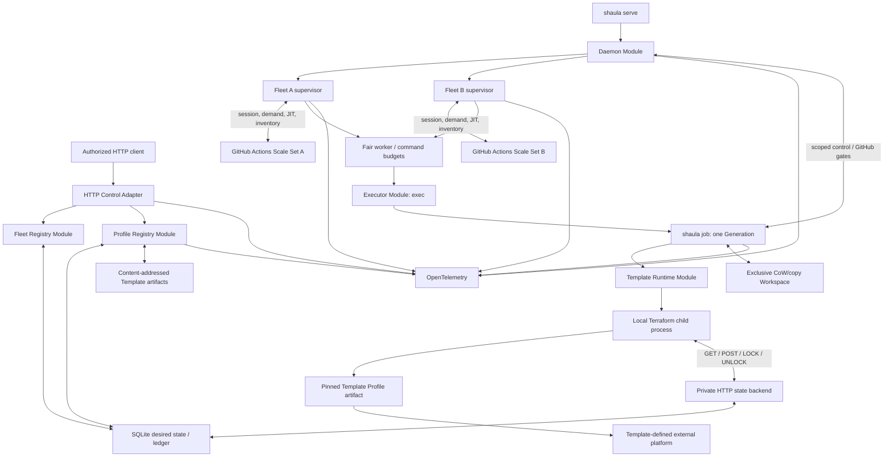
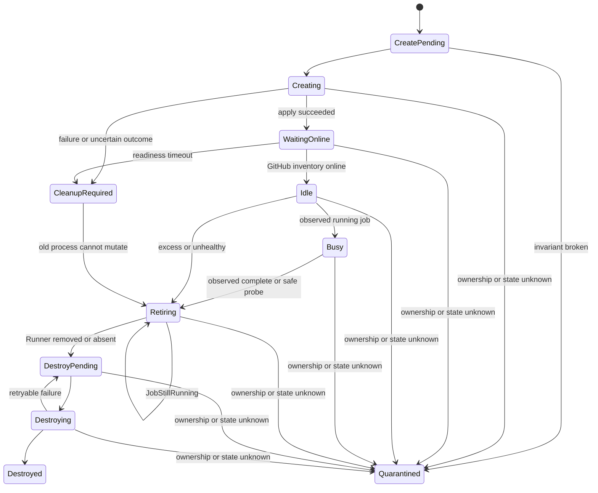

# Shaula v1 Multi-Fleet Runner Scale Set Controller Specification

- Status: Draft
- Date: 2026-09-04
- GitHub target: `github.com`
- Supported scopes: organization and repository
- Supported GitHub authentication: schema 2 GitHub App with explicit TargetPolicy (spec 0018)
- Platform SDK clients: none; fixed host container bootstrap is owned by spec 0020
- Bundled Template Platforms: Kubernetes, Docker and Proxmox (spec 0022)
- Lifecycle primitives: Create and Destroy only
- Lifecycle execution: one `shaula job` per Generation; exec Executor only in v1
- Terraform state authority: daemon HTTP backend backed by SQLite
- Observability: Day 0 OpenTelemetry
- Production implementation: pure Rust multi-crate workspace
- Rust stack: Tokio, clap, axum, SeaORM/SQLite, serde, reqwest and Rust OpenTelemetry

本文定义 Shaula v1 的产品边界和系统行为。关键词 MUST、MUST NOT、SHOULD、SHOULD NOT、MAY 表示规范强度；实现包布局、具体类型名和私有函数不属于本规范。

## 1. Outcome

一个 `shaula serve` daemon 管理多个相互隔离的 Fleet。每个 Fleet 固定绑定一个 organization 或 repository GitHub Target、一个 GitHub Actions Scale Set、一个 GitHub Auth Profile 和一个精确的 Template Profile Revision，并拥有独立的 Rust protocol-adapter session/listener、Assigned Demand、容量状态和 Runner 生命周期。

Fleet、Template Profile 和 GitHub Auth Profile 都通过同一 HTTP control plane 管理；SQLite 中的不可变 Revision、desired head、observed state、Change、outbox 和 audit 是唯一运行时真相源。Template artifact 通过 digest HTTP 发布到 content-addressed artifact store。Fleet/Profile resource mutation 只提交 durable desired state，GitHub、Profile validation 和 IaC 副作用都在提交后异步发生；artifact streaming 与 atomic publication 遵循独立的高权限上传契约。

Shaula 是 pure-Rust 多进程执行模型：一个 daemon 管理 Fleet/GitHub/容量，每个 Generation 的 `shaula job` worker 顺序负责完整 Terraform 生命周期。生产路径使用 Tokio、clap、axum、SeaORM/SQLite、serde、reqwest 和 Rust OpenTelemetry；`shaula-scaleset` 实现 GitHub wire protocol，state 通过 daemon 内部 HTTP backend 写入 SQLite。生产 binary 不链接 Go、Kubernetes 或 Docker SDK client；core 不构造平台请求或解释平台对象。[spec 0020](0020-official-container-runner-bootstrap.md) 明确允许 Template Runtime 内部通过固定宿主 CLI 完成官方镜像的 Create bootstrap。Kubernetes/Docker 是 bundled Terraform Profiles，不是 Executor Drivers。

每个 Runner Generation 固定一份不可变 Template Profile Revision、artifact、输入、Workspace 和 IaC state。基础设施生命周期只有 Create 和 Destroy，没有 Update。JobStarted、JobCompleted 和进程内 wakeup 都可能丢失；最新 Assigned Demand、GitHub Runner inventory、Generation/worker 与外部副作用事实、outbox 扫描和 retirement reaper 共同提供 level-triggered 最终收敛，而不是完整事件重放。

OpenTelemetry tracing、metrics 和日志关联是 Day 0 Interface。HTTP commit、Profile validation/activation、Auth rollout、Fleet session、reconcile、Runner lifecycle、IaC subprocess、recovery 和 reaper 从首次实现开始就必须可观察。

Web UI 的 Jobs 以已观测 GitHub workflow job 为主，关联 Runner Generation 与持久化 Apply/Destroy 日志。日志保留、状态来源、未关联 Runner 排障入口和容器 Setup Info 的唯一契约见 [spec 0019](0019-workflow-jobs-and-operation-logs.md) / [ARD-0023](../ard/0023-retain-operation-logs-and-present-workflow-jobs.md)；它们不改变 demand、Busy-safe removal 或资源销毁的事实来源。

详细契约：

- [Fleet HTTP Control-Plane Specification](0002-fleet-http-control-plane.md)
- [Kubernetes Runner Resource Specification](0003-kubernetes-runner-resource.md)
- [Docker Runner Resource Specification](0006-docker-runner-resource.md)
- [Template Profile Runtime Specification](0004-template-profile-runtime.md)
- [Profile HTTP Control-Plane Specification](0005-profile-http-control-plane.md)
- [Rust Workspace Architecture Specification](0007-rust-workspace-architecture.md)
- [Workflow Jobs and retained operation logs](0019-workflow-jobs-and-operation-logs.md)

相关 Architecture Decision Records：

- [ADR-0001: One daemon supervises multiple isolated homogeneous Fleets](../ard/0001-one-daemon-supervises-multiple-isolated-fleets.md)
- [ADR-0014: Lifecycle workers and database HTTP state backend](../ard/0014-run-lifecycle-workers-with-a-database-http-state-backend.md) supersedes ADR-0002；详细协议见 [spec 0010](0010-lifecycle-worker-and-http-state-backend.md)。
- [ADR-0003: Treat Scale Set messages as reconciliation hints](../ard/0003-treat-scale-set-messages-as-reconciliation-hints.md)
- [ADR-0004: Allow bootstrap secrets in provisioning state](../ard/0004-allow-bootstrap-secrets-in-provisioning-state.md)
- [ADR-0005: Manage Fleet desired state through HTTP and SQLite revisions](../ard/0005-manage-fleet-desired-state-through-http-and-sqlite.md)
- [ADR-0006: Realize each Kubernetes Runner Generation as one Pod and one bootstrap Secret](../ard/0006-realize-each-kubernetes-runner-generation-as-one-pod-and-one-bootstrap-secret.md)
- [ADR-0007: Target-bound GitHub auth profiles (authentication format superseded by ADR-0022)](../ard/0007-use-target-bound-github-auth-profiles.md)
- [ADR-0008: Keep platform capabilities in Terraform Template Profiles](../ard/0008-keep-platform-capabilities-in-terraform-template-profiles.md)
- [ADR-0009: Manage Template and GitHub Auth Profiles through HTTP and SQLite](../ard/0009-manage-profile-resources-through-http-and-sqlite.md)
- [ADR-0010: Build a pure-Rust multi-crate daemon and use scaleset as an oracle](../ard/0010-build-a-pure-rust-multi-crate-daemon-and-use-scaleset-as-an-oracle.md)

ADR-0008、ADR-0009、ADR-0010、ADR-0013 与其 worker/internal-HTTP 修订 ADR-0014 共同约束平台边界、Profile publication、credential storage、Auth rollout、HTTP exposure、mandatory OIDC、生产语言和 Scale Set protocol verification；本规范的核心模型遵循这些已接受决定。ADR-0013 supersedes ADR-0011。
- [ADR-0013: Require OpenID Connect for all HTTP access](../ard/0013-require-openid-connect-for-all-http-access.md)

## 2. Goals

v1 MUST：

1. 由 pure-Rust `shaula-scaleset` protocol Adapter 使用 reqwest，为每个 organization 或 repository Fleet 建立 message session、长轮询 listener、ACK/acquire、JIT Runner Registration 和 Runner inventory/removal 操作；固定版本的 `github.com/actions/scaleset` Go SDK 只作为测试 oracle，不进入 production binary 或运行时。
2. 由 Shaula 为每个 Fleet create-or-adopt 一个 Scale Set；普通关停、重启和 Fleet Decommission 都保留它。
3. 由一个 daemon 管理多个 Fleet，同时隔离其 Scale Set、session、需求、Template Revision、Workspace、操作、重试和故障状态。
4. 通过 HTTP/SQLite 动态管理 Fleet、Template Profile 和 GitHub Auth Profile；daemon bootstrap 不维护这些资源的第二份真相源。
5. 将 Fleet 固定到一个精确 Template Profile Revision 和 artifact digest；发布新 Revision 不隐式改变 Fleet 或既有 Runner。
6. 将 Fleet 绑定到一个完整 Auth Revision Ref `(profile_key, revision)`，并以显式 `desired_auth_ref` / `observed_auth_ref` 状态推进已验证 credential revision 的 session rollout。
7. 根据最新 Assigned Demand，在每个 Fleet 的 `min_runners` 与 `max_runners` 之间最终收敛 Runner 容量。
8. 经 exec Driver 启动每 Generation 一个 Lifecycle Worker，由它执行 Create、等待安全清退、Destroy；daemon 不持久化/派发每个 Terraform 步骤。核心 Interface 不出现平台分支或平台对象类型。
9. 同时交付 `templates/kubernetes` 与 `templates/docker`，并让两者遵守相同的 Template Runtime contract。
10. 使用 SQLite desired/worker/GitHub facts、HTTP-backed Terraform state/lock、retained artifacts/inputs 和 emergency state 支持恢复，不承诺 Create 的逐指令 resume。
11. 容忍重复、乱序和缺失的 Job Observation，且不故意销毁 GitHub 已知仍在执行 job 的 Runner。
12. 只接受 schema 2 GitHub App authentication，支持显式多账户 TargetPolicy；PAT、旧版和未知格式必须拒绝，认证失败不自动 fallback 到另一 kind 或旧 revision，详见 spec 0018。
13. 接受 GitHub App private key 与 schema-sensitive Kubernetes/Docker Template bindings 作为 write-only HTTP 输入并允许其明文存入各自 immutable SQLite Revision，同时禁止所有读取接口、audit、error、log、OTel 和 diagnostics 回显；GitHub credential 只进入 GitHub Access Module，Template binding secret 只进入 exact-Revision IaC 与固定 bootstrap child，二者都不进入 Runner/workflow。历史 PAT bytes 继续受同等保护，但不再作为输入或执行凭据。
14. 从 Day 0 通过 Rust `tracing`/OpenTelemetry 产生 traces 和 metrics，并让结构化日志与 trace 关联。

## 3. Non-goals

v1 不包括：

- GitHub Enterprise Server 或 `github.com` enterprise-level Scale Set；
- 通用 Kubernetes/Docker client、watcher、controller、core 平台对象 schema 或平台特定 reconcile 分支；spec 0020 的固定 Runtime bootstrap 不属于通用平台 API；
- 在单个 Scale Set 内按逐 job labels 动态选择 Template Profile；
- Runner 或 Scale Set 原地 Update、模板热更新、自动 drift repair；
- 实现 Kubernetes Job 或远程 Executor Driver；仅保留其可替换 Interface，不禁止未来另行决策的扩展；
- 多主、跨主机 HA、共享 SQLite 或分布式 operation lease；
- 完整 JobStarted/JobCompleted audit、消息 exactly-once 或 job history 重建；
- 自动删除 GitHub Scale Set；
- 服务任意项目的通用 Terraform remote backend；v1 仅实现 Shaula Generation 专用的数据库 HTTP backend；
- 未通过兼容性门槛的 OpenTofu 支持；
- 手工 `shaula create`、`shaula destroy` 或 `shaula update` CLI 命令；
- 通过 Fleet HTTP 直接创建、更新或强制销毁 Runner；
- 让普通 Fleet 写权限提交任意 Terraform code、provider、可执行文件、argv、环境变量、本地路径或网络 endpoint；
- 在 metrics labels 中记录 Fleet、Profile、Runner、job、workspace、revision 或 error text 等无界高基数字段。

Template artifact 的 digest HTTP publication 是明确存在的高权限远程代码发布能力，不属于普通 Fleet mutation；它必须经过独立授权、验证、审计和资源限制。

## 4. System shape



`Profile -> Platform` 表示 Terraform provider 的行为，不表示 Shaula daemon 拥有平台 client。平台只通过 Profile manifest、标准 inputs、declared outputs 和 IaC exit/state classification 与核心相接。

### 4.1 Module Interfaces

本节的 Module/Adapter 边界由 [Rust Workspace Architecture Specification](0007-rust-workspace-architecture.md) 映射到 Cargo crates。生产 workspace 包含 `shaula`、`shaula-core`、`shaula-daemon`、`shaula-http`、`shaula-store`、`shaula-store-migration`、`shaula-scaleset`、`shaula-template` 和 `shaula-observability`；依赖只朝 `shaula-core` 指向，binary 是唯一 composition root。Adapter DTO、SeaORM entity 和 Scale Set wire model 不得穿过 core-owned ports。

Daemon Module 的 driving Interface 是启动 HTTP control plane 并运行 SQLite 中所有 active Fleets，直到 Tokio cancellation 或 daemon-fatal error。clap parsing 和 signal handling 在 `shaula` binary 外层；telemetry startup、Registry/worker recovery、supervisor 管理、公平预算和 shutdown ordering 隐藏在 `shaula-daemon` Implementation 中。Executor 与 worker 协议由 spec 0010 定义，Terraform 内部步骤不回流为 daemon 的逐命令状态机。

Fleet Registry Module 负责 Fleet Spec admission、不可变 Fleet Revision、optimistic concurrency、idempotency、Fleet Change 和 Decommission。HTTP 和未来远程 CLI 是 driving Adapters。它提交 desired state，但不在 HTTP transaction 中调用 GitHub 或 IaC。

Profile Registry Module 负责 Template/Auth Profile 的 typed resources、不可变 Revision、异步 validation/activation、reference integrity、Profile Change、outbox 和 redaction。Template Artifact Module 独立负责 streaming、digest、archive safety、atomic publication 和 garbage collection。完整契约见 [Profile HTTP Control-Plane Specification](0005-profile-http-control-plane.md)。

GitHub Access Module 的 production Adapter 是 `shaula-scaleset`。它由稳定 Auth Profile key、指定 v2 GitHub App revision、typed GitHub Target 和 exact Resolved Auth Context 构造 core-owned Scale Set Interface，并隐藏 GitHub App client 构造、短期 token refresh、reqwest/wire DTO、redaction 和 typed authentication failures。Credential 或 Adapter concrete types 不跨出此 Interface；失败不触发 auth-kind 或旧 revision fallback。

每个 Fleet Reconciler 只处理一个 Scale Set 的 durable observations、capacity intent 和 Runner lifecycle。它不暴露 reqwest/wire DTO、Terraform、SeaORM/SQLite 或任何平台对象类型。

Executor Interface 只负责 launch、observe、stop/fence `shaula job` 及 descendants；每个 worker 内的 Runner Lifecycle 只执行 Create/Destroy。Template Runtime Module 是 worker 的 IaC seam，隐藏 materialization、Workspace、env、subprocess、backend access、plan/output classification 与只读 diagnosis，见 [Template Runtime](0004-template-profile-runtime.md)。GitHub safety 通过 daemon 内部控制通道请求，state 通过内部 HTTP backend 持久化，见 [spec 0010](0010-lifecycle-worker-and-http-state-backend.md)。

Store、HTTP、Scale Set、Template Runtime 和 telemetry 都有 local-substitutable test Adapters。生产实现分别以 SeaORM/SQLite、axum、reqwest、Tokio subprocess 和 Rust `tracing`/OpenTelemetry 封装于对应 crate。平台资源声明属于 Template Profile artifact；spec 0020 的固定宿主 bootstrap 属于 Runtime 内部能力，二者均不扩张 Fleet/Runner core Interface。

### 4.2 Native dependency boundary

除 [spec 0020](0020-official-container-runner-bootstrap.md) 明确规定、位于 Runtime 内部的 exact-resource bootstrap 外，生产路径 MUST NOT：

- 链接 Kubernetes 或 Docker API client；
- 构造、watch、list、get、patch 或 delete 平台对象；
- 根据 Pod、Secret、container 等平台状态决定 Runner readiness 或安全删除；
- 为 namespace、socket、platform endpoint 或 provider credential 另建 Fleet-level platform-target abstraction；
- 把任意平台 object identity 暴露为核心强类型。

Profile Revision 拥有全部平台 bindings。Shaula 只通过固定的 `shaula` input envelope 向 IaC 传值，并将固定 `shaula_result` output envelope 作为有限大小、受保护且不透明的 evidence 持久化。Runner readiness 和 Busy safety 以 GitHub inventory/removal semantics 为准。

### 4.3 Failure isolation

一个 Fleet 的 listener、ownership、auth rollout、profile、IaC 或 Runner failure MUST NOT 污染另一个 Fleet 的状态或终止 daemon。共享 Auth Profile、GitHub rate limit、Profile artifact 或外部平台故障可以同时影响其消费者；只要记录不串扰且无关 Fleet 继续工作，就不构成隔离失败。

SQLite corruption、共享 data directory 丢失、ownership lock 失效、scheduler safety invariant 破坏或 mandatory in-process telemetry 无法初始化是 daemon-wide failure。OTLP exporter unavailable 不是 daemon-fatal。

`/readyz` 表示 control plane 能否认证管理请求、durably commit 并安全调度。Fleet-local degraded state 只出现在该 Fleet status 和 telemetry 中，不让整个 API unready。

## 5. CLI and daemon bootstrap

### 5.1 Commands

v1 MUST 提供：

- `shaula serve --config <path>`：运行 HTTP control plane 和 SQLite 中所有 active Fleets；启动时还 MUST 通过 clap flags / env 提供 mandatory OIDC Provider/client 配置，见 [spec 0009](0009-mandatory-openid-connect.md)；
- `shaula job`：仅由 Executor 经受保护 handoff 启动的内部 Lifecycle Worker，不是 operator infrastructure mutation CLI；
- `shaula version`：输出版本信息；
- clap 生成的 shell completion commands MAY be provided。

`serve` MUST 使用 clap derive，并由 Tokio runtime 驱动。运行时错误不打印 clap usage。Runner Create/Destroy 和 Profile/Fleet mutation 都不是本地 operator commands；未来 CLI MAY 作为 HTTP client，但不得直写 SQLite 或绕过认证、并发控制、validation 和 audit。

`--oidc-provider <issuer-url>` / `SHAULA_OIDC_PROVIDER` 为必填，且无默认值；完整 client ID、secret、public origin 和 API audience 契约由 spec 0009 定义。OIDC 配置与 discovery/JWKS validation 必须在 HTTP bind 和资源 workers 启动之前成功，失败时非零退出；禁止匿名、legacy backend-token 或 development fallback。OIDC 配置不来自 bootstrap YAML 或 SQLite，authorization grants 仍属于 daemon bootstrap policy。

PAT、App private key、JIT、provider credential、OIDC client secret 和 telemetry header MUST NOT 作为 CLI flags。

### 5.2 Bootstrap shape

Bootstrap 只包含 daemon-native concerns。以下为目标配置示例，不代表当前 parser 已支持新字段，最终 defaults/limits 见统一决策 D3：

```yaml
version: 1

storage:
  data_dir: /var/lib/shaula
  database: shaula.db
  work_root: runners
  artifact_root: template-artifacts
  retained_input_root: generation-inputs

http:
  listen: 127.0.0.1:8080
  request_body_limit: 1MiB
  artifact_body_limit: 64MiB

worker_http:
  listen: 127.0.0.1:8081

limits:
  max_active_fleets: 100
  max_pending_changes: 1000

execution:
  executor: exec
  create_concurrency: 8
  destroy_concurrency: 8
  operation_timeout: 30m
  engines:
    terraform:
      executable: terraform

observability:
  service_name: shaula
  # Optional OTLP/HTTP (http/json) collector base URL. Export is
  # asynchronous and bounded; omitting the otlp section keeps local
  # JSON telemetry only. Any other protocol value fails bootstrap.
  otlp:
    endpoint: http://127.0.0.1:4318
    protocol: http/json
```

Bootstrap MUST NOT 包含任何 Fleet、Template Profile、GitHub Auth Profile 或平台 binding catalog。前三类资源只通过 HTTP 创建并保存在 SQLite；平台 bindings 属于 Template Profile Revision。HTTP clients 可以从 YAML 或 Git 生成请求，但这些文件不是 daemon watch 的真相源。

Bootstrap、filesystem roots、HTTP safety policy、engine executable/install policy、limits 和 telemetry 必须在 API ready 前静态验证。任何路径必须解析在批准 root 内，并拒绝 traversal、symlink/junction/reparse escape 和 Workspace aliasing。

Terraform 是 v1 必需 engine。OpenTofu 只有通过 section 12 的兼容性门槛后才可被声明支持；否则在 Profile validation 阶段 fail closed，而不产生外部副作用。

## 6. Managed resources and revisions

### 6.1 Fleet

Fleet 是稳定 Fleet Key 下的 desired resource。客户端 Fleet Spec 包含 typed GitHub Target、稳定 `auth_profile_ref` key、不可变 Scale Set identity、capacity、精确 `template_profile_ref` 和 bounded template inputs。Fleet admission 把该 key 当时的 current active Auth Revision 解析并记录为 Fleet Revision 的 admission-time tuple；独立 `fleet_auth_handoffs` 状态维护可推进的完整 `desired_auth_ref` / `observed_auth_ref`，因此 same-Profile promotion 不修改 Fleet Spec、Fleet Revision 或 ETag。Auth Profile key 只可通过显式 conditional Fleet replacement 改变；admission 要求零 Occupancy、无 unresolved worker/Create handover、acquisition 或 mutating GitHub effect。既有 idle session 本身不阻止提交，由后续 Auth Handoff quiesce/release；详见 spec 0002。Fleet HTTP、Revision、Status 和 Change 语义以 [Fleet HTTP Control-Plane Specification](0002-fleet-http-control-plane.md) 为准。

Fleet mutation 使用 conditional request 与 idempotency key；effective mutation 在一个短 SQLite transaction 中提交 Revision、Change、audit 和 durable wake marker。handler 返回 `202` 前不调用 GitHub、Terraform 或任何外部平台。

### 6.2 Template Profile

Template Profile 是 HTTP-managed logical resource。异步静态验证通过后自动把仍为 desired 的 Candidate 经 `Ready` 推进到 `Active`，完整状态机与升级规则由 [spec 0017](0017-automatic-template-activation.md) 维护。只有 current Active Revision 可接收新的 Fleet 引用；Active 不声明完整运行验证通过。Revision 固定运行配置 tuple：

- content-addressed Terraform artifact 和 dependency lock；
- manifest-derived Template Platform、engine constraints、固定 input/output protocol 与 managed-plan shape；
- administrator-owned platform bindings；
- Fleet 可提供的 bounded input policy；
- artifact 和规范化非 credential material 的 digest。

Attestation 是引用 Template Revision/canonical subject 的独立 immutable 运行证据；它的 PUT 不创建或修改 Revision、Profile head 或 activation ID。自动 `Ready -> Active` transaction 冻结 opaque activation provenance；兼容字段 `active_attestation_id` 不再表示新版本必有 conformance record，详见 spec 0017。Artifact upload 是独立的 digest-idempotent HTTP operation。`template.publish` 拥有等同部署 IaC code 的高权限并授权通过校验后的自动激活，`template.attest` 独立控制 attestation acceptance；普通 `fleet.write` 两者皆无。新增或改变 Template reference 的 admission 只解析 current Active subject，并冻结 revision/artifact/activation provenance；capacity/inputs/no-op 中未改变的旧 pin 按 spec 0002 保留，不重新准入或升级。以后发布、激活或 attestation 新 Template Revision 不改变该 Fleet；切换必须显式 Fleet replacement，且 v1 仅在 Resource Occupancy 与 active Runner Operations 都为零时允许。Template Platform 只能来自 admitted artifact manifest，HTTP body、bindings 或 attestation 均不得覆盖。

### 6.3 GitHub Auth Profile

[spec 0011](0011-multi-account-github-authentication.md) / [ADR-0015](../ard/0015-route-one-github-app-profile-to-multiple-accounts.md) 定义同一 App 的多账户 bindings、动态仓库 policy 和 exact context；[spec 0018](0018-github-app-only-authentication.md) / [ARD-0022](../ard/0022-retire-legacy-github-authentication.md) 取消旧单 installation/PAT publication、升级和执行兼容。这些已接受契约替代原单 installation 基线。

GitHub Auth Profile 是稳定 logical key 下的一组不可变 credential Revisions，只接受 `kind: github_app`、`schema_version: 2`、positive decimal App ID、private key 与显式 TargetPolicy。已验证 numeric App identity 在 Profile incarnation 内固定；同 App 的 key rotation、policy 调整和 installation replacement 可通过新 Candidate 验证，且必须保留 spec 0011 的 numeric account/repository identity 与 live dependent coverage。改变 App identity 需要新 key；旧格式 Profile 不得隐式转换。Fleet 改引新 key 使用 spec 0002 的零占用/effect barrier；idle session 由 Handoff quiesce，不能成为进入 Handoff 的前置阻碍。

GitHub App private key 是 write-only HTTP field，并允许原始明文字节保存在 SQLite Auth Revision 中。历史 credential bytes 保留但不授权旧格式执行。所有 GET/list/status/revision、audit、error、log、trace 和 metric 只能返回 `credential_present` 等非 secret metadata，不能返回 prefix、suffix、hash 或任何可推导 secret 的表示。

Candidate credential 必须经过异步、bounded、read-only GitHub identity/access validation。失败时旧 active revision 保持不变。same-key promotion 后，Profile Registry 为每个依赖 Fleet 设置新的 `desired_auth_ref=(profile_key, revision)`；已准入的 cross-key replacement 由 Fleet mutation 写入同样完整的 desired ref。二者进入同一个 durable Auth Handoff：停止新 job acquisition、处理已在途 acquisition，并以 desired ref 对已持久化 Scale Set ID/identity 做 read-only ownership/absence classification。Handoff 只持久化 classification 并推进完整 `observed_auth_ref`；它不调用 create-or-adopt、不绑定 ID、不建立或替换 session。普通 Fleet reconciliation 独占这些副作用，并且只有为 observed ref 建立 ready session 后才恢复 acquisition。

Auth handoff 完成必须同时持久化匹配的完整 `(profile_key, revision)` ref 与已验证 exact Resolved Auth Context；ref equality 本身不证明授权，也不代表 Scale Set/session 存在或 capacity 已收敛。ref 或 context 不一致必须作为独立、可恢复、可告警 rollout lag 暴露，不能被 Fleet desired/observed revision 掩盖。旧版、未知版、缺失 policy/context 的引用不得执行，包括 cleanup；部署恢复要求见 spec 0018。

Decommission 中的 Auth change 使用 cleanup-only handoff：候选 ref 可做只读 access/ownership validation，并原子推进完整 observed Auth Revision Ref，但不得创建 session、acquire job、Create 或 create-or-adopt。之后每次 inventory/removal effect 都记录所用 exact ref/context。旧 revision 只要仍被 Profile desired/active/observed head、Fleet desired/observed ref、in-flight effect/session、cleanup 或 recovery 引用就必须保留；`Blocked` 不释放任何引用。

切换失败使依赖 Fleet `Blocked`/`Degraded`，且不会自动 fallback 到另一 auth kind、旧 credential revision 或另一个 Profile。旧 revision 的保留只服务已记录引用与 recovery，不授权未记录的 runtime fallback。

Permission admission 与真实验收至少覆盖以下 `github.com` baseline；实际 GitHub read probe 仍是 authority，不能只检查声明字段：

| Credential | Organization Target | Repository Target |
| --- | --- | --- |
| GitHub App | Organization `Self-hosted runners: read/write`；Repository `Metadata: read` | Repository `Administration: read/write`、`Metadata: read`，以及 Scale Set Adapter/API 实际要求的 installation access |

GitHub App 是唯一受支持的认证方式，必须在 organization/repository 两种 Target 上做真实 Scale Set/JIT/inventory/removal 验收，并覆盖多个 organization 与个人动态仓库。PAT variants 不再是待决定的支持项；历史 Profile 只显示受限的 unsupported 状态，不重建旧凭据身份。

### 6.4 Source-of-truth rules

- SQLite desired heads 是 Fleet/Profile 资源的唯一运行时真相源。
- Template artifact store 只保存按 digest 引用的 bytes；没有 Profile Revision 引用的 artifact 不能直接运行。
- 每个 Runner Generation 永久固定其创建时的 Fleet Revision、Template Revision、artifact digest、inputs、Workspace 和 state。
- Auth Profile 的 same-key active credential 可通过受控 rollout 演进，因此 Fleet status 必须同时暴露完整 `desired_auth_ref` 与 `observed_auth_ref`；跨 Profile key replacement 仅在 spec 0002 的零 Occupancy/effect barrier 下提交，并走同一 Auth Handoff；idle session 不单独构成 admission blocker。
- 任何 direct SQLite edit、第二 writer 或 bootstrap catalog override 都不受支持。

## 7. Fleet and Scale Set ownership

Fleet identity 是稳定 Fleet Key。远程 Scale Set identity 是 typed GitHub Target、resolved runner group 和 scale-set name；该 tuple 在 Fleet incarnation 内固定，name 在 runner group 内唯一，并在 retained-conflicting incarnation 解除前保留。相同远程 identity 不能同时属于两个 active 或 retained-conflicting Fleet incarnations。v1 接受结构化 Target fields，并在内部推导 `github.com` configuration URL；不把 caller URL 当作通用 endpoint。

Fleet supervisor 激活时 MUST：

1. 在任何 remote mutation 前持久化 normalized Target、stable remote identity、immutable fingerprint 和 create-or-adopt intent。
2. 解析 Fleet 完整 `desired_auth_ref`，只接受 v2 GitHub App，验证其 TargetPolicy 并解析冻结的 account binding/exact context；执行使用已验证 observed authority，不 fallback。
3. 进行 bounded authenticated read，解析 runner group 并按完整稳定 tuple 查找 Scale Set。
4. 只有成功认证的 read 证明不存在时才允许 Create；调用 POST 前先在一个 transaction 中写 `ScaleSetCreateStarting`、唯一 attempt identity 和 exact Target/group/name/fingerprint。重启或重试不得换 name。
5. Create success、`409`、timeout、connection reset 或 response body 丢失都先进入同一 uncertain-outcome reconciliation：按原 tuple lookup，不直接再发 POST。
6. 恰有一个 compatible match 时 adopt，并在 session 前持久化 Scale Set ID、normalized Target、完整 exact Auth Revision Ref、fingerprint 和 attempt result；multiple/conflicting match 时 fail closed。
7. 只有 authenticated lookup 再次给出 authoritative absence，且 retry budget 允许时，才可沿同一 intent、name 和 attempt lineage 重试 Create；不能用 Update 或新 name 绕开 Create 的不确定性。
8. 任何 access/ownership classification 与 retry deadline 都必须 durable，进程内 wakeup 只用于降低延迟。

`401`、`403`、access-filtered `404`、Target malformed 或 permission mismatch 是 access failure，不是 absence proof，必须 fail closed 且不得进入 Create。

存在以下情况时 Fleet 必须停止新 Create 并暴露 bounded Condition：multiple matches、runner group/fingerprint conflict、首次 adoption 的 labels conflict、persisted ID identity mismatch、duplicate local ownership、或 remote inventory 中有无法映射到 non-terminal Generation 的 Runner。空 ledger 只可 adopt 空 Scale Set；未知 remote Runner 不自动删除。

Label type 在 GitHub wire boundary 解析为有限类型；服务端返回的 `system` / `System`、`user` / `User` 各自按同一语义比较，不得仅因 type 大小写不同把正常 Scale Set 分类为 access failure。Shaula 为显式 desired labels 和空配置的 Scale Set name fallback 发送 `System`；`Customer` 不属于 GitHub 的合法 label type。未知 type、不同 label name、缺失/额外 label 仍不构成 compatible ownership；不能通过整体忽略 labels 来修复大小写问题。

Runner inventory endpoint 返回 Target 范围的清单，可能同时包含普通 Runner 和多个 Scale Set。缺失或为 `0` 的 `runnerScaleSetId` 表示没有声明 Scale Set 归属，不能使整个 Fleet 验证失败；inventory port 只返回明确匹配当前正数 Scale Set ID 的条目。响应 count、Runner ID/name 和非负归属值仍须有效，当前 Scale Set 的未知 Runner 仍阻塞 adoption。精确名称查询中，返回名称不符或归属缺失/为 `0` 必须 fail closed，不能据此声称匹配当前 Scale Set 或证明 Runner 已不存在。

Shaula 仅按 spec 0002 §6.1 对 proven-owned Scale Set 更新 labels，不通过 Update 修复其他 identity drift；首次 adoption 仍要求完整 labels 兼容。普通 shutdown、restart、Fleet replacement 和 Decommission 都不删除 Scale Set。若已持久化 Scale Set 被 authenticated read 确认缺失，而 Resource Occupancy 非零或存在 non-terminal Generation，Fleet MUST 进入 `ScaleSetMissingWithResources`：停止 create-or-adopt、session、acquisition 和重新绑定；Scale Set/Runner 的 absent 或 `404` 不能单独证明一个可能 Busy 的既有资源可 Destroy。只有 JIT 与 IaC Create 均可证明从未开始的 Generation 可以本地终结；任何可能已注册或已创建基础设施的 Generation 必须继续计入 Occupancy 并 Blocked/Quarantined，直到恢复 consistency-set 证据或未来显式 operator procedure。仅当 Occupancy 和 active Runner Operations 都为零时，普通 reconciliation 才可从 `ScaleSetMissing` 建立新的 create-or-adopt binding。

## 8. Listener, demand and eventual convergence

每个 Fleet 拥有独立的 `shaula-scaleset` Rust session/listener supervisor。生产 Adapter 以 reqwest 实现 core-owned poll、ACK、acquire、JIT、inventory/removal ports；固定 commit/module/checksum 的 `github.com/actions/scaleset` Go SDK 与 `internal/testserver` 只作为 differential test oracle，既不链接也不由 `shaula serve` 启动。

建立或替换 session 时，supervisor 取得 per-Fleet session-effect gate 的 exclusive permit，等待旧 epoch outbound effects 完成或取得 durable uncertainty classification，再分配 Fleet-scoped、单调递增的 `session_epoch`，并在开始 poll 前将 session identity、epoch 和 initial current statistics 原子持久化。安装 CAS 同时检查捕获的 Fleet incarnation、desired Revision、mutation fence、预期前一 epoch，以及已观测的完整 Auth Revision Ref / Resolved Auth Context；DELETE、replacement、handoff 或 restart 后的过期结果不能安装 session。

每个 poll task 捕获该完整快照；message ingest、ACK authorization、`AcquireStarting` 和 demand write 都必须通过其 current-authority CAS。ACK/Acquire 在各自 HTTP call 前还必须取得 epoch-scoped shared permit 并重新授权 current epoch，直至 outcome durable classification 才释放；旧 epoch task 即使延迟返回也不能 ACK、acquire、覆盖 demand 或 wake lifecycle。已经开始的 Acquire 即使变旧仍须按原 intent 记录结果，不把结果重新归属新 session，也不因此修改新 demand。取消旧 task 是资源管理，不是 correctness proof；SQLite transaction 不跨 network call。

Listener poll 必须由 daemon 实际调度，并与同 Fleet 的容量 reconcile、其他 Fleet 的 poll 分开；不能把 70 秒长轮询串行放入全局扫描。Auth Handoff、Fleet replacement 与 DELETE 先停止旧 listener 的新 effects，再推进 authority 或执行 cleanup。普通 restart 先分类并关闭持久化的旧 session，再安装新 session；清除 session 仍保留并推进 epoch，不能从 1 重新开始形成 ABA。

每个已 poll 的 message 遵循 persist-before-ACK：

- 在一个短 SQLite transaction 中先验证 current epoch，按消息内容原子替换最新 `TotalAssignedJobs` snapshot、写 idempotent Job Observations、message ID/checkpoint、durable acquisition intent 和 Fleet wake marker；
- transaction commit 失败时不发送 ACK 或 acquire；只终止/重试该 Fleet listener；
- commit 成功后才允许 ACK；ACK response uncertain 时只按已持久化 message identity/checkpoint 幂等重试或等待 redelivery/new session，不重复创建 acquisition intent；
- ACK 后依据 durable intent 调用 Acquire；调用前写 `AcquireStarting`，结果按 exact epoch 分类。outcome uncertain 时不从事件数量推导新 Create，等待 current statistics、inventory 或 recovery scan 分类。

Ingested message 与已 ACK checkpoint 分开持久化。下一次 poll 的 `lastMessageId` 只能来自已确认 checkpoint；恢复先处理未 ACK 的持久 message 和已 ACK、尚未开始的 acquisition。重复 `(Fleet, epoch, message ID)` 不重写较新的 statistics；同 epoch/request ID 不因重投到另一个 message 而再次 Acquire。相同 message ID 在不同 Fleet 或 epoch 下不互相去重。

ACK failure 保留 durable message；若原 session 无法确认该消息，按有界退避重建 session，并以新的 initial statistics 恢复 level source，不把一般 `404` 当作 ACK 成功。旧 Pending acquisition 可取消；Starting/Uncertain 不能盲重试。新 session 的 authoritative initial statistics 提交后，可把旧 uncertainty 标为已由新快照接管并释放其 live auth pin；历史 outcome 仍保留，既有 Runner/Generation 的 ownership 和 cleanup pins 不因此释放。

Session initial statistics 和 message statistics 必须明确包含非负 `TotalAssignedJobs`。缺失/null 的 statistics、缺失 assigned count 或负计数是无效响应，不得默认为零、清空 demand 或标记健康。显式零是正常的权威快照。

非 acquisition 观测 `JobAssigned`、`JobStarted`、`JobCompleted` 的 `runnerRequestId=0` 表示没有有效 request identity；应按原消息身份幂等保存该未知事实、已有 `jobId`、Runner identity 和批准 metadata，并与同批 statistics、message fact 和 wake marker 一起提交，提交后才 ACK。不能因为这个未知 request 提示而回滚有效的 `TotalAssignedJobs`，也不能丢弃观测或提前 ACK 来跳过重投。`0` 不是可 Acquire 的 request、跨消息 request 去重键、Jobs 关联或执行 episode 相同的证据；保留的真实 job/runner 证据仍按既有 scope、identity 和 lifecycle safety gates 使用，不能因 request 未知而丢弃。`JobAvailable` 创建 acquisition intent 仍要求正数 request ID，所有消息的负数 request ID 仍拒绝。零值观测的 Jobs 投影规则由 spec 0019 §2 维护；本地 Assigned 与外部 Completed 实证及 Started 的合同支持边界见 ARD-0003。

Session request 的 `X-ScaleSetMaxCapacity` 始终是该 Fleet 的 `max_runners`，而不是 daemon global concurrency、当前空闲 worker 数或所有 Fleet 容量之和。Listener reconnect 使用 bounded exponential backoff 和 jitter；一个 Fleet 的 retry/circuit breaker 不占满全局 scheduler，也不暂停其他 Fleet 的 listener。

Persist-before-ACK 消除了“本地提交尚未完成却主动确认”的窗口，但不提供 exactly-once：消息可能在到达前丢失、被截断/重分配，ACK 结果也可能未知。因此 Job Observation 和单个 message 仍只是 hint；成功持久化的 current-statistics snapshot 是可替换的 level source。Shaula 不从 Started/Completed 增减永久计数器，也不以完整事件序列作为安全前提。

最终收敛依赖以下独立、level-triggered 事实源：

1. 新 session initial current statistics 与后续 current-statistics snapshot 原子替换旧 Assigned Demand；
2. periodic GitHub Runner inventory 重新观察 online/busy/absent 状态；
3. retirement reaper 重新检查过期或多余 Generation，并始终经过 GitHub removal safety gate；
4. SQLite 中的 non-terminal Generation/Worker Claim、GitHub/acquisition intents、Fleet Change 与 retry deadlines 在 restart 后恢复；
5. outbox、message checkpoint 与 `desired > observed` periodic scans 修复丢失的进程内 wakeup；
6. saved state、process fences 和 authoritative removal results 重新证明 Create/Destroy 是否可推进。

最终收敛保证是有条件的：desired state 必须最终稳定；当前 Auth/Scale Set ownership 必须可证明；GitHub、filesystem 和 IaC engine 必须最终返回 authoritative 结果；listener 必须最终取得新的 current-statistics snapshot；旧 child 必须可终止或 fence；scheduler/reaper 必须继续获得运行机会；且 Fleet 不处于 Quarantine、`ScaleSetMissingWithResources`、missing-state 或其他 safety block。

满足这些条件时，重复 reconcile 最终达到固定点：在安全清退后 Resource Occupancy 不超过当前 max（显式缩容可暂时低于既有 Occupancy），Effective Capacity 匹配最新 target，已完成/多余资源通过安全 removal 后 Destroy，GitHub 已知 Busy 的 Runner 不被故意销毁。事件丢失只会推迟这一过程，不是唯一授权。条件不满足时 Shaula 优先停止副作用、持久化并告警 bounded Condition，且 MUST NOT 误报 `Converged=True`；不承诺固定 wall-clock SLO 或完整 job history。

## 9. Capacity and fair scheduling

每个 Fleet 独立计算：

```text
target[fleet] = min(maxRunners[fleet], minRunners[fleet] + TotalAssignedJobs[fleet])
```

`TotalAssignedJobs` 是最新快照，替换旧值而非累加。`minRunners` 表示 assigned work 之外的 warm/idle buffer。

- Effective Capacity 包含 `CreatePending`、`Creating`、`WaitingOnline`、`Idle` 和 `Busy`。
- Resource Occupancy 保守包含 Destroy 尚未完成的每个 Generation，包括 cleanup、retiring 和 quarantined 状态。

```text
createCount[fleet] = min(
    max(0, target[fleet] - effectiveCapacity[fleet]),
    max(0, maxRunners[fleet] - resourceOccupancy[fleet])

)
```

一个 tick 算出的 create 预算**并发启动**：每个 Create 在入口获取全局 create
信号量（`create_concurrency`，跨 Fleet 共享），因此 N 个同时排队的 job 不需要
串行等待 N 次 JIT+init+plan+apply 链路。已启动的 Create 全部结束后才传播首个
错误——不得取消已越过效果边界（JIT 已 mint / apply 已跑）的兄弟；下一 tick
从账本 level-triggered 地重算容量，不盲目重发。

scale-down 优先选择 observed Idle；由于 Completed 可能丢失，stale Busy observation 不能永久阻塞候选检查，但 GitHub removal 的 `JobStillRunning` 仍是 Destroy 前的 authoritative safety gate。Retirement 一旦开始即单调前进；需求回升会在 occupancy 允许时新建 Generation，而不 Update 或恢复旧 Generation。

Worker lifetime 与活跃 Terraform command budgets 分开；等待 GitHub 的 worker 不占用 Create/Destroy command slot。两种命令保留独立预算及跨 Fleet 公平性，同 Workspace 至多一个 active command。Create-start 和 Decommission 的 side-effect handover 由 spec 0010 约束，事务不跨等待/IPC/网络/子进程。下调 max 可暂时低于既有 Occupancy/Busy；此时不准新增 Generation，只安全清退，不强杀 Busy。

## 10. Provider-neutral Runner lifecycle

### 10.1 States



图中是 coarse status，不要求持久化每条边或 Terraform subphase。GitHub observations 与 worker 状态不互相推断；spec 0010 §2 定义必要的持久化事实。worker exit、heartbeat timeout 和 state lock expiry 都不是 side effect 未发生或资源已销毁的证明。

### 10.2 Create

daemon 在外部效果前分配并持久化 stable Generation ID、由 Fleet incarnation/完整 Generation 派生的唯一 Runner name、exact immutable materials、Worker Claim 和容量槽。名字永不复用；JIT 由 daemon 在 Fleet/session fence 下记录 intent/result 并调用 GitHub，不把控制面 credential 交给 worker。

worker 的 materialize → HTTP-backed locked init → JIT → saved Create plan → 单次 apply → 等待 GitHub 的顺序、Create-start handover 与 retained facts 只在 [spec 0010 §2–3](0010-lifecycle-worker-and-http-state-backend.md) 定义。Saved-plan 的 action/shape/provenance policy 只在 [spec 0004 §5](0004-template-profile-runtime.md) 定义。完整 protected inputs/JIT 至少保留到可信的空 state terminal completion；不能因 token 过期删除 recovery/Destroy 材料。

`JITStarting` 后若 response outcome unknown，绝不对同一 Generation/name 直接再发 JIT POST。恢复先在 exact Target/Scale Set 下按 stable unique Runner name 做 bounded lookup：恰有一个 exact match 时持久化 recovered Runner ID，经过正常 safe removal，确认 absent 后终结旧 Generation，再以全新 Generation/name 请求 fresh JIT；authoritative proof 表明 POST 未 commit 时也只终结旧 Generation并创建 fresh Generation；multiple/mismatched match、access ambiguity 或无法证明 absence 时 Quarantine。已知 JIT 过期、损坏或 protected input 丢失也遵循 remove-then-fresh-Generation，而不复用旧 identity。

Create 一旦可能启动，worker crash/restart 只能进入观察或 cleanup-only 恢复，不产生同 Generation 的第二次 Create apply。任何 replacement worker/Destroy 都要先证明旧 worker 及 Terraform/provider descendants 不能继续修改资源；未知 outcome 保留 Occupancy 和证据，不以进程退出或锁超时替代证明。

### 10.3 Retirement and Destroy

JobCompleted 或 excess capacity 只开始 Retirement。worker 向 daemon 请求 exact Runner 的 safe-removal：`JobStillRunning` 使 Destroy call count 保持零；只有已验证 ownership 的 removed/authoritative absence 且不处于 `ScaleSetMissingWithResources` 才能授权 Destroy。

worker 从原始 materials 和 database state 执行 delete-only saved plan；partial Destroy 只有在旧 descendants 已结束/fenced 后才能重新读 state、re-plan 重试。成功退出、可信 state-empty proof、daemon completion/seal 与 Workspace cleanup 的顺序以 spec 0010 为准；不能从 worker exit、空初始 state 或缺失 state 推导资源已不存在。

### 10.4 Template specializations

核心 lifecycle 不知道 Template Platform。随附 Kubernetes、Docker 与 Proxmox Terraform Profile；其全部 resource shape、bootstrap、provider access 和安全约束分别由 [Kubernetes Runner Resource Specification](0003-kubernetes-runner-resource.md)、[Docker Runner Resource Specification](0006-docker-runner-resource.md)、[Proxmox Runner Template](0022-proxmox-runner-template.md)、[Template Profile Runtime Specification](0004-template-profile-runtime.md)、Profile artifact 和外部 integration harness 定义。

Shaula 不新增通用平台 preflight 或 reconcile。Profile-side Terraform checks 和外部验收观察平台；spec 0020 仅允许固定 bootstrap 对 exact 新建资源的身份及启动门槛进行检查，不能替代 GitHub readiness/safe-removal 权威。
The Kubernetes Profile uses a user-published, Revision-pinned namespace binding and a collision-resistant Generation name persisted before external effects；the bundled Profile uses that exact value as both objects' `metadata.name`, with kind separating their Resource Keys. v1 accepts the HashiCorp provider's Terraform-state-driven namespace/name deletion and never calls that name a Kubernetes UID. The target binding and namespace must retain continuity, and all namespace writers must reserve Shaula names until Destroy；if an external actor repoints the target, recreates the namespace or replaces an object under the same name, a later Destroy may delete that replacement. This residual risk is accepted, while missing/corrupt state still quarantines and never authorizes reconstructed-name deletion.


## 11. Durable state and recovery

v1 使用一个 WAL-mode SQLite database 和一个 local filesystem tree。Fleet Key namespacing 每条 Runner record 和 Workspace；shared data directory 是 daemon 的 durability/ownership unit。

Ledger 至少持久化：

- Fleet incarnation、desired/observed revision、mutation fence、deletion marker、Fleet Change、idempotency、audit 和 outbox；
- Template/Auth Profile desired/active/observed revisions、Profile Change、references 和 credential rollout acknowledgements；
- normalized GitHub Target、per-Fleet desired/observed Auth Revision Refs、Scale Set identity/ID/fingerprint、Create attempt/outcome 和 `ScaleSetMissingWithResources` Condition；
- session identity/epoch、latest Assigned Demand、message checkpoint/dedup、acquisition intent/result 和 inventory/reaper progress；
- Generation identity/stable name、creating Fleet Revision、GitHub JIT intent/result/Runner ID、Template/engine/runtime material refs、protected inputs/retention、Workspace ownership 和 protected opaque `shaula_result`；
- Worker Claim/epoch/Executor identity、Create-start/cleanup authority、Terraform backend state/version/lock、recovery/terminal facts、sanitized status 和 retry deadlines；不要求持久化 init/plan/inspect 等逐命令 subphase；
- async correlation context needed for span links。

GitHub mutation 与可能启动的基础设施 mutation 均受 durable identity/intent 和结果分类保护；worker 内部 Terraform 步骤不另建中央 operation ledger；事务不跨 network 或 subprocess。Listener 先本地 commit 再 ACK，stale session epoch 不能 ACK/acquire。Scale Set Create 与 JIT POST 都以 stable identity、starting phase 和 lookup/classify-before-retry 处理 uncertain response。

### 11.1 Startup

全局 startup barrier 只做共享工作：

1. 由 `shaula-observability` 初始化 Rust `tracing`、local structured logging 和可选的 OTLP/HTTP metric export pipeline（[ARD-0032](../ard/0032-process-telemetry-uses-otlp-http.md)）；
2. 验证 daemon bootstrap、HTTP safety、engine 和 filesystem roots，并完成 clap/env mandatory OIDC 配置及 discovery/JWKS validation；任一失败均不启动 HTTP listener 或资源 workers；
3. 获取 data-directory ownership lock，迁移 SQLite，验证数据库/artifact/workspace consistency；
4. 启动管理 HTTP registries、独立内部 control/state backend、Executor/budgets 和 periodic scans；内部 backend 可用前不 launch worker；
5. 从 SQLite 加载 active Fleet/Profile desired heads。

之后每个 Profile validator、Auth rollout 和 Fleet supervisor 独立恢复。一个资源缓慢、invalid 或 blocked 不延迟无关 Fleet 建立 session。Fleet supervisor：

1. 解析精确 Template Revision 和 Auth desired/observed state；
2. 验证 non-terminal Generation 的 database state、retained artifact/inputs、Worker Claim 与 emergency evidence，不解释平台对象；
3. 验证/恢复或 fence 旧 worker 和 descendants；不得凭 lease/lock expiry 接管；
4. 在 ownership/missing-set gates 允许时 reconcile Scale Set，恢复或隔离 incomplete Generations；
5. 执行 GitHub inventory/reaper，启用安全 claims 并建立 listener。

### 11.2 Recovery rules

Worker fencing、database state CAS、emergency state、Workspace 重建、backup 和旧 local-state migration 的唯一契约在 [spec 0010 §6–7](0010-lifecycle-worker-and-http-state-backend.md)。

- JIT uncertainty 仍按 §10.2 的 stable-name/remove/fresh-Generation 规则处理。
- GitHub known Busy 的既有 Runner 跨 worker/daemon restart 保留，通过 inventory 和 safety gate 重新观察。
- Auth desired/observed 不同恢复 normal 或 cleanup-only Handoff；失败不 fallback。
- `ScaleSetMissingWithResources` 不因 worker 重启解除，继续阻止 rebind/acquisition/absent-based Destroy。
- 只读 diagnosis 不能 apply/import/repair；Quarantine 不 silently forget，也不属于自动收敛承诺。

SQLite/retained material/emergency state 构成 credential-grade consistency set；普通 materialized Workspace 可重建，不再把所有本地文件都视作 authoritative state。

## 12. Subprocess and engine contract

每次 IaC invocation MUST：

- 使用 argument vector，不使用 shell string；
- 使用对应 Runner Workspace 作为 cwd；
- 使用 explicit per-process environment allowlist，不修改 daemon-global environment；
- 使用 Generation retained runtime material 固定的 exact engine executable/kind/version/binary digest，并在 spawn 前重新 hash binary；禁止换 engine、版本或同路径替换二进制；
- 只接收该 Profile/operation 声明的 provider/bootstrap material；
- 有 bounded stdout/stderr、redaction、timeout 和 cancellation；
- 与同 Workspace 的其他 operation 串行，并参加 global fair Create/Destroy limits；
- 由 Worker Claim、exec descendant fencing、Workspace exclusivity 和 backend locks 共同防止新旧 attempt 并发；cancellation/UNLOCK 本身不是 child 已退出的证明；
- spawn 前创建 OTel span，退出和 classification 后结束；
- 遵循 checked-in dependency lock，禁止 implicit provider upgrade；
- 只运行固定 Terraform protocol；Profile 不得定义 custom executable hook 或 command name；
- Create/Destroy 都先生成 saved plan、解析 JSON 并执行 fail-closed action/cardinality policy；spawn 前重验 plan/artifact/input digests 与 state lineage/serial，只 apply exact immutable saved-plan path；
- 将 tfvars、plan/state JSON、provider output 与 `shaula_result` 全部视为 credential-grade data。

不同 Workspace 可以并发。shared provider mirror/cache 只有在 concurrency-safe 时可用；working directory 和 state 永不共享。

Terraform 是 required v1 engine。OpenTofu 只有在 exact versions、init/apply/destroy/state/lock/cancellation/error semantics 和完整 lifecycle/crash/telemetry/redaction suite 均通过，且无需在 Fleet/Runner lifecycle 分支时才可 advertised；否则 v1 是 Terraform-only。

Graceful shutdown 遵循 spec 0010 §8：先停止管理 mutation/acquisition/new claims，再处理 worker/descendants；内部 backend/DB 必须等待最后 state write、UNLOCK 和 receipt，不得先关 backend。随后 bounded telemetry flush，并保留 Scale Sets、Runner Resources 与 consistency set。

## 13. Day 0 observability

Shaula MUST 在 ledger migration 或 remote side effect 之前由 `shaula-observability` 初始化 Rust `tracing`/OpenTelemetry traces 和 metrics。测试可以通过 in-memory Adapters 观察 spans 与 measurements。

v1 落地范围由 [ARD-0032](../ard/0032-process-telemetry-uses-otlp-http.md) 记录：`shaula-observability` 持有进程级 subscriber、local JSON sink、finite metric labels 和可选的 OTLP/HTTP（http/json）导出器；metrics 经窄 `TelemetryHandle` facade 从生产调用点记录，导出为 `shaula.operations.total{operation,result}` 的 DELTA monotonic sum。traces 由 crate 内的 `tracing` Layer 采集（仅 `shaula` target 的 span），经有界队列批量导出到 `/v1/traces`，traceId 由根 span 的 registry id 零扩展派生；初始 span 集覆盖 `shaula.daemon.startup`/`shaula.daemon.shutdown`、`shaula.http.request`（route template）、registry mutation、bounded GitHub operations、IaC create/destroy 与 reconcile tick，其余 §13.1 span 家族随后续 spec 增量交付。degraded export 以进程内 counter 报告，导出失败永不阻塞 listener、commit、lifecycle 或 shutdown；shutdown 时 telemetry flush 有明确 budget。测试可以直接观察 layer 的内存 channel（in-memory span adapter）。core 不持有 telemetry port。

### 13.1 Required spans

至少包括：

- `shaula.daemon.startup`、recovery attempt 和 `shaula.daemon.shutdown`；
- `shaula.http.request`，使用 route template；
- Fleet/Profile registry validate、commit、Change reconcile 和 revision observation；
- Template artifact publish/validate 和 GitHub Auth candidate validation/rollout；
- per-Fleet session establish/reconnect、epoch handoff、message persist/ACK/acquire、inventory、reaper 和 reconcile；
- bounded GitHub operations，包括 create-or-adopt、JIT 和 safe removal；
- Runner create/retire/destroy 和 scheduler delay；
- Template Runtime artifact materialization、`init`、Create/Destroy plan、saved-plan policy、apply、read-only diagnosis、output/state classification；
- quarantine、degraded 和 exporter failure transitions。

process lifetime、listener lifetime 和 successful empty poll 不建立长时间 span；用 metrics 表示 uptime/session age。跨重启与异步 handoff 通过持久化 correlation context 建 span links，而不伪装成原 request 的长子 span。

### 13.2 Metrics and logs

Operation Log 是 spec 0019 定义的专门持久制品，不通过 OTel/普通请求日志承载正文。经脱敏的 operator 读取与面向 workflow 的 Setup Info 采用各自发布策略；raw credentials、state/input body 与 provider secret 仍不得公开。新增 Runner Setup Info capability 只允许读取本 Generation 的 Create 安全投影，经独立 loopback listener/HTTPS proxy 交付；它不属于管理或 worker/control/state 通道，也不能访问它们。

Metrics 至少覆盖 HTTP、registry admission、desired-to-observed lag、Profile Change、Auth rollout、active Fleets、capacity/occupancy、reconcile/queue、Runner Operation、GitHub access、IaC operation、listener/inventory/reaper、quarantine 和 exporter degradation。v1 的 `shaula.operations.total{operation,result}` 覆盖其中 HTTP request、registry admission、reconcile、Runner/GitHub operation、IaC operation 和 exporter degradation（`MetricOperation::Exporter` 只进进程内 counter，不产生导出流量）；其余维度随后续 spec 交付。

属性必须来自 finite allowlist。`action=create|destroy`；Template `platform=kubernetes|docker|proxmox|other` 仅作为 bounded metadata。Fleet/Profile key、revision、artifact digest、actor、Target owner/repository、Runner/job/Workspace/resource identity、URL 和 error text 不得作为 metric labels。

结构化日志始终写 local sink，并在适用时携带 `trace_id`、`span_id` 和高基数 correlation identifiers。所有字段经过统一 redaction。SQLite audit 是 mutation audit truth；OTel 可以 sampled/lost，不能替代 audit。

OTLP exporter 不可用或 hung 时不得阻塞 listener、commit、lifecycle 或 shutdown 超过明确 budget。bounded queues、timeouts、rate-limited local logs 和 in-process counters 报告 degraded export。

## 14. Security boundaries

Credential 术语必须准确：

| Class | Examples | Runner/workflow visibility |
| --- | --- | --- |
| GitHub Control-Plane Credential | App private key、installation/admin token；历史 PAT bytes 仍受保护但不再执行 | 只在 daemon GitHub Access Module，永不传入 Lifecycle Worker、IaC、Runner 或 workflow |
| Internal Worker/State Capability | Generation/worker-scoped control token、Terraform backend password | control token 仅 worker；state token 仅 worker/其 Terraform child；两者都不进入 Runner/workflow |
| Platform Provider Credential / Sensitive Binding | Profile-owned kubeconfig、remote Docker TLS/registry credential、schema-sensitive Kubernetes/Docker binding | 原始值只从 exact Template Revision 传给获准 IaC 与固定 bootstrap subprocess，永不传入 Runner/workflow；local `docker.sock` 是同 OS identity children 共享的 ambient host-admin capability，不是 environment scoping 可隔离的 credential |
| Runner Registration | one-time JIT bootstrap payload | 进入 bootstrap/Runner Execution Domain；禁止主动传递给 job，但 v1 接受同域 process inspection 风险 |
| Workflow Credential | per-job `GITHUB_TOKEN` 与 workflow 显式引用的 `${{ secrets.* }}` | 按 GitHub/workflow policy 对该 job 可见 |

GitHub 不提供标准 `${{ github.pat }}`。workflow 的默认 job credential 是 `github.token` / `${{ secrets.GITHUB_TOKEN }}`，与 Shaula PAT/App credential、JIT 都不同。

GitHub App private key 与 schema-sensitive Template bindings 可以明文存入各自 immutable SQLite Revision；历史 PAT bytes 继续保留但不得用于执行。所有这些材料必须满足：

- secret 只能经 write request 进入 SQLite；external secret reference 不是 v1 storage mode；
- GET/list/status/revision/attestation、audit、error、structured log、trace、metric 和 diagnostic bundle 永不回显，只可返回 schema-approved non-secret fields 与 bounded presence metadata；
- 不暴露 value、prefix、suffix、hash、length、parser error content 或 request body；
- SQLite main DB、WAL/SHM、online/backup/migration copy、crash dump、filesystem permission、retention 和 disposal 都按 credential-grade 管理；
- host administrator 位于 trust boundary；application-level encryption 不是 v1 requirement，deployment-level disk/filesystem/backup encryption 强烈建议；
- GitHub control-plane credential 从 SQLite 解出后只经过 GitHub Access Module，永不进入 Template/Terraform/Runner/workflow；`shaula-scaleset` 派生的短期 token 同样受保护；
- sensitive Template binding 只从 exact Revision 解析到获准 IaC 与固定 bootstrap child，永不进入 Runner/workflow。

Template artifact publication 等价于部署可运行 provider plugin 并持有平台权限的代码。`template.publish`、`template.attest`、`fleet.write`、`auth.write`、read 和 retirement 必须独立分权；artifact streaming 需 digest、size、expansion、path/link/device、atomic publication 和 GC 安全检查。Static validation 通过后自动激活；独立 conformance evidence 不控制 Active，且 Template Platform 只从 artifact manifest 派生。

v1 管理 HTTP listener 只支持 loopback；non-loopback startup fail closed，远程 proxy 终止 TLS，Shaula 自行执行 spec 0009 的 OIDC/authz/audit。所有管理 UI、assets、API、health 均认证，仅 exact login/callback 可匿名完成认证流程。Direct loopback/development 无例外，legacy actor/backend token 不是管理身份。

新增的独立 loopback worker/control/state listener 只接受 spec 0010 的 scoped capabilities，不暴露给管理 reverse proxy，也不接受管理 Cookie/OIDC token 代替内部权限。State/JIT 的受保护内部传输是明确授权的 secret channel，不是 ordinary management read。Native inbound TLS/mTLS 不在 v1 范围；loopback 不是 tenant boundary。两种通道均禁止把请求 body、Authorization、cookie、OIDC code/token/client secret、CSRF、idempotency/lock ID、JIT、bindings、tfvars/state、provider output 或 OTel headers 写入日志/telemetry。

IaC child process 使用 configured Shaula execution identity、restricted Workspace 和最小环境。Runner 只接收 JIT；任何 Profile provider credential、Shaula HTTP credential 或 SQLite access material 都不进入 Runner。若 Docker Profile 使用 local `docker.sock`，该 identity 实际拥有 host-admin capability，所有 same-identity IaC children 都在同一 ambient trust domain；只有选择 separate OS identity/sandbox 才能声称 per-Profile isolation。

## 15. Failure policy

| Failure | Required behavior |
| --- | --- |
| Invalid/unauthorized HTTP mutation | Reject before desired-state commit or external effect |
| SQLite commit succeeds but response/wakeup is lost | Idempotent retry returns original result；periodic scan observes desired revision |
| Daemon crashes after commit | Resume Change/Operation/rollout from SQLite and retained artifacts/state |
| Duplicate/out-of-order/missing Job Observation | Treat as hint；latest snapshot, inventory and reaper converge |
| Message transaction fails before ACK | Send neither ACK nor acquire；restart only that Fleet listener and accept redelivery |
| ACK/acquire result is uncertain or old epoch task returns | Deduplicate from durable intent/checkpoint；epoch CAS makes stale task no-op；refresh level sources |
| One Fleet supervisor fails | Retry/degrade only that Fleet；healthy Fleets continue |
| Auth Candidate validation fails | Keep previous active revision；do not enqueue rollout |
| Auth rollout fails after promotion | Keep dependent Fleet blocked/degraded with desired != observed；never fallback automatically |
| GitHub returns `401`, `403` or access-filtered `404` | Fail access；do not infer Scale Set absence or Create |
| Scale Set Create response is uncertain | Persist starting attempt；lookup exact stable tuple before same-name retry；never Update or choose a new name |
| Persisted Scale Set is missing while resources may exist | Enter `ScaleSetMissingWithResources`；block rebind and absent-based Destroy |
| Unknown remote Runner | Degrade ownership and block Create；never auto-remove unknown resource |
| Template artifact or pinned state is unavailable | Fail affected Profile/Fleet closed；preserve recovery evidence |
| JIT POST/input outcome is uncertain | Lookup stable name；safe-remove and use a fresh Generation, or Quarantine；never retry JIT on the old Generation |
| Apply fails or outcome is uncertain | Fence child, then `CleanupRequired` and safe removal/Destroy；never re-apply same Generation |
| `JobStillRunning` during removal | Retain resource and retry；Destroy call count remains zero |
| Destroy fails or result is uncertain | Fence prior child, retain original artifact/input/state, revalidate lineage and retry a new delete-only plan |
| Missing/corrupt authoritative state or unresolved emergency state | Follow spec 0010 recovery；never recreate a fresh backend row after possible Create；preserve Occupancy/evidence |
| Ordinary materialized Workspace is missing | Rebuild only from verified retained artifact/inputs and authoritative DB state, after old worker fencing |
| Backend unavailable / state upload fails | Stop new mutation starts；retain emergency local state and Workspace；never infer Destroyed |
| Worker exit or orphan Terraform lock | Retain Occupancy；prove all descendants fenced before replacement/lock recovery |
| Profile-side drift is observed | Diagnose or retire；never same-Generation Update/repair |
| Shared SQLite/data directory becomes unsafe | Stop new mutations/effects and mark control plane unready |
| OTLP exporter fails | Continue lifecycle with bounded local degradation reporting |
| Shutdown | Preserve Scale Sets, Runner Resources, ledger, artifacts and Workspaces |

## 16. Verification and acceptance criteria

Implementation is incomplete until：

1. 一个 daemon 同时管理至少两个 HTTP-created、SQLite-persisted Fleets，它们使用不同的 exact Template Revisions 且需求互不干扰。
2. Daemon 在 bootstrap 不含任何 Fleet/Profile resource catalog 的情况下启动；三类 resources 均通过 HTTP 创建并跨重启恢复。启动必须通过 spec 0009 的 OIDC 配置/discovery gate，所有 UI/assets/API/health routes 通过其认证验收。
3. `cargo metadata`/`cargo tree` architecture gate 证明 production binary 是 pure Rust，不含 Go bridge/FFI 或 Kubernetes/Docker client；framework/Adapter concrete types 与平台分支不进入 `shaula-core`。
4. Template artifact HTTP publication 对 digest idempotent，并拒绝 traversal、link/device、expansion bomb、digest mismatch 和 oversize；`template.publish`、`template.attest` 与 `fleet.write` 权限彼此独立。
5. Static validation 通过后自动产生 `Active`，无须 conformance PUT；已有 Ready 经重新校验自动激活。新增或改变 Template reference 的 admission 只解析 current Active subject 并冻结 artifact/activation provenance，未改变的旧 pin 按 spec 0002 保留；新 Profile Revision、激活或 attestation 不改变 Fleet 和既有 Generation，Platform authority 只来自 artifact manifest。
6. 受支持的 v2 GitHub App private-key 与 sensitive Template binding bytes 能从 exact SQLite Revision 跨重启重建 client 或 IaC input；历史 PAT/旧格式 bytes 保留但不能重建执行客户端。任何 GET/list/status/revision/attestation、audit、error、log、trace、metric 或 diagnostic 均不含原值或可推导表示；两类 secret 都不进入 Runner/workflow，GitHub credential 也不进入 Terraform。
7. same-key credential promotion 为每个依赖 Fleet 写入完整 desired/observed Auth Revision Refs；normal handoff 只做 quiesce、read-only ownership/absence classification 与 observed-ref acknowledgement，再由普通 reconcile 独占 create/adopt、ID binding 和 session establish/replace。Decommission cleanup-only handoff 不建 session/acquire/Create；跨 Profile key replacement 只在零 Occupancy且无 active acquisition/GitHub/Runner Operation 时接受，`Blocked` 不释放任何 exact reference。
8. pinned Go-oracle differential suite 与 organization/repository × GitHub App 的真实 `github.com` matrix 都通过 create-or-adopt、session、ACK/acquire、JIT、inventory、safe removal 和 restart；旧版、未知版和 PAT 的拒绝按 spec 0018 验收。
9. Scale Set uncertain Create 先持久化 `ScaleSetCreateStarting` 并按 stable tuple lookup；missing set with resources 进入 `ScaleSetMissingWithResources`，不 Update、不换名、不重绑。
10. 两个 Fleet 的相同 message/job/runner suffix 不发生 cross-Fleet dedup、wakeup、retirement 或 recovery。
11. fault injection 证明 message facts 在 ACK 前提交、commit failure 不 ACK、redelivery 幂等，且旧 `session_epoch` task 无法 ACK/acquire/覆盖 demand；事件丢失仍通过 fresh snapshot、inventory、reaper 和 periodic scan 收敛。
12. 并发 Create admission 不超当前 max 或重复 Generation；显式下调 max 可低于既有 Occupancy，但停止新建并安全清退，不强杀 Busy。
13. 丢失 JobStarted 后 scale-down 遇到 `JobStillRunning` 时 Terraform Destroy call count 为零；丢失 JobCompleted 在一次成功 inventory/reaper cycle 后进入正常 removal gate。
14. JIT response loss 按 stable unique name lookup，remove 后使用 fresh Generation 或 Quarantine；Create-start response/spawn uncertainty 跨 worker crash 不产生第二次 Create apply。
15. Destroy 使用原始 exact runtime/Profile/inputs 和 database state；prior descendants fenced，engine/plan/state bindings 重验，只有可信 empty-state completion/seal 后才允许清理 protected inputs。普通 Workspace 重建不能换材料。
16. Create/Destroy plans 只有 supported format、`applyable=true`、`complete=true`、`errored=false` 才可 apply；managed actions 分别严格等于 create/delete，并在 spawn 前复验 plan/engine/artifact/input/state bindings。
17. exec Driver 启动每 Generation 一个 `shaula job`，Terraform 是其受跟踪 child；进程树 fencing、隔离 cwd/env、worker restart、内部 auth 和 HTTP state CAS 通过 spec 0010 完整验收。v1 无远程 Executor 或通用 native platform client；固定 bootstrap 的子进程边界按 spec 0020 验收。
18. Kubernetes 与 Docker bundled Profiles 均在 `Active` 前取得绑定 exact artifact/dependency/engine binary/provider/protected bindings/runtime policy/image/suite tuple 的 conformance attestation，并通过 [Template Runtime](0004-template-profile-runtime.md) contract suite；各自 real integration test 从 queue 到 run-once、safe unregister、Destroy 和 empty state。Kubernetes 还必须证明 exact `metadata.name` 稳定且跨 Generation 不复用、normalization/truncation collision 在 mutation 前 fail closed、Destroy 只使用原始 state，并记录 target/namespace continuity 被破坏或同名 replacement 时 name-based provider 可能删除 replacement 的 accepted risk。
19. 一个平台 Profile 的错误/阻塞不会停止另一个 Fleet 或整个 HTTP control plane；hung dependency 受 deadline 限制。
20. 每个 effective Fleet/Profile mutation 原子持久化 Revision、Change、audit 和 outbox；handler 在 `202` 前无 GitHub、Terraform 或平台副作用。
21. ETag concurrency、idempotent lost-response replay、no-op PUT、DELETE/Create race 和 crash recovery 均通过 fault-injection test。
22. Fleet Decommission 永久停止新 acquisition/Create，允许 cleanup-only Auth Handoff，等待 Busy Runner，Destroy 已知 owned Generations，保留 Scale Set 并写 tombstone；unknown ownership/Quarantine 显示 Blocked 而非假成功。
23. Day 0 in-memory OTel tests 覆盖 startup、HTTP、Profile/Auth、session、reconcile、Create/Destroy、recovery 和 exporter failure；metric cardinality 有显式上界。
24. hung exporter 不超过 queue/timeout budget，也不延迟 commit/lifecycle；本地 rate-limited warning 和 counters 可见。
25. JIT、PAT/App key、derived token、provider credential、Profile sensitive binding、tfvars、state、request body、Authorization 和 OTel headers 不进入任何进程 argv、普通管理读取、audit、log 或 telemetry。JIT 的唯一 Runner env 例外按 specs 0020/0022 使用官方 `ACTIONS_RUNNER_INPUT_JITCONFIG`（Kubernetes 用 Secret 引用，Proxmox 用受保护的 cloud-init 文件交付后导出）；其他 env/args/metadata 与普通 job environment/context 无这些凭据。Docker 初始配置/env、Proxmox ISO/cloud-init 缓存可能保留 JIT，因此属于 credential-grade；官方 Runner 捕获并 unset 普通环境项，不表示同域 process isolation。Provider/binding secrets 只进入 exact-Revision IaC 与固定 bootstrap child，GitHub/HTTP/SQLite 控制凭据永不进入 Runner。
26. graceful stop 和 forced kill 都不删除 Scale Set 或主动 fleet-wide Destroy；backend 在 worker 最后写入后关闭，restart/backup/migration 从 spec 0010 consistency set 恢复。

Verification SHOULD 组合 deep-Interface unit tests、fake Scale Set/IaC Adapters、pinned Go-oracle differential tests、in-memory OTel exporter、crash injection、real GitHub Scale Sets，以及由外部 harness 执行的 Kubernetes/Docker integration tests。外部 harness 的额外平台检查不扩大 spec 0020 明确限定的生产 bootstrap 能力。

## 17. Delivery plan

以下是交付顺序，不是当前实现进度。唯一进度与验收证据见 [implementation status](../IMPLEMENTATION_STATUS.md)；已定基线、未决项和发布门槛见 [文档索引](../README.md)。

### Phase 0: Contract and threat-boundary freeze

- 对齐 section 18 open decisions，接受或更新相关 ADR。
- 固定 Rust toolchain/MSRV、Cargo.lock/features、`shaula-scaleset` wire fixtures、Go oracle commit/module/checksum、Terraform/provider 和 Rust OpenTelemetry version policy。
- 冻结 Template manifest、Profile/Fleet HTTP schemas、auth identity/rollout state、redaction fixtures 和 metric attribute allowlist。
- 为 plaintext SQLite credential/sensitive binding、mandatory OIDC/session/CSRF boundary 和 remote IaC publication 完成 threat review。

### Phase 1: Native daemon, persistence and Day 0 visibility

- 建立多 crate Cargo workspace 与 dependency architecture gates；clap `serve`、Tokio supervision、bootstrap validation 和 ownership lock。
- SeaORM/SQLite migrations、typed repositories、Change/outbox/idempotency/audit 与 consistency checks。
- Rust `tracing`/OpenTelemetry、in-memory test exporter、OTLP traces/metrics 和 correlated local logging。
- axum HTTP Adapter、Fleet/Profile Registry deep Modules、authorization skeleton 和 serde/redaction tests。

### Phase 2: Template Registry and provider-neutral runtime

- safe digest artifact publication、static validation、reference/retention 和 Profile state machine。
- `shaula job`、exec Driver、分权内部 control/state listener、Generation Claim 与事务化 HTTP state/LOCK/UNLOCK。
- worker-owned Template Runtime、CoW/copy materialization、fixed envelopes、saved-plan policy、Create/Destroy、emergency-state recovery 与旧 local-state migration。
- fake third-platform contract test，证明核心无需平台 branch。

### Phase 3: GitHub access and multi-Fleet reconcile

- GitHub App × organization/repository matrix，包含多账户和个人动态仓库路由。
- Profile credential validation/promotion 与 per-Fleet desired/observed Auth Revision Ref rollout。
- 以 `shaula-scaleset`/reqwest 实现 create-or-adopt、independent sessions/listeners、persist-before-ACK、Assigned Demand、JIT、inventory 和 safe removal，并通过 pinned Go oracle。
- capacity/fair scheduler、event-loss convergence、fault isolation 和 Decommission。

### Phase 4: Bundled Profiles

- `templates/kubernetes` 及其外部 contract/integration tests。
- `templates/docker` 及其 Docker-provider/socket contract/integration tests。
- 两个 Profile 的 credential/JIT/state residue 和 no-native-client assertions。

### Phase 5: End-to-end hardening

- real `github.com` queue-to-create-to-run-to-destroy suites。
- crash/uncertain-effect/blocked-rollout/backup-restore/exporter-outage tests。
- operational runbooks、least-privilege deployment guidance 和 retention/GC verification。
- optional time-boxed OpenTofu compatibility spike。

## 18. Open decisions

统一清单见 [文档索引](../README.md#仍需决定或冻结)：D1（GitHub App 真实路由验收）、D2/D3（retention 与运行限额）、D4（bindings commitment）及 R1–R3（发布配置/验收）。PAT 停用已由 spec 0018 决定。

OIDC、保留 Scale Set、默认 Runner 不挂 host socket 已是基线，不重复列为未决。额外 hardening、OpenTofu 与远程 Executor 是候选扩展；未经相应决定和验收不得 advertised。

## 19. References

- [actions/scaleset Go SDK and compatibility oracle source](https://github.com/actions/scaleset)
- [actions/scaleset internal test server](https://github.com/actions/scaleset/blob/main/internal/testserver/server.go)
- [Go internal package import rule](https://go.dev/doc/go1.4#internalpackages)
- [GitHub Actions Runner CommandSettings environment-input behavior](https://github.com/actions/runner/blob/main/src/Runner.Listener/CommandSettings.cs)
- [Linux `/proc/pid/environ` initial-environment semantics](https://www.man7.org/linux/man-pages/man5/proc_pid_environ.5.html)
- [Terraform Kubernetes provider Pod and Secret delete implementations](https://github.com/hashicorp/terraform-provider-kubernetes/tree/main/kubernetes)
- [GitHub Actions runner authentication permissions](https://docs.github.com/en/actions/how-tos/manage-runners/use-actions-runner-controller/authenticate-to-the-api)
- [Fleet HTTP Control-Plane Specification](0002-fleet-http-control-plane.md)
- [Kubernetes Runner Resource Specification](0003-kubernetes-runner-resource.md)
- [Docker Runner Resource Specification](0006-docker-runner-resource.md)
- [Template Profile Runtime Specification](0004-template-profile-runtime.md)
- [Profile HTTP Control-Plane Specification](0005-profile-http-control-plane.md)
- [Rust Workspace Architecture Specification](0007-rust-workspace-architecture.md)
