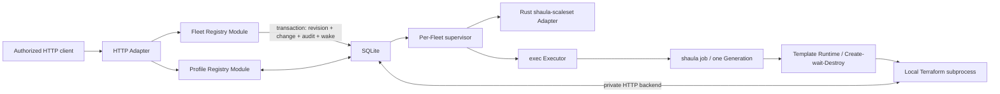

# Shaula v1 Fleet HTTP Control-Plane Specification

- Status: Draft
- Date: 2026-09-04
- Persistence: SQLite
- Reconciliation: asynchronous and level-triggered
- Template selection: exact immutable Revision
- Auth handoff visibility: explicit desired/observed Auth Revision Ref
- Observability: Day 0 OpenTelemetry

This specification extends the [Multi-Fleet Runner Scale Set Controller Specification](0001-shaula-runner-scale-set.md). It defines Fleet desired state and HTTP behavior；it does not expose direct Runner or Terraform endpoints on management HTTP. The separate private worker/state protocol is owned by [spec 0010](0010-lifecycle-worker-and-http-state-backend.md).

Template/Auth Profile publication, validation and retirement are normative in the [Profile HTTP Control-Plane Specification](0005-profile-http-control-plane.md). The provider-neutral execution seam is normative in the [Template Profile Runtime Specification](0004-template-profile-runtime.md). Kubernetes and Docker details live in their [Kubernetes](0003-kubernetes-runner-resource.md) and [Docker](0006-docker-runner-resource.md) specializations；neither becomes a Fleet HTTP or native daemon object model.

Related decisions：

- [ADR-0005: Manage Fleet desired state through HTTP and SQLite revisions](../ard/0005-manage-fleet-desired-state-through-http-and-sqlite.md)
- [ADR-0008: Keep platform capabilities in Terraform Template Profiles](../ard/0008-keep-platform-capabilities-in-terraform-template-profiles.md)
- [ADR-0009: Manage Template and GitHub Auth Profiles through HTTP and SQLite](../ard/0009-manage-profile-resources-through-http-and-sqlite.md)
- [ADR-0013: Require OpenID Connect for all HTTP access](../ard/0013-require-openid-connect-for-all-http-access.md)

## 1. Outcome

一个 `shaula serve` process 暴露同一 HTTP control Interface，并从 SQLite 管理全部 active Fleets。Template Profile 和 GitHub Auth Profile 也由该 API/SQLite 管理，但由 [Profile HTTP Control-Plane Specification](0005-profile-http-control-plane.md) 定义各自 typed resource contract。

一个 accepted Fleet mutation 只改变 durable desired state。它不等待 GitHub、Template Runtime 或外部平台副作用完成：



Fleet Registry 是 deep Module。HTTP routing、strict JSON、OIDC verification、browser session/CSRF、authorization middleware 和 response mapping 位于 driving Adapter；TLS termination 位于 deployment reverse proxy，SQLite schema/transactions/migrations 位于 Store Adapter。Registry Interface 负责 canonicalization、Profile reference resolution、authorization facts、optimistic concurrency、idempotency、Revision/Change/audit/outbox commit 和 Decommission rules。HTTP Adapter 不直接调用 Store、GitHub 或 Template Runtime，Registry 不接收未验证 OIDC wire claims。

Shaula 核心没有 Kubernetes/Docker client 或平台对象语义。Fleet Registry 只认识已验证的 Template Profile key/revision/digest 和 bounded inputs；所有 namespace、socket、endpoint、provider credential 等 binding 固定在 Template Profile Revision 中。

## 2. Required invariants

1. SQLite 的 current Fleet Revision 是唯一 Fleet desired-state source of truth；bootstrap 不含 `fleets`。
2. Fleet mutation 在返回成功前 commit；transaction 和 HTTP handler 中无 GitHub、Terraform 或平台副作用。
3. 每个 effective mutation 创建一个 durable Fleet Revision 和 Fleet Change；有效 no-op 只持久化 replayable response 与 audit，不创建 Revision/Change。
4. Committed Change 在 client disconnect、response loss、daemon crash 或 in-memory wakeup loss 后仍可发现并恢复。
5. Per-Fleet supervisor 周期扫描 outbox、due Change 与 `desired_revision > observed_revision`；in-memory notification 只是 latency optimization。
6. Fleet 精确 pin 一个 immutable Template Profile Revision/artifact digest。以后发布 Profile Revision 不改变 Fleet 或既有 Generation。
7. Fleet 的 desired/observed Auth 状态都是不可拆分的 Auth Revision Ref `(profile_key, revision)`；同 Profile credential promotion 不伪装成 Fleet revision change，跨 Profile replacement 则受零 Resource Occupancy gate 约束。
8. HTTP 不暴露 Runner Update。既有 Runner Generation 只有 Create 和 Destroy，并永久使用原始 Template Revision、Workspace 和 state。
9. Fleet Key 标识一个 incarnation；旧 incarnation 的 ETag/idempotency 不能修改新 incarnation。
10. Direct SQLite write、另一个 writer、bootstrap catalog override 或绕过 Registry 的 CLI 不受支持。
11. PAT/App private key 与 schema-sensitive Template bindings 可以明文存在各自 immutable SQLite Revision；任何管理 response、audit、error、log、OTel 或 diagnostic 不得包含原值或 prefix/suffix/hash/length 等可推导表示。
12. 普通 `fleet.write` 不能发布 Template artifact 或提交 conformance attestation；digest publication 与 `template.attest` 是独立的 high-trust capabilities。

## 3. Sources of configuration

### 3.1 Daemon bootstrap

`shaula serve --config` 只包含 process-wide native concerns：

- data directory、SQLite filename、artifact/workspace roots 和 ownership lock；
- loopback HTTP bind、mandatory OIDC 启动配置、principal authorization policy、body/rate/backlog limits；OIDC Provider/client 仅通过 clap/env 提供，见 [spec 0009](0009-mandatory-openid-connect.md)；
- supported IaC executable/install policy；
- Create/Destroy concurrency、timeouts、retry defaults；
- artifact upload/expansion/retention limits；
- OpenTelemetry 和 structured logging configuration。

Bootstrap 在 API ready 前验证并在 process lifetime 内冻结。它 MUST NOT 包含任何 Fleet、Template Profile、GitHub Auth Profile 或平台 binding catalog。缺失或不可用的 persisted resource 只降级其依赖者，不把 static file 变成第二真相源。

### 3.2 HTTP-managed resources

以下都是 SQLite-backed desired resources：

- Fleet；
- Template Profile；
- GitHub Auth Profile。

YAML、Git 或其他系统可以调用 HTTP，但只是 client。Template bytes 先通过 digest endpoint 发布为 immutable artifact，再由 Template Profile Revision 引用。GitHub App private key 通过 schema 2 Auth Profile PUT 写入 SQLite；PAT 与旧格式输入按 [spec 0018](0018-github-app-only-authentication.md) 拒绝。schema-sensitive Kubernetes/Docker bindings 通过 Template Profile PUT 写入其 immutable Revision。完整 Profile endpoints 和 state machines 见 [0005](0005-profile-http-control-plane.md)。

### 3.3 Runtime artifacts

SQLite（含 HTTP-backed Terraform state/locks/worker facts）、retained artifacts/inputs 和 unresolved emergency state 构成 spec 0010 的 durability set；普通 Workspace 副本可重建。Artifact bytes 不是 desired resource；只有 current `active_revision` 及其 durable activation provenance 可以接收新的 Fleet reference。激活由 [spec 0017](0017-automatic-template-activation.md) 的静态校验自动触发，conformance 为独立运行证据。已准入 Fleet 的旧 exact Revision/artifact/activation provenance pin 在引用清除前仍可用于其正常 reconcile、未来 Create、Destroy 与恢复。Workspace/state 只属于一个 Runner Generation，不能成为共享 Fleet configuration。

## 4. Resource model

### 4.1 Fleet Spec

Canonical desired Fleet representation 至少包含：

```json
{
  "key": "linux-x64",
  "spec": {
    "github": {
      "target": {
        "kind": "organization",
        "owner": "example-org"
      },
      "auth_profile_ref": "production-app",
      "scale_set_name": "shaula-linux-x64",
      "runner_group": "Default",
      "labels": ["shaula-linux-x64"]
    },
    "capacity": {
      "min_runners": 0,
      "max_runners": 20
    },
    "template_profile_ref": {
      "key": "kubernetes-linux-x64",
      "revision": 4
    },
    "template_inputs": {
      "size_class": "standard"
    }
  },
  "metadata": {
    "incarnation": "opaque-id",
    "revision": 7,
    "created_at": "timestamp",
    "updated_at": "timestamp"
  },
  "resolved": {
    "template_artifact_digest": "sha256:...",
    "template_conformance_attestation": {
      "id": "opaque-attestation-id",
      "subject_digest": "sha256:..."
    },
    "auth_desired": {
      "profile_key": "production-app",
      "revision": 3
    }
  }
}
```

Repository Target 使用 `{"kind":"repository","owner":"example-org","repository":"example-repo"}`。恰好一种 shape 可接受；fields 是 normalized GitHub names，不是 path fragment、URL 或 generic endpoint。

Template reference 支持 `{key, revision}` 或 bare key。必须先区分 reference 是否真的改变：

- 新建 Fleet，或 replacement **改变** Template key/revision：只接受当时的 current `active_revision` 及有效 activation provenance；bare key 在同一 admission transaction 解析并冻结 exact key/revision/artifact/activation ID。
- 既有 Fleet 保持原 exact pin（包括重新提交相同 bare key）：capacity-only、允许的 inputs-only replacement 或 no-op **不是新引用**，即使该 pin 不再 current Active 或 Profile 正在 Retiring，也保留原 exact subject，不重新解析成最新 Revision。
- 显式升级必须提交不同的 exact current Active revision，并通过 §6 的零占用 barrier；不能把 bare-key replay 当作隐式升级。

返回 representation 与 idempotent replay 都保留第一次解析的 exact subject；新 idempotency key 仍先检查 ETag。旧 pin 的 artifact/activation provenance integrity 与 retention 继续必需；本规则不允许新增 Fleet 引用旧 Revision或自动替换不可用材料。本文示例中历史 `template_conformance_attestation`、`attestation_id` 与相关 `attestation` 命名的 wire/storage 字段按 spec 0017 作为 opaque activation provenance 槽位保留；历史 ID 仍引用原证明，新自动激活 ID 引用 immutable activation audit，字段非空不表示 conformance 通过。

`auth_profile_ref` 是 operator 选择的 Profile key，不是 secret。新建或改变 Auth reference 的 admission 要求 Profile 已 Active、Target policy 匹配，并把当时的 current active revision 解析为 durable desired Auth Revision Ref `(profile_key, revision)`。同 Profile promotion 通过独立 Auth Handoff 推进 desired tuple；Fleet Spec 和 desired ETag 不因此改变。把 `auth_profile_ref` 换成另一个 Profile key 是 Fleet replacement：只有通过 §6 的零 Occupancy/effect barrier 才可 admission，并在同一 Fleet transaction 中把新 Profile 的 current active revision 固定为新的 desired tuple。

Template Profile 固定 executable artifact、engine、provider bindings、provider dependency policy、manifest-derived `platform`/`bindings_contract`、activation provenance 和可用 Fleet input schema。Fleet 只能提交 schema 允许的 bounded values/finite aliases；不能提交 artifact bytes、script、image URL、raw user-data、provider、module、executable、argv、environment、filesystem path、platform endpoint/binding、platform identity、attestation 或 credential。

本地 admission 不声明 GitHub access 此刻可用。Fleet Change 进行 bounded authenticated reads；`401`、`403` 和 access-filtered `404` 形成 access Condition，不能作为 Scale Set 不存在的证据。

### 4.2 Fleet Revision

每次 effective desired mutation append immutable Fleet Revision 并原子推进 desired head。Revision 在一个 Fleet incarnation 内单调递增且不回退。Revision 固定：

- canonical Fleet Spec 和 normalized GitHub Target；
- requested Auth Profile key 及 admission-time desired Auth Revision Ref；
- exact Template Profile key/revision/artifact digest/activation provenance；
- normalized Template inputs 和 input digest；
- authenticated actor、reason 和 timestamps。

Fast successive capacity changes 可以 supersede 尚未 observed 的中间 Revision；history 保留 audit，已经启动的 Runner Operation 使用其原始 revision 完成或安全 cleanup。

相同 canonical Spec 和相同 resolved Template Revision/digest/attestation 是 no-op。Profile status、同 Profile credential promotion、Fleet Status 或 Assigned Demand 变化不产生 Fleet Revision；跨 Profile Auth replacement 会产生。

### 4.3 Fleet Status

Runtime status 与 desired representation 分离：

```json
{
  "fleet_key": "linux-x64",
  "desired_revision": 7,
  "observed_revision": 7,
  "phase": "Reconciling",
  "dependencies": {
    "template_profile": {
      "key": "kubernetes-linux-x64",
      "revision": 4,
      "artifact_digest": "sha256:...",
      "attestation_id": "opaque-attestation-id",
      "state": "Active"
    },
    "github_auth": {
      "desired": {"profile_key": "production-app", "revision": 3},
      "observed": {"profile_key": "legacy-app", "revision": 5},
      "handoff_state": "Blocked"
    }
  },
  "conditions": [
    {"type": "SpecAccepted", "status": true},
    {"type": "TemplateActive", "status": true},
    {"type": "AuthRevisionObserved", "status": false, "reason": "OwnershipProofFailed"},
    {"type": "GitHubAccessVerified", "status": false},
    {"type": "OwnershipVerified", "status": true},
    {"type": "ListenerReady", "status": false},
    {"type": "Converged", "status": false}
  ],
  "capacity": {
    "assigned_demand": 4,
    "target": 4,
    "effective": 3,
    "occupancy": 4
  },
  "last_error": null
}
```

`observed_revision == desired_revision` 表示 supervisor 已分类该 Fleet Revision，并持久化下一步 intents 或 blocking Condition；不表示 capacity 已收敛。

`observed_auth_ref == desired_auth_ref` 按完整 `(profile_key, revision)` 比较，表示新 credential 的 authenticated access context 与 read-only ownership/absence classification 已持久化。它不表示 Scale Set 已 create/adopt、ID 已绑定、session 已建立或 capacity 已收敛；这些副作用只由普通 Fleet reconciliation 执行。tuple 不同必须作为独立、可恢复、可告警的 Auth Handoff lag 暴露，不能被 Fleet `observed_revision` 掩盖。

Fleet phase 是 `Pending`、`Reconciling`、`Ready`、`Degraded`、`Decommissioning` 或 `Decommissioned`。Conditions 使用 stable finite reason codes 和 sanitized summaries，不含 provider-specific object status。

`Pending` 只表示当前 Revision 尚未由 supervisor 分类；已发生的 ownership、authentication、session 或 listener failure 必须持久化为 `Degraded` / blocking Condition，并透传有限 `last_error`，不得长期用 `Pending` 或固定 `last_error: null` 隐藏失败。下一次成功分类可恢复并清除旧错误，但成功的 session 不能掩盖仍存在的 ownership 或 capacity block。

`Ready` 要求当前 Fleet head 与 auth context 一致、Scale Set ownership 已证明、完整当前 session 已持久化且 listener 已可调度；仅 Profile Active、仅 Scale Set ID 或仅 credential handoff 都不满足。`Ready` 不等于 runner 数量非零或容量已经收敛：当 `min_runners=0`、Assigned Demand 为 0 时，`Ready`、target/effective capacity 均为 0 是正常状态。`Converged=true` 同时要求 `phase=Ready`、`observedRevision=desiredRevision`、可解码的当前 capacity policy、`effective=target` 和 `occupancy=target`。尚未补足的容量或仍在清退、继续占位的 Generation 都不得仅凭 `Ready` 宣告收敛。

Runtime observation 同时 CAS Fleet incarnation、desired Revision、mutation fence 与当前 session epoch；捕获旧 Revision 的任务不能用新的 head 令牌替旧 spec 记为 Ready。状态与对应 Fleet Change 的 Running/Blocked/Succeeded 进度在一个短 transaction 中推进，已经完成的 Change 不因后续 listener failure reopen；DELETE/tombstone 不能被迟到的观测改回普通运行 phase。

### 4.4 Fleet Change

Fleet Change 跟踪一个 accepted Fleet mutation 的异步处理，与 Profile Change、Auth Handoff acknowledgement 和 Runner Operation 不同：

```text
Pending -> Running <-> Blocked
            |-----> Succeeded
            |-----> Failed
            \-----> Superseded
```

`Blocked` 非终态，覆盖 Busy Runner、`JobStillRunning`、ownership uncertainty、Quarantine、Profile unavailable、Auth Handoff lag 或其他 dependency。每个 non-terminal Change 持久化 attempt、lease 和 `next_retry_at`；periodic scan 可从 `Blocked` 恢复。

Completion predicate 有界：

- Create：ownership verified、所需 Auth Revision Ref observed、listener established，并在一个 transaction 中记录 Fleet observed revision、所采用 demand checkpoint 和由此派生的 lifecycle intents；不等待不断变化的 capacity 永久静止。
- Capacity replacement：记录 observed Fleet revision、demand checkpoint 和相应 Create/Destroy intents。
- Template replacement：仅在 occupancy 和 active Runner Operations 为零时 admission；新的 current active exact Revision/attestation 被 supervisor observed 后成功。
- Decommission：所有 owned Generations terminal、supervisor stopped、tombstone durable 后成功。

后续 Assigned Demand 触发新的 level reconcile，不 reopen 已完成 Change。同 Profile Auth promotion 触发独立 durable handoff；跨 Profile replacement 是受零占用 gate 保护的 Fleet mutation。

## 5. HTTP Interface

v1 base path 是 `/api/v1`：

| Method | Path | Meaning |
| --- | --- | --- |
| `GET` | `/fleets` | Paginated active Fleet summaries |
| `PUT` | `/fleets/{fleetKey}` | Conditionally create or fully replace desired Fleet state |
| `GET` | `/fleets/{fleetKey}` | Canonical desired Fleet Spec and strong ETag |
| `GET` | `/fleets/{fleetKey}/status` | Runtime status including Auth desired/observed rollout |
| `DELETE` | `/fleets/{fleetKey}` | Request safe terminal Decommission |
| `GET` | `/fleet-changes/{changeId}` | Query asynchronous Fleet Change |
| `GET` | `/livez` | Process liveness without resource details |
| `GET` | `/readyz` | Ability to authenticate management calls, commit and schedule |

同一 server 还提供 `/template-artifacts`、`/template-profiles`、`/github-auth-profiles` 和 `/profile-changes` endpoints；其 request/response 和权限以 [0005](0005-profile-http-control-plane.md) 为准。

v1 不提供 `PATCH`、writable status、raw Runner lifecycle、manual reconcile、force delete、operation cancellation、remote Terraform invocation 或平台对象 endpoint。

### 5.1 Conditional writes

- Create 使用 `If-None-Match: *`。
- Replacement 和 Decommission 要求 desired Fleet `GET` 返回的 strong ETag 进入 `If-Match`。
- 缺失 precondition 返回 `428 Precondition Required`。
- stale precondition 返回 `412 Precondition Failed`，只带 current non-secret revision metadata。
- immutable identity 变化返回 `409 Conflict`。
- syntactically valid but inadmissible Spec 返回 `422 Unprocessable Content`。

Desired ETag 只包含 opaque Fleet incarnation/revision，不含 status、secret 或同 Profile Auth promotion revision。Status churn 和同 Profile promotion 不造成虚假 desired-state conflict；跨 Profile replacement 是真实 Fleet mutation并推进 ETag。

Versioned resource GET 和 mutation 的 `202` / no-op `200` response 同时返回 `Shaula-Resource-Version`，其值为 origin strong ETag 的完整 quoted value（例如 `"opaque-id:7"`）。该 header 承载用于条件写入的 opaque resource version；压缩代理可能将 representation `ETag` 改成 `W/"opaque-id:7"`，但 MUST 原样转发 `Shaula-Resource-Version`。Client 优先把读取 snapshot 的 `Shaula-Resource-Version` 原样放入 `If-Match`；旧 server 缺少该 header 时，仅可 fallback 到 strong ETag。不得去掉 `W/` 将 weak ETag 当作 strong validator。缺少可用版本时拒绝发起 replacement / decommission；stale version 仍返回 `412`。

### 5.2 Idempotency

每个 mutation 需要 bounded `Idempotency-Key`，scope 包含 authenticated principal、method 和 canonical Fleet resource。Canonical request hash 包含 method、resource、normalized body 和 normalized precondition；key 本身不是 credential，仍不得写入 log/telemetry。

Transaction 内 replay lookup 在 concurrency check 前：

- 相同 key/hash 返回原 status、headers、resolved exact Template Revision/attestation、admission-time desired Auth Revision Ref 和 Fleet Change；
- 相同 key、不同 request 返回 `409 IdempotencyConflict`；
- 新 key 才执行 conditional validation 与 commit。

No-op PUT 在同一 transaction 中 append audit 并保存 `200 OK` replay response，不创建 Revision/Change。新 idempotency key 仍先检查 ETag 再比较 no-op，避免 stale client 借 no-op 绕过 concurrency。

### 5.3 Asynchronous responses

Effective mutation 仅在 SQLite transaction commit 后返回 `202 Accepted`，包含新 desired ETag、Fleet location 和 Fleet Change location，并明确 acceptance 不等于 external convergence。Request cancellation/disconnect 不取消 committed Change。

有效 identical PUT 返回 durable/replayable `200 OK`。Decommission 完成后 desired `GET` 返回 `410 Gone` 与 audit-safe tombstone metadata；exact DELETE retry 仍由 idempotency record 返回原结果。新 mutation key 不能 revive terminal incarnation。

List endpoint 使用 bounded page size 和 opaque cursor。Tombstone 默认不在 active list；未来 audit view 需要独立 authorization。

## 6. Mutable and immutable behavior

Fleet full replacement 不意味着任意 Update：

- `capacity.min_runners` / `max_runners` 可在 active 时变化，要求 `0 <= min <= max`。max 可以暂时低于已有 Occupancy/Busy；禁止新增 Generation，安全清退直到满足新 max，不强杀 Busy 或谎报 Converged；
- Fleet Key、typed GitHub Target、Scale Set name 和 runner group 在一个 incarnation 内 immutable；`github.labels` 是可更新的 Scale Set 路由配置，按 §6.1 收敛；
- `auth_profile_ref` 可替换，但必须零 Occupancy，且无 non-terminal worker/Runner Operation、unresolved Create-start handover、acquisition 或 mutating GitHub effect；Target 与 Scale Set identity/ID 不变。既有 idle session/只读 poll 本身允许存在，由提交后的 Auth Handoff quiesce/release；
- exact Template pin 的实际改变只接受 current Active subject，并要求零 Occupancy、无 non-terminal worker/Runner Operation 或 unresolved start；未改变的 pin 按 §4.1 保留；
- `template_inputs` 的 normalized value 变化也要求相同零占用 barrier，以保持 Fleet 同质；原 inputs 的重排/等价 canonical no-op 不触发替换。并发 Create claim 与该检查必须在同一 admission/Store fence 下排序，不能在事务外先数 Occupancy 再提交；
- Template Profile engine、artifact、manifest-derived `platform`/`bindings_contract` 和 bindings 随 exact Revision 固定，不能由 Fleet field 单独更新；
- incompatible identity 需要新 Fleet；
- capacity/profile replacement 只生成未来 Create/Destroy intents，不调用 Runner 或 Scale Set Update。

上述 reference/input barrier 与 Create/Acquire authorization 共用 side-effect admission gate；不能把“先人工停掉 session”作为 Auth Handoff 可达性的隐含要求。未改变的 Auth key 不因 capacity/no-op mutation 回退其已持久化 desired Auth ref。

Auth Profile 内同 numeric App identity 的 credential、policy 或 binding publication 不是 Fleet replacement，并须通过 spec 0011 的 identity/coverage 检查。异步 validation 成功后，Profile active head 推进并触发 section 7 handoff；Fleet key、Fleet Revision 和 desired ETag 保持不变。跨 Profile replacement 会产生 Fleet Revision/Change，但复用同一 handoff protocol。

### 6.1 Mutable Scale Set labels

已有 Fleet 可以通过同一 conditional `PUT` 增加、删除或替换 `github.labels`。它使用既有 `fleet.write`、CSRF、`If-Match` 和 idempotency 检查；有效修改提交新的 immutable Fleet Revision、mutation fence、Change、audit 和 wake marker 后返回 `202`。只修改 labels 不要求零 Occupancy，允许 Busy jobs 存在，不改变 Fleet incarnation、Scale Set identity/ID、Auth 或 Template pin。混合修改仍须满足各字段原有 barrier；旧 ETag 返回 `412`，accepted request replay 不重复提交。

显式 labels 使用现有 GitHub `Customer` wire type；空列表恢复以 Scale Set name 为名的 `System` fallback label，不发送含义不明的空 PATCH。比较使用完整 `(name, normalized type)` 集合，忽略顺序和重复项；删除 label 必须收敛，不能仅检查 desired 是 observed 的子集。

普通 Fleet supervisor 独占 labels 收敛。首次 create/adopt 仍要求完整 identity、labels 和 inventory 兼容；同名对象或仅保存了候选 ID 不构成修改授权。只有持久化的 proven-owned ID、当前 authenticated identity lookup 和已知 Runner inventory 均匹配时，才允许对该 ID 发出仅含 labels 的 Scale Set PATCH。Target、name、runner group、fingerprint 或未知 Runner 冲突仍阻塞，不能借更新 labels 接管未知 Scale Set。

PATCH 前取得与 Fleet PUT/DELETE、session/Acquire 共用的 per-Fleet exclusive effect gate，重新检查 captured incarnation/revision/fence、deletion marker 和完整 observed Auth Context，并持久化非 `Adopted` 的 pending ownership state。SQLite transaction 不跨 HTTP。更新未确认时禁止新 acquisition/Create；已经运行的 jobs、acquired facts 和 Generations 保留，不能为 labels 变化重建或强杀 Runner。

PATCH response 不是收敛证明：必须 authenticated readback 同一 ID、identity、完整 labels 和 inventory 后才恢复 `Adopted`，随后按原 session 协议恢复 Ready。timeout、丢失 response 或失败保持可见 pending/Degraded reason；下次 reconcile（包括重启后）先 readback，再决定是否重试当前 desired labels。新 Revision supersede 旧 desired，DELETE 阻止新的 PATCH；不宣称 GitHub 提供 remote mutation fence，也不保证已经排队或分配的 job 在更新瞬间重新路由。

## 7. Auth Revision handoff

[spec 0011 §5](0011-multi-account-github-authentication.md#5-publication-handoff-and-isolation) 为同 App 的 policy/binding publication 定义 exact Resolved Auth Context。它保留本节完整 Auth Revision Ref、quiesce 与 ownership/effect 边界。[Spec 0018](0018-github-app-only-authentication.md) 进一步要求所有 handoff、session 和 retained execution 都使用 schema 2 GitHub App 与完整已验证 context；旧格式和 reference-only authorization 已停用，历史证据保留且不能作为执行 fallback。

Auth Revision Ref 是不可拆分的 `(profile_key, revision)` tuple。每个 Fleet 有 durable `desired_auth_ref`、nullable `observed_auth_ref`、handoff state、attempt、lease、`next_retry_at` 和 sanitized reason；所有 GitHub intent/effect 记录其使用的 exact tuple，不能仅凭裸 revision number 关联。

Desired tuple 有两个合法来源：同 Profile Candidate promotion 将每个 dependent Fleet 从 `(P,n)` 推进到 `(P,n+1)`，写 outbox/Profile Change linkage但不产生 Fleet Revision；零 Resource Occupancy 的 Fleet replacement 将 `auth_profile_ref` 从 `P` 改为 `Q`，解析 `Q` 的 current active revision，并与 Fleet Revision/Change 原子提交 `(Q,m)`。

两种来源都执行同一个可恢复 Auth Handoff：

1. Fleet supervisor 关闭新的 job acquisition，并等待跨越 quiesce fence 的 acquisition 返回或被分类。Decommissioning Fleet 保持 acquisition 永久关闭，但允许 handoff 以 cleanup-only mode 继续。
2. 使用 desired tuple 的 v2 GitHub App、TargetPolicy 与冻结 account binding 构造 matching Rust `shaula-scaleset` client；不尝试旧格式、旧 revision 或另一 Profile。
3. 已绑定 Scale Set ID 的 Fleet 只执行 authenticated read-only lookup，证明 persisted Target、runner group、Scale Set name/ID/fingerprint 匹配，或持久化可信的 absence classification。尚未绑定 Scale Set 的 Fleet 只验证 Target/runner-group access 并记录 authenticated context。Handoff 本身绝不 create/adopt Scale Set、写或改 Scale Set ID、创建 session、获取 JIT。
4. 只有相应 access/ownership/absence classification 与 exact numeric Target identity 已验证，且 captured fence/desired context 仍匹配时，才在一个 transaction 中原子推进 `observed_auth_ref` 与 verified exact context，并唤醒普通 Fleet reconciliation。ref equality 本身不是 handoff 成功或授权。
5. 普通 Fleet reconciliation 独占 create-or-adopt、Scale Set ID/fingerprint binding 和 session establish/replace。Active Fleet 只在 desired/observed ref 与已验证 context 匹配且新 session ready 后恢复 acquisition；Decommissioning Fleet 不建立 acquiring session，只使用 v2 observed tuple/exact context 执行 inventory/removal 等 cleanup。旧格式或缺失 context 的 retained references 必须 fail closed 并保留证据。

Production GitHub access 使用 Rust `shaula-scaleset`。测试固定一个 reviewed `github.com/actions/scaleset` Go commit 作为协议与行为 oracle；Go oracle 只运行 conformance/differential suites，不被 production daemon 链接或启动。

Handoff 无法完成时 Fleet 保持 quiesced/Degraded，完整 desired/observed tuples 保持不同并由 durable retry 恢复。Candidate validation 失败则不 promotion，旧 active revision 和 Fleet desired tuple 都不改变；这叫 staged activation，不是 runtime fallback。

Auth Revision 仅在不再是任何 Profile desired/active/observed head 或 Fleet desired/observed tuple，且不存在 in-flight GitHub effect/session、Decommission cleanup 或 recovery record 引用时才可 GC。`Blocked` 是 non-terminal reference：它不能 acknowledgement、释放旧 observed tuple 或使新 desired tuple 被回收。

## 8. Decommission semantics

HTTP `DELETE` 是 safe Fleet Decommission，不是 row deletion：

1. 取得 Fleet exclusive side-effect admission gate；一个 transaction 写 deletion marker、increment mutation fence，并提交 Fleet Revision/Change/audit/wake marker。
2. 立即禁止新 Create 并永久停止 job acquisition；不得取消 durable Auth Handoff，后者只能以 cleanup-only mode 前进。
3. 等待所有 in-flight acquisition 返回或分类后写 `AcquisitionStopped=True`。Inventory 和 Runner removal 使用 observed Auth Revision Ref 的 non-acquiring cleanup path；handoff 不得在 Decommission 中启动 listener、Create/adopt、JIT 或改写 Scale Set ID。
4. 只有此后才让每个 owned Generation 进入正常 Retirement 和 GitHub removal safety gate。
5. `JobStillRunning` 持续 Blocked/retry；只有对仍绑定且可认证读取的 Scale Set 返回 runner-specific already-absent 时才可继续。Scale Set 本身 missing、access-filtered `404` 或 `ScaleSetMissingWithResources` 不能作为 Busy-safe proof，必须保持 Blocked/Quarantined。
6. 由 current Lifecycle Worker 使用原始 Template/runtime/inputs 和 database state 运行 Destroy，遵守 spec 0010 的 process fence 与 completion/seal。
7. unknown remote Runner、Quarantine、missing state 或 unresolved Busy safety 使 Change 保持可见 `Blocked`，不得 purge。
8. 全部 owned Generations terminal、cleanup Auth references/recovery records 清除后停止 supervisor，写 Decommissioned tombstone，并保留空 GitHub Scale Set。

每个 Create claim 在 JIT/Create-start 前重新验证 mutation/deletion fences；worker spawn handover 按 spec 0010 §3，在确认 spawn 或不能再 spawn 前不让 DELETE 越过 gate。SQLite transaction 不跨 IPC 或 child lifetime；uncertain handover 不能按 timeout 当作未启动。旧 claim 可证明未开始时 Superseded，否则保守 cleanup。

Decommission 在 v1 不可逆。Tombstone retention 期间 Fleet Key reuse 被拒绝；无 force path 可遗忘可能残留的基础设施。

## 9. SQLite durability and recovery

Conceptual Fleet schema 包含：

- `fleets`：key、incarnation、desired head、mutation fence、deletion marker；
- `fleet_revisions`：canonical Spec、normalized immutable Target/Scale Set identity、requested Auth Profile key、admission-time desired Auth Revision Ref、exact Template Revision/digest/attestation、input digest、actor/reason/timestamps；
- `fleet_status`：observed revision、phase、Conditions、capacity summary；
- `fleet_auth_handoffs`：desired/observed `(profile_key, revision)` tuples、access/ownership context、state、attempt、lease、retry；
- `fleet_changes`：mutation kind、target revision、state、lease、retry 和 sanitized result；
- `scale_set_state`：candidate/bound ID 与单独的 `owned_scale_set_id` 证明、identity fingerprint、ownership/pending state。owned marker 只由成功 create/adopt 建立，限同一 ID/identity 保留，重新绑定时清除；迁移只从明确 `Adopted` 且正数 ID 的旧记录回填，旧 blocked/candidate ID 必须重新证明归属；
- `reconcile_outbox`、`idempotency_records`、append-only `audit_records`。

Generation/Worker Claim、GitHub observation 和 tombstone records 由 Fleet Key namespace，保留 exact material refs、protected opaque result、数据库 state/locks 与最小 side-effect/terminal facts；字段和恢复契约由 spec 0010 定义，不建立中央 saved-plan command ledger。核心 schema 不含 namespace、Pod、Secret、container、socket 或其他平台 object columns。

Template/Auth Profile typed tables、plaintext credential revisions、attestations、artifact references 和 Profile Changes 由 [0005](0005-profile-http-control-plane.md) 定义。Fleet transaction 的新 Template/Auth reference 只接受相应 current `active_revision`，并通过 reference integrity 防止 desired/observed/in-flight/Decommission/recovery 所需的旧 Revision 或 attestation 提前 retire/GC。

一个短 transaction 完成 precondition、reference resolution、revision append、desired-head change、Fleet Change、audit、outbox 和 idempotency response。它不跨 artifact upload/validation、network、filesystem materialization 或 subprocess。

Commit 后 best-effort notification wake supervisor。Startup/periodic scans 处理 outbox、`desired > observed`、Auth tuple handoff lag 和 due non-terminal Changes。Change 的 scheduling lease 可在 crash 后 expire/recover；Worker Claim 与 Terraform lock 不能据此抢占，须先满足 spec 0010 的 descendant-fencing 证明。丢通知/response 不遗忘 accepted desired state。

Backup/restore 使用 spec 0010 的 SQLite/retained-material/emergency-state consistency set。单 daemon ownership lock 禁止第二 writer，但不提供 HA 或对 host administrator 的安全隔离。

## 10. Startup and readiness

Startup 顺序：

1. 初始化 local structured logging 和 OpenTelemetry SDK。
2. 验证 bootstrap、HTTP safety、filesystem roots、IaC engines 和 limits；从 clap/env 读取 mandatory OIDC Provider/client 配置并完成 discovery/JWKS validation，失败时在 listener/workers 启动前非零退出；不加载 static resource catalogs。
3. 获取 data-directory ownership lock，migrate SQLite，检查 artifact/workspace consistency。
4. 启动 Fleet/Profile Registries、管理 HTTP、独立内部 control/state backend、Executor/budgets 和 periodic scanners；backend 未 ready 时不 launch worker。
5. 从 SQLite 恢复 Profile/Fleet Changes、Auth Handoffs、Generation/Worker Claims 和 locks；按 spec 0010 先恢复/fence 旧 descendants。
6. 为每个 Fleet 独立验证其 exact pinned、仍被 retention/reference rules 保留的 Template Revision/artifact/activation provenance，以及完整 Auth desired/observed tuples；重启不要求旧 pin 仍是 current Active。随后由普通 reconciliation 恢复 create-or-adopt、ID binding 与 session。

`/livez` 与 `/readyz` 的 HTTP 访问均先通过 spec 0009 的 OIDC authentication。`/livez` 的业务检查只检查 daemon supervision loop，不访问 SQLite、GitHub、IaC、平台或 OTel exporter。`/readyz` 仅在 authenticated control plane 能 durable commit 与安全调度时 true；OIDC service degradation 的 readiness 行为见 spec 0009 §6。Ownership-lock loss、shared storage failure 或 scheduler termination 让 readiness false 并停止新 effects。

Profile/Fleet invalid、Auth Handoff lag、listener failure 或外部依赖 failure 只降级相应资源/消费者。它们不让整个 API unready，也不阻塞无关 Fleet recovery。

## 11. Security

本节只覆盖管理 HTTP；独立内部 worker/control/state 认证由 spec 0010 定义。v1 假设一个 administrative security domain，不声明 tenant isolation。若增加 multi-tenancy，object authorization、所有 Store query、artifact ownership 和 metric/log isolation 都需新 ADR。

- v1 只支持 loopback listener；配置 non-loopback address 必须在 startup fail closed。远程访问由 reverse proxy 终止 TLS；Shaula 按 [spec 0009](0009-mandatory-openid-connect.md) 执行 mandatory OIDC、authorization 与 audit。Native inbound TLS/mTLS 仍不在范围内。
- Authorization 至少区分 `fleet.read`、`fleet.write`、Fleet retirement、`template.read`、高权限 `template.publish`、独立高权限 `template.attest`、`auth.read`、高权限 `auth.write` 和 Auth retirement。
- 所有 UI、静态资源、API 和 health routes，无论经 proxy 还是 direct loopback，均必须验证 OIDC-derived session 或相应 API access token；仅 exact login/callback GET 有匿名例外。缺失/无效身份的 API 请求返回 `401`，有效身份缺少权限返回 `403`；body actor、caller identity/scopes headers 和 legacy backend token 均不建立身份。Cookie mutations 必须通过 Origin/CSRF 校验，全部响应 private/no-store；loopback 不是 tenant boundary。
- Strict JSON 拒绝 unknown fields，并限制 body、strings、lists、pagination、rate 和 backlog。
- Fleet JSON 不接受 PAT、App private key、derived token、JIT、provider credential、platform identity/binding、conformance attestation、raw endpoint 或 executable；它只引用 typed Target、Auth Profile key、current active exact Template Revision 和 bounded inputs。
- Auth Profile PUT 只接受 v2 GitHub App 的 write-only private key；Template Profile PUT 可以携带 binding schema 标记为 sensitive 的 write-only value。SQLite 允许把两者原始 plaintext 存入对应 immutable Revision。历史 PAT bytes 保留且继续受同等 secret boundary 保护，但不能作为输入或执行凭据。所有 GET/list/status/revision/attestation、Fleet response、audit、errors、logs、traces、metrics 和 panic/diagnostic middleware 永不回显 request body、secret、prefix/suffix/hash/length 或 parser content。
- GitHub control-plane credentials 只交给 GitHub Access Module，永不进入 Template/Terraform/Runner；sensitive Template bindings 只交给 exact Revision 获准的 IaC child，永不进入 Runner/workflow。
- SQLite main DB、WAL/SHM、online copy、backup、migration artifact、crash dump 和 retention/disposal 都是 credential-grade boundary；application-level encryption 不是 v1 requirement，host/filesystem/backup protection 是 deployment responsibility。
- Template artifact upload 是高权限 remote code publication。Server streaming 验证 declared digest/length、archive containment、path/link/device、expansion limit 和 atomic publication；普通 Fleet caller 只能选择已有 durable activation provenance 的 current Active Revision，不能注入 code 或自行 attest。
- GitHub Target 只规范化为支持的 `github.com` organization/repository form；不 fetch caller-controlled generic URL。
- IaC child 只接收 Generation-specific JIT、Profile provider/bootstrap material，以及 spec 0010 明确允许的 scoped HTTP state credential；不接收 worker control token、管理 HTTP/OIDC credential、GitHub App/PAT/derived token、SQLite access 或 daemon full environment。
- Runner Resource 只接收 JIT。Per-job `GITHUB_TOKEN` 与 workflow 显式选择的 `${{ secrets.* }}` 属于 GitHub/workflow policy，不是 Fleet API 或 Shaula auth data。
- 管理 API/telemetry 不输出 JIT、tfvars/state、sensitive bindings、provider raw output、Authorization、idempotency key 或 secret-derived identifier。内部 worker/state listener 不属于该管理 Router，不允许由 proxy 暴露或用管理身份替代其 scoped capabilities。

## 12. Day 0 observability

Instrumentation 从首个 HTTP implementation 开始存在。Required spans 至少包含：

- `shaula.http.request`，使用 route template 而非 raw path；
- `shaula.fleet.registry.validate`、`shaula.fleet.registry.commit`；
- `shaula.fleet.change.reconcile` 和 state transition；
- Auth Handoff quiesce、access/ownership proof、tuple acknowledgement，以及后续普通 reconcile 的 session handoff；
- request span 到 async Fleet Change、Profile Change 和 Runner Operation traces 的 links。

Incoming W3C trace context 仅在 strict validation 后使用，外部 baggage 丢弃。Shaula 生成 request/Change IDs；audit 不依赖 client trace ID。

HTTP spans 可记录 method、route template、response class、authenticated role category、safe revision 和 stable error code。不得记录 request/response body、Authorization、idempotency key、raw path/query、arbitrary user-agent、credential identity 或 binding values。

Metrics 至少覆盖 bounded request count/duration、admission outcome、precondition/idempotency conflict、active Fleet、Fleet desired/observed lag、Auth desired/observed tuple lag、Change age/state 和 reconcile wake delay。Attributes 使用 finite allowlist；Fleet/Profile key、revision、digest、actor、Target、Change ID、Runner/job、URL、path 和 error text 一律排除。

OTLP failure 不使 committed mutation 失效或阻塞 reconcile。Rate-limited local logs 和 bounded in-process counters 独立报告 degradation。SQLite audit 是 mutation truth；OTel 可 sampled/lost，不能作为唯一 audit。

## 13. Failure behavior

| Failure | Required behavior |
| --- | --- |
| Invalid/unauthorized request | Reject before desired-state mutation or external effect |
| Duplicate idempotency retry | Return original resolved representation/Change；changed replay conflicts |
| Stale ETag | Return `412`；do not merge or overwrite |
| SQLite commit fails | No accepted Revision/Change/effect exists |
| HTTP response lost after commit | Retry resolves through idempotency record |
| In-memory wakeup lost | Outbox/periodic scan eventually observes revision |
| Daemon crashes after commit | Startup resumes Fleet Change/Auth Handoff/Runner Operation from SQLite |
| Client disconnects after commit | Continue asynchronous reconciliation |
| Template key has no Active revision | Reject every new or replacement Fleet reference；an already-admitted Fleet may continue from its retained exact pin without current Active |
| Pinned Template revision/artifact/attestation unavailable or invalid | Block affected Fleet closed and preserve evidence；never substitute a newer revision |
| Auth Candidate validation fails | Keep prior active revision and do not advance dependent desired Auth tuples |
| Auth Handoff cannot prove access/ownership | Keep dependent Fleet quiesced/degraded with explicit desired/observed tuple lag；retain all referenced revisions and never fallback |
| Unbound Fleet or authenticated Scale Set absence during handoff | Record access/absence context only；ordinary Fleet reconciliation exclusively decides create-or-adopt, ID binding and session |
| GitHub `401`/`403`/access-filtered `404` | Publish access Condition；never create on assumed absence |
| One Fleet supervisor retry storm | Circuit-break/degrade that Fleet；bounded scheduler preserves others |
| Busy Runner blocks Decommission | Wait/retry removal；never Destroy early |
| Unknown Runner/Quarantine/missing state | Keep Decommission visibly Blocked；never claim success/purge |
| Shared SQLite/data set unsafe | Mark control plane unready and stop new mutations/effects safely |
| OTLP exporter fails | Continue commit/reconcile with bounded local diagnostics |
| Admission/backlog limit reached | Return `429` with bounded `Retry-After`；do not create unbounded Changes |

## 14. Acceptance criteria

Implementation is incomplete until：

1. 两个使用不同 exact Template Profile Revisions 的 Fleets 通过 HTTP 创建，并在没有 bootstrap resource catalogs 的情况下跨 daemon restart 恢复。
2. Fleet、Template Profile 和 GitHub Auth Profile 都从 HTTP/SQLite 管理；bootstrap 若试图定义这些资源或平台 bindings，validation fail closed。
3. 每个 effective Fleet mutation 原子提交 Revision、Fleet Change、audit、outbox 和 idempotency result；HTTP handler 在 `202` 前不调用 GitHub、Terraform 或平台。
4. Lost response retry 返回原 resolved exact Template Revision；altered replay conflict。并发同 ETag 请求一胜一 `412`，status/Auth Handoff churn 不改变 desired ETag。
5. 新 bare/exact reference 冻结 current Active subject；旧 pin 的 capacity/no-op PUT 在 promotion/retirement 后仍保留 exact pin，拒绝新 Fleet 借此引用旧 Revision。测试涵盖 ETag、lost-response replay 与并发 activation。
6. Fleet 无法提交 platform binding、provider credential 或 executable；conceptual Fleet/Runner schema 无平台 object columns。
7. Same-Profile promotion 和 zero-occupancy cross-Profile replacement 都写入完整 desired Auth Revision Ref，经过同一 quiesce/read-only proof/context handoff 后才推进完整 observed tuple；handoff 不 create/adopt、不写 ID、不建 session。
8. Handoff crash 从 SQLite 恢复；失败 Fleet 暴露完整 tuple lag、保持 quiesced/degraded，且 `Blocked` 不释放任一 desired/observed/in-flight/Decommission/recovery reference。
9. v2 GitHub App private key 与 sensitive Template bindings 以 plaintext SQLite bytes 跨重启可用；历史 PAT/旧格式 bytes 保留但不得执行。任何 Fleet/Profile GET、status、revision、attestation、audit、error、log、trace、metric 或 diagnostic 均不含原文或可推导表示；受支持凭据各自只进入 GitHub Access Module 或 exact-Revision IaC / spec 0020 固定 bootstrap child，绝不进入 Runner/workflow。
10. Template artifact publication 只有 `template.publish` 可执行并授权静态校验后的自动激活，conformance attestation 只有 `template.attest` 可提交且不改变激活状态；Fleet 只能选择由 manifest 派生 platform 且已有 durable activation provenance 的 current Active Revision。
11. Capacity-only replacement 不 Update Runner/Scale Set；降低 max 到 Busy/Occupancy 以下只阻止新建。Template inputs/pin 或 Auth-key 改变受事务化零占用/effect barrier；idle session 的 cross-Auth replacement 可达并经 Handoff quiesce。
12. DELETE/Create race 使用 mutation fence：commit 后不 spawn 新 Create-capable subprocess；uncertain older Create 进入 cleanup。
13. DELETE 永久停止 acquisition 但允许 cleanup-only Auth Handoff，等待 `JobStillRunning`，只 Destroy known owned Generations，保留 Scale Set 并写 tombstone；unknown/Quarantine/Auth handoff failure 保持 Blocked。
14. Lost wakeup、crash after commit 和 due `Blocked` Change 都从 periodic scan/lease recovery 前进。
15. 一个 blocked/retrying Fleet 不影响另一个 healthy Fleet 的 HTTP management、session 或 lifecycle；shared unsafe storage 才使 global readiness false。
16. Restart 从 spec 0010 consistency set 与 exact engine policy 恢复 supervisors、Changes、Auth Handoffs 和 Worker Claims；启动还必须满足 spec 0009 的 OIDC 配置/discovery 前置条件，不依赖 mutable source directory 或 native platform inspection。
17. v1 non-loopback bind 始终在 startup fail closed；缺少 clap/env OIDC Provider/client 配置或 discovery validation 失败同样不启动 listener/workers。UI/assets/API/health/fallback 均通过 spec 0009 认证矩阵验收；forged actor headers 与 legacy backend token 无法绕过。生产路径无 native inbound HTTP TLS/mTLS serving，但必须有 OIDC verification；GitHub/OTLP outbound TLS 不受此限制。
18. In-memory OTel tests 覆盖 HTTP、commit、async links、Auth Handoff、reconcile 和 exporter outage；credential/request body 不泄漏，metric series 数量有显式上界。
19. Continuously changing Assigned Demand 不让 Fleet Change 永久 open；Change 记录明确 demand checkpoint，后续 demand 触发新 reconcile。
20. Organization/repository Target canonical round-trip；unknown kind、malformed name、arbitrary URL、不受 v2 TargetPolicy 允许的 Target，以及旧版/未知 authentication revision 都 fail admission。

## 15. Open decisions

只在 [统一决策清单](../README.md#仍需决定或冻结) 维护 D2/D3（retention、限额）与 D4（commitment 格式）。OIDC、保留 Scale Set、支持 bare/exact Template reference 并冻结 exact pin 是当前契约；本轮不移除已有 convenience Interface。
