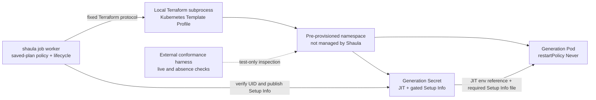

# Shaula v1 Kubernetes Runner Resource Specification

- Status: Draft
- Date: 2026-09-04
- Template Platform: Kubernetes
- Managed objects per Runner Generation: one Pod and one Secret

This specification refines the Kubernetes portions of the [Multi-Fleet Runner Scale Set Controller Specification](0001-shaula-runner-scale-set.md). Worker/state ownership follows [spec 0010](0010-lifecycle-worker-and-http-state-backend.md). Related decisions are [ADR-0014](../ard/0014-run-lifecycle-workers-with-a-database-http-state-backend.md), [ADR-0004](../ard/0004-allow-bootstrap-secrets-in-provisioning-state.md), [ADR-0006](../ard/0006-realize-each-kubernetes-runner-generation-as-one-pod-and-one-bootstrap-secret.md), and [ADR-0008](../ard/0008-keep-platform-capabilities-in-terraform-template-profiles.md).

## 1. Outcome and capability boundary

The Kubernetes Template Profile realizes each Runner Generation as exactly two generation-scoped Kubernetes objects in one pre-provisioned namespace：

1. one `core/v1 Secret` containing JIT, initially mutable only for the fixed bootstrap publication and immutable afterward；
2. one `core/v1 Pod` that runs one ephemeral GitHub Actions Runner.

In the v1 exec baseline, Terraform runs inside a local `shaula job` Lifecycle Worker. Kubernetes hosts the Runner Pod, not that worker or the daemon listener; a future Kubernetes Job Executor is a separate, unimplemented extension. The Runner Pod receives no Kubernetes API credential, schema-sensitive Profile binding, GitHub App private key, installation/admin token or Shaula PAT.

[Spec 0020](0020-official-container-runner-bootstrap.md) adds a fixed host-side Runtime bootstrap capability: verify the exact newly created Pod/Secret and publish Setup Info with UID/resourceVersion preconditions. The lifecycle core remains provider-neutral; it has no general Kubernetes request, watch, adopt or repair interface. The host kubectl CLI is an explicit dependency of this capability. The Runner Pod receives neither that tool nor its API credentials.

## 2. Required resource invariants

1. One Runner Generation owns exactly one Pod and one Secret. It owns no other Kubernetes object.
2. The Template Profile MUST NOT manage a Namespace, ServiceAccount, Role, RoleBinding, ClusterRole, ClusterRoleBinding, Job, Deployment, ReplicaSet, StatefulSet, DaemonSet, PVC or NetworkPolicy.
3. Before JIT or IaC, Shaula persists the Runner Generation ID and its collision-resistant `generation_name`. The bundled Profile uses that exact value as both the Pod and Secret `metadata.name`；resource kind disambiguates their keys. The same Generation keeps the same names across retry/restart, while different Generations/Fleets MUST NOT reuse or collide on the same target/namespace/kind/name key and never share an object, volume or mutable selector. Any normalization/truncation collision fails closed before JIT or external mutation. Per-plan `generateName` or fresh randomness is forbidden.
4. The Pod has `restartPolicy: Never` and `automountServiceAccountToken: false`.
5. The Pod does not name a custom ServiceAccount and contains no projected ServiceAccount token volume or default token mount. Kubernetes may still report `serviceAccountName: default`; the invariant is absence of API credentials, not an empty field.
6. JIT enters the generation Secret and is referenced by `secretKeyRef` for the official `ACTIONS_RUNNER_INPUT_JITCONFIG`. Its plaintext MUST NOT appear in Pod env values, args, commands, annotations, labels or termination messages.
7. The Secret is required and generation-scoped, initially `immutable: false`; the fixed bootstrap adds `.setup_info` and sets `immutable: true`. A required missing Setup Info volume item blocks main-container startup until publication.
8. The Runner Generation has only Create and Destroy. The only permitted Secret mutation is the fixed publication within the original Create under spec 0020; no general update, repair or second apply is allowed.
9. Destroy is authorized only after the normal GitHub Runner removal safety gate. `JobStillRunning` means neither object may be deleted.
10. The namespace and Terraform Kubernetes credential are external prerequisites, not Runner Resources.
11. `(exact Kubernetes target binding, namespace name, resource kind, exact metadata.name)` is the Kubernetes Generation Resource Key used by v1 name-based provider lifecycle；for the bundled Profile, `metadata.name == generation_name`. It is not Kubernetes `metadata.uid`.
12. The exact target binding and namespace name MUST continuously designate the original trusted domain until every associated Generation completes Destroy；deleting/recreating the namespace or repointing the target is a trust violation. Every actor/controller able to write it MUST also reserve Shaula Generation names. A violation may cause Terraform to delete a same-name replacement, including one in a recreated namespace, and is an accepted v1 residual risk.

These are Profile conformance properties. Core enforces the provider-neutral manifest and saved-plan policy; the private Runtime bootstrap additionally enforces the exact platform contract from spec 0020.

## 3. Responsibility split

| Concern | Production Shaula core | Kubernetes Template Profile | External conformance harness |
| --- | --- | --- | --- |
| Artifact and execution | Pin immutable artifact, lock file, Workspace, inputs and state；run the fixed Terraform protocol | Declare provider, ordinary data reads, blocking preconditions, Secret, Pod, dependencies and outputs | Exercise the published artifact with the exact attested compatibility tuple |
| Create plan | Parse saved-plan JSON generically；allow only declared managed types/counts and create-only actions | Resolve namespace through Terraform and produce one Secret plus one Pod | Confirm the plan and real cluster contain no other managed Kubernetes objects |
| Provider evidence | Validate and store the standard `shaula_result` envelope as opaque JSON | Echo the Generation Resource Keys and exact UIDs required by the bootstrap contract | Compare names and optional diagnostics with live objects and admission results |
| Drift inspection | Run a no-apply Terraform Inspect and classify its finite result | Express desired state, blocking lifecycle preconditions and advisory checks in HCL | Inspect live Pod/Secret shape and negative security properties |
| Destroy | Enforce the GitHub safety gate, delete-only saved-plan policy and final empty Terraform state | Use exact original bindings/state for name-based Pod-before-Secret deletion | Observe delete calls for the recorded namespace/name and final live absence |
| Uncertain ownership | Enter or retain Quarantine | Refuse out-of-state discovery, reconstructed-name deletion, import or adopt | Supply evidence for an operator-controlled recovery procedure |

The Profile is reviewed executable infrastructure code and part of the trusted computing base. Publishing a Profile is therefore privileged code publication, not an ordinary Fleet mutation.

## 4. Namespace and provider access

The namespace is pre-created outside Shaula. A user with `template.publish` authority selects it through the Template Profile `bindings.namespace` value；admission freezes it in the immutable Revision and protected `bindings_digest`. The template may consume that binding, but Shaula does not hard-code the namespace. A Fleet HTTP request MUST NOT provide or override a namespace string, kubeconfig or Kubernetes endpoint.

The Profile reads namespace existence and identity through an ordinary Terraform provider data source and references it from blocking resource `lifecycle.precondition` expressions during Create planning. A standalone `check` block is advisory and MUST NOT be used as the namespace safety gate. Production Shaula receives only a finite success/failure classification and protected opaque evidence or a sanitized diagnostic；it does not issue Namespace `GET`, `LIST` or `WATCH` requests and does not interpret a namespace UID.

The Profile MUST fail planning rather than create a missing namespace or select a fallback namespace. No saved plan is admitted or applied. Core reports only `TemplatePlanFailed` with phase `create.plan`；it does not derive a Kubernetes-specific reason from provider text. Whether this blocking precondition completes before JIT acquisition remains the explicit compatibility gate in section 11；the current sequence may consume one JIT when planning fails.

Terraform's Kubernetes credential is a schema-sensitive, write-only Profile binding whose original plaintext is retained in the immutable SQLite Template Revision and supplied only to its exact local Terraform and fixed bootstrap subprocesses. It is distinct from the Runner Pod identity and is provisioned outside Shaula. Reading the existing Namespace object requires explicitly scoped access to that cluster-scoped resource; Pod/Secret permissions are namespace-scoped and cover the pinned provider plus exact Pod/Secret reads and conditional Secret patch for bootstrap. No permission to create Namespaces or manage RBAC is implied. External secret references are not a v1 storage mode；the Profile neither grants nor manages the underlying access.

A Fleet may share a namespace only with Fleets in the same operator-declared trust and policy domain. A dedicated namespace per trust domain is recommended. The target must not be repointed and the namespace must not be deleted/recreated while any associated Generation remains；every writer, admission webhook and controller in that domain MUST honor Shaula's reserved-name rule. Cluster administrators or compromised provider credentials can violate these assumptions. Namespace/target binding changes create a new Profile Revision, while existing Generations always Destroy through their exact original Revision, bindings and state.

Admission webhooks or policies MUST NOT inject ServiceAccount tokens, sidecars or other state that violates this specification. A no-apply Terraform Inspect may classify visible configuration drift；the external conformance harness performs the authoritative live-object and admission-mutation tests. Shaula core never parses the live Pod.

## 5. Official Runner and external bootstrap

The bundled Pod directly uses an official `ghcr.io/actions/actions-runner` digest and runs `/home/runner/bin/Runner.Listener run`. It contains no custom image, init/sidecar, shim, staged JIT copy, download or waiting script. The Secret is `Opaque`, generation-scoped, initially mutable, and initially contains only `jit_config`; it never contains GitHub control-plane, Kubernetes provider or Shaula state/control credentials.

The Pod receives JIT through `secretKeyRef` into the official `ACTIONS_RUNNER_INPUT_JITCONFIG` input. It mounts only the required `.setup_info` Secret key as a read-only subPath at `/home/runner/.setup_info`, not the JIT key. That Setup Info key is absent during apply, so the container cannot start. The provider waits for `Pending`, not Running/Ready. Spec 0020 owns host-side JSON generation, exact Pod/Secret UID and ownership checks, the UID/resourceVersion-tested one-time Secret patch, and transition to `immutable: true` before Listener startup.

The official Listener captures and unsets the ordinary JIT environment entry; job children must not inherit it. This is not initial-environment/process-memory isolation, and the same Runner Execution Domain risk remains accepted. This replaces the former init-to-memory and declarative-env prohibition explicitly; it does not permit literal JIT in Pod fields or any secret-bearing argv. Terraform inputs, plan/state, Secret and provider responses remain credential-grade until their original retention/cleanup rules allow removal.

The fixed bootstrap is the only extra platform mutation inside Create. Content publication failure can substitute an empty JSON array; identity/patch/start-gate uncertainty fails Create and enters safe cleanup. Pod API credentials, custom ServiceAccounts, bootstrap exec and general Secret updates remain forbidden. Old retained v1/v2 artifacts keep parse/recovery/Destroy compatibility without in-place migration; new publication/Create requires the official-image host bootstrap contract.

## 6. Profile manifest, plan and result contract

The Kubernetes Profile declares, as data rather than core code：

- `bindings_contract: shaula.bindings.kubernetes/v1` and `schemas/bindings.schema.json`, fixed by the Profile Revision；
- exactly one `kubernetes_secret_v1` and one `kubernetes_pod_v1` managed resource；
- the standard input envelope containing Generation identity, Runner name, JIT, exact `bindings_digest`, approved bindings and admitted Profile parameters；
- the fixed standard output `shaula_result`.

The Terraform saved-plan policy in [0004](0004-template-profile-runtime.md) remains unchanged; the separately admitted fixed bootstrap is owned by spec 0020. Create requires empty managed prior state and exactly one Secret plus one Pod with exact `["create"]` actions. Non-empty Destroy requires exact `["delete"]` for every remaining managed instance. Only data resources may use `["read"]` or `["no-op"]`；unsupported JSON majors, non-applyable/incomplete/errored plans, deferred or unknown shape, import, deposed, move and replacement are rejected before apply.

The Profile's `shaula_result` uses the standard envelope, echoed Generation ID and exact `bindings_digest`. It carries each exact namespace/name and its UID in `incarnation` for the bootstrap capability; resourceVersion is not an incarnation. Core stores protected evidence, while the private Runtime adapter checks it against original state and live Pod/Secret before conditional publication. Raw output is never returned as ordinary diagnostics.

GitHub inventory, not a Terraform output or Kubernetes readiness field, is the authority for promoting a Generation to `Idle` or `Busy`.

## 7. Create sequence

The worker sequence and daemon GitHub gates are defined once in spec 0010 §3, with saved-plan admission in spec 0004 §5. Kubernetes adds only:

1. The already-persisted stable Generation name becomes the exact Pod/Secret `metadata.name`; collision detection precedes external mutation.
2. A namespace data source feeds blocking Pod/Secret `lifecycle.precondition` expressions. Lookup/precondition failure prevents an applyable plan; it may occur after JIT under the baseline ordering.
3. Create's managed shape is exactly one Secret and one Pod, each with `["create"]`; the Terraform graph creates the initially mutable Secret before its gated dependent Pod.
4. After completed apply and validated output/state, host bootstrap publishes Setup Info and freezes the exact Secret under spec 0020. Only GitHub inventory proves online/Busy. The target HTTP-state worker composition and current local-state implementation remain distinguished in implementation status.

A post-Create Terraform Inspect MAY run an ordinary no-apply plan with detailed exit classification. It may report drift but never authorizes repair. Core does not interpret live objects; the fixed Runtime bootstrap checks the exact live gate and identity, and external conformance verifies the full platform shape.

JIT uncertainty follows spec 0001 §10.2's stable-name lookup/remove/fresh-Generation rule. Worker crash and Create uncertainty follow spec 0010: no second Create apply, no process/lock-expiry inference, and no protected-input cleanup before trusted empty-state completion.

## 8. Retirement and Destroy

The worker requests daemon safe-removal authority; spec 0010 owns Busy/absence/ownership gates, original-state delete-only planning, process fencing, completion/seal and retention ordering. Already-empty state skips apply only when that contract's trusted terminal classification holds; an empty initial state or worker exit is not cleanup proof.

The Kubernetes-specific requirement is Pod-before-Secret deletion through the original provider-bound namespace/name state. A partial Destroy may leave a subset of the original managed instances; a retry uses a new delete-only plan only after prior descendants are excluded.

The bootstrap UID check does not authorize native Pod/Secret deletion, absence-based cleanup, or reconstructed resource names after state loss. With usable exact original bindings, Workspace and Terraform state, v1 intentionally permits the pinned HashiCorp provider to delete by namespace/name. Missing or corrupt state, contradictory opaque evidence, a known binding/name collision or any condition in which the original state-bound key is unavailable leaves the Generation in Quarantine and retains Resource Occupancy.

Trusted Destroy classification plus exact state-empty completion is the provider-neutral proof available to core；it is not independently asserted to be a Kubernetes live-absence proof. The external conformance harness MUST verify Pod-before-Secret name-based deletion and final live absence for every exact attested compatibility tuple.

Claims of verified Kubernetes behavior require a conformance attestation binding the exact engine binary, provider lock/checksums, artifact naming algorithm, protected bindings/namespace, runtime trust policy, official Runner image and host bootstrap CLI tuple and suite, and proving stable same-Generation names, cross-Generation non-reuse, collision failure and original-state-only Destroy. Profile activation instead follows automatic static validation under [spec 0017](0017-automatic-template-activation.md) and does not assert those runtime guarantees. No UID-precondition claim is made for Terraform Destroy; bootstrap publication has its separate UID/resourceVersion precondition. A same-name different-UID replacement may be deleted when target/namespace continuity or trusted name reservation is violated；this accepted risk does not prevent activation.

## 9. Drift and recovery

| Observation available to core | Required behavior |
| --- | --- |
| JIT request provably never started | Continue the original Generation's persisted JIT intent and stable name；do not mint a second identity |
| Protected JIT is valid and Create-start is provably not authorized/possible | Continue original frozen input under the worker protocol; never mint a second JIT for that Generation |
| JIT outcome is uncertain, expired or missing | Apply section 7 lookup/removal/absence classification, terminalize the old Generation, then use a fresh Generation/name；ambiguity quarantines |
| Apply may have started and its result is unknown | Enter `CleanupRequired`; never re-apply |
| Valid state describes a partial or drifted Generation | Pass GitHub safe removal, then run the original delete-only Destroy；never Update |
| Terraform Inspect returns drift | Retire or Quarantine according to generic ownership confidence；never apply the proposed change |
| The Profile reports bindings/Generation Resource Key disagreement | Block new effects and Quarantine rather than delete through reconstructed or mismatched state |
| Authoritative state or unique emergency evidence is missing/corrupt while objects may remain | Quarantine and retain Occupancy; no native discovery/import/reconstructed-name deletion |
| Ordinary Workspace copy is lost, but retained materials and DB state are complete | Rebuild only after worker fencing under spec 0010; do not change original bindings |
| Pod never becomes online according to GitHub inventory | Retire, remove the registration and Destroy through Terraform |
| Destroy result is uncertain but state remains usable | Fence prior descendants, re-read state and admit a new delete-only plan; complete only with the exact backend empty-state receipt |

Kubernetes UIDs and live-object observations may appear inside opaque Profile evidence or external harness results, but UID is neither the v1 Resource Key nor a column/branch in the core lifecycle state machine. Recovery remains level-triggered from SQLite, GitHub inventory and fixed Terraform operations. Kubernetes event watches are neither present nor required for correctness.

## 10. Security, observability and acceptance

Kubernetes Secrets may be stored unencrypted in etcd unless the cluster enables encryption at rest. The target namespace, Kubernetes credential, saved plans, state, backups and node access belong to the deployment threat model. Because the binding credential is plaintext in the Template Revision, SQLite main DB, WAL/SHM, online/migration copies, backups and crash dumps are also credential-bearing. Every management HTTP read, audit, error, log, OTel signal and diagnostic excludes the binding value and any prefix/suffix/hash/length. A subject allowed to create Pods in the namespace may often arrange to consume namespace Secrets, so the namespace is a trusted runner security domain rather than isolation from its administrators.

Runtime telemetry uses provider-neutral attempts such as Profile validation, Terraform init, create plan, saved-plan policy, apply, Inspect, destroy plan, destroy apply and state-empty verification. Attributes may contain Fleet Key, Generation ID, Profile digest and finite result/reason values. They MUST NOT contain namespace/object identity, JIT, Kubernetes credentials, manifests, Terraform input, saved-plan JSON, state, raw `shaula_result` or unredacted provider output. Metrics use only bounded dimensions and omit Fleet, namespace and resource identity.

Core contract tests, without a Kubernetes client, MUST prove：

1. the production dependency graph contains no Kubernetes SDK; only the fixed Runtime bootstrap invokes the host kubectl contract；
2. `platform` and `bindings_contract` come only from the admitted artifact manifest；the exact protected `bindings_digest` comes from the immutable Profile binding revision accepted through HTTP/SQLite. Fleet input cannot assert or override any of them；
3. saved-plan admission accepts only a supported JSON format major with `applyable=true`, `complete=true` and `errored=false`, and rejects unknown shape/action/mode/address/type, deferred changes, import, deposed instances, moves and replacements；
4. Create requires empty managed prior state and exactly one manifest-declared Secret plus one Pod with exact `["create"]` actions；
5. trusted terminal classification permits empty-state completion without apply; otherwise require exact `["delete"]` for each managed instance, with data-only read/no-op；
6. `shaula_result` is schema-checked, must echo `bindings_digest`, is stored opaquely and is never interpreted as Kubernetes fields by core; the private Runtime adapter checks bootstrap identities under spec 0020；
7. Create apply uncertainty never produces a second Create apply；
8. worker provenance, Create-start facts, descendant fencing and backend state/locks satisfy spec 0010, without requiring daemon per-command subphases；
9. `JobStillRunning` keeps Terraform Destroy invocation count at zero；
10. missing/corrupt state with possible residue enters Quarantine；
11. Destroy is complete only after empty state and the exact original protected input remains until that proof；
12. every operation emits bounded, correlated and redacted OpenTelemetry data from Day 0.
13. schema-sensitive Kubernetes bindings survive restart from the exact immutable SQLite Revision, reach only the approved IaC and fixed bootstrap children, and remain absent from every read/audit/diagnostic/telemetry surface；

The external Kubernetes conformance harness MUST prove for every supported tuple of engine kind/version/binary digest, provider lock versions/checksums, Profile artifact digest, protected `bindings_digest`, runtime/trust policy digest, official Runner image and host bootstrap executable digests, and suite revision：

1. each successful Generation has exactly one original-state-bound Pod and Secret in the pre-created namespace, and the live Secret is immutable after bootstrap; later Destroy refresh observes the published values without an Update apply；
2. no Namespace, ServiceAccount, RBAC, Job, workload controller, PVC or NetworkPolicy is managed or created；
3. a missing namespace is not created and no object appears in another namespace；
4. the live Pod has `restartPolicy: Never`, `automountServiceAccountToken: false`, no custom ServiceAccount and no projected/default ServiceAccount token mount；
5. the live Secret is generation-scoped, initially holds only JIT, and blocks runner startup through a missing required `.setup_info` item; after completed apply, exact UID/resourceVersion-conditional publication adds the file and makes the Secret immutable, without init/sidecar or Pod mutation;
6. JIT is delivered only through the approved Secret environment reference and is absent from literal Pod env values, args/command/metadata, process argv, ordinary inherited job environment, workflow context, HTTP reads, audit, logs and telemetry; the report records the accepted same-Execution-Domain process-inspection risk;
7. same-Generation retry/restart keeps identical exact `metadata.name` values, while concurrent or later Generations share no target/namespace/kind/name key, Pod, Secret, volume, selector or Terraform state；any normalization/length-truncation collision fails before JIT/external mutation；
8. crash injection after JIT, after each object creation and after apply success never results in a second Create apply；
9. external deletion, mutation, a known name/binding disagreement or Create `AlreadyExists` never invokes Update, adopt, import, unknown-object delete or same-Generation re-apply；
10. controlled same-name different-UID object replacement and namespace delete/recreate tests demonstrate and record that the state-bound HashiCorp provider may delete a replacement；the conformance report identifies target/namespace continuity and name reservation as accepted trust assumptions rather than claiming UID safety；
11. Destroy uses the exact original Profile, bindings, Workspace and state, requests Pod removal before Secret removal by recorded namespace/name, and finishes with both names absent and no managed resource in state；
12. a workflow cannot authenticate with a Pod ServiceAccount credential or obtain any Shaula App/PAT/provider credential；
13. the official Listener captures and unsets `ACTIONS_RUNNER_INPUT_JITCONFIG`; wrong UID/labels, changed resourceVersion, gate removal, permission failure, lost admission and uncertain publish fail safely without duplicate Create or general Update.

The conformance harness MAY inspect Kubernetes API audit evidence or use a fake provider to establish delete-call order while `JobStillRunning`; those inspection capabilities remain outside production Shaula.

Spec 0005 §5.1's authenticated, independently authorized and immutably audited attestation binds this exact tuple and retained conformance report; a separate signing PKI is not required. It supports claims of tested platform capability but is not an activation or Fleet-admission prerequisite. Static validation automatically activates the Profile under spec 0017; existing pins follow spec 0002's retained-reference rules.

A placeholder `.terraform.lock.hcl` is not a verified provider pin. Release requires real checksums and passing engine/provider/image/GitHub/HTTP-backend tests; the checked-in artifact's evidence status lives in [implementation status](../IMPLEMENTATION_STATUS.md).

## 11. Open decisions and compatibility gates

The [central decision register](../README.md#仍需决定或冻结) owns R1/R3: exact images, resource limits, security context, seccomp/capabilities, namespace sharing/network policy and RBAC acceptance. The baseline checks the namespace during Create planning, after JIT; a pre-JIT provider check is an optional extension, not a promised guarantee that an unavailable namespace consumes no JIT.

The Runner process-inspection choice is resolved as an accepted v1 trust limitation, not a compatibility gate. A future guarantee against same-domain `/proc` or memory inspection requires a new hardening decision and conformance contract.

The official Runner native JIT input and conditional host bootstrap from spec 0020 replace the former init-only handoff. State-bound name-based Destroy under a continuously reserved target/namespace remains accepted. Conformance evidence must attest the exact `metadata.name` algorithm, non-reuse/collision behavior, namespace binding and provider tuple；Kubernetes UID preconditions are required for bootstrap publication but not provided by Terraform Destroy. Object or namespace same-name replacement during Destroy remains an explicit residual risk.
