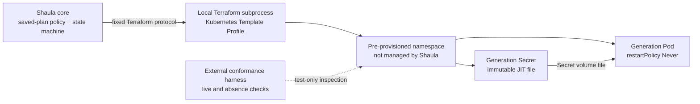

# Shaula v1 Kubernetes Runner Resource Specification

- Status: Draft
- Date: 2026-09-04
- Template Platform: Kubernetes
- Managed objects per Runner Generation: one Pod and one Secret

This specification refines the Kubernetes portions of the [Multi-Fleet Runner Scale Set Controller Specification](0001-shaula-runner-scale-set.md). Related decisions are [ADR-0002](../ard/0002-run-immutable-runner-lifecycles-as-local-subprocesses.md), [ADR-0004](../ard/0004-allow-bootstrap-secrets-in-provisioning-state.md), [ADR-0006](../ard/0006-realize-each-kubernetes-runner-generation-as-one-pod-and-one-bootstrap-secret.md), and [ADR-0008](../ard/0008-keep-platform-capabilities-in-terraform-template-profiles.md).

## 1. Outcome and capability boundary

The Kubernetes Template Profile realizes each Runner Generation as exactly two generation-scoped Kubernetes objects in one pre-provisioned namespace：

1. one immutable `core/v1 Secret` containing the encoded JIT bootstrap payload；
2. one `core/v1 Pod` that runs one ephemeral GitHub Actions Runner.

Shaula runs Terraform locally. Kubernetes does not run the IaC engine and does not host a Shaula controller or listener. The Runner Pod receives no Kubernetes API credential, schema-sensitive Profile binding, GitHub App private key, installation/admin token or Shaula PAT.

The production Shaula binary MUST NOT link a Kubernetes client, deserialize Kubernetes objects, construct Kubernetes requests, invoke `kubectl`, or implement Pod, Secret, Namespace or UID semantics. Its Runner Lifecycle Module invokes the approved local Terraform subprocess through the provider-neutral Template Runtime Interface. The Kubernetes provider and its platform object model belong to the immutable Profile artifact and Terraform child process, not to Shaula core.

An external conformance harness MAY use `kubectl` or a Kubernetes client to inspect real objects. That harness and its Kubernetes credentials MUST NOT be linked into or shipped as a runtime dependency of the production daemon.

## 2. Required resource invariants

1. One Runner Generation owns exactly one Pod and one Secret. It owns no other Kubernetes object.
2. The Template Profile MUST NOT manage a Namespace, ServiceAccount, Role, RoleBinding, ClusterRole, ClusterRoleBinding, Job, Deployment, ReplicaSet, StatefulSet, DaemonSet, PVC or NetworkPolicy.
3. Before JIT or IaC, Shaula persists the Runner Generation ID and its collision-resistant `generation_name`. The bundled Profile uses that exact value as both the Pod and Secret `metadata.name`；resource kind disambiguates their keys. The same Generation keeps the same names across retry/restart, while different Generations/Fleets MUST NOT reuse or collide on the same target/namespace/kind/name key and never share an object, volume or mutable selector. Any normalization/truncation collision fails closed before JIT or external mutation. Per-plan `generateName` or fresh randomness is forbidden.
4. The Pod has `restartPolicy: Never` and `automountServiceAccountToken: false`.
5. The Pod does not name a custom ServiceAccount and contains no projected ServiceAccount token volume or default token mount. Kubernetes may still report `serviceAccountName: default`; the invariant is absence of API credentials, not an empty field.
6. JIT enters Kubernetes only as a file in the generation Secret and through a Secret volume. It MUST NOT appear in Pod environment values, args, commands, annotations, labels or termination messages.
7. The Secret is required, immutable and generation-scoped. The Pod cannot start if the named Secret or JIT key is absent.
8. The Runner Generation has only Create and Destroy. Neither Shaula nor its Profile updates, repairs or re-applies an existing Pod or Secret.
9. Destroy is authorized only after the normal GitHub Runner removal safety gate. `JobStillRunning` means neither object may be deleted.
10. The namespace and Terraform Kubernetes credential are external prerequisites, not Runner Resources.
11. `(exact Kubernetes target binding, namespace name, resource kind, exact metadata.name)` is the Kubernetes Generation Resource Key used by v1 name-based provider lifecycle；for the bundled Profile, `metadata.name == generation_name`. It is not Kubernetes `metadata.uid`.
12. The exact target binding and namespace name MUST continuously designate the original trusted domain until every associated Generation completes Destroy；deleting/recreating the namespace or repointing the target is a trust violation. Every actor/controller able to write it MUST also reserve Shaula Generation names. A violation may cause Terraform to delete a same-name replacement, including one in a recreated namespace, and is an accepted v1 residual risk.

These are Profile conformance properties. Production Shaula enforces only the provider-neutral manifest and saved-plan policy described below；it does not contain Kubernetes-specific enforcement code.

## 3. Responsibility split

| Concern | Production Shaula core | Kubernetes Template Profile | External conformance harness |
| --- | --- | --- | --- |
| Artifact and execution | Pin immutable artifact, lock file, Workspace, inputs and state；run the fixed Terraform protocol | Declare provider, ordinary data reads, blocking preconditions, Secret, Pod, dependencies and outputs | Exercise the published artifact with the exact attested compatibility tuple |
| Create plan | Parse saved-plan JSON generically；allow only declared managed types/counts and create-only actions | Resolve namespace through Terraform and produce one Secret plus one Pod | Confirm the plan and real cluster contain no other managed Kubernetes objects |
| Provider evidence | Validate and store the standard `shaula_result` envelope as opaque JSON | Echo the Generation Resource Keys and emit provider identity/UID diagnostics when available | Compare names and optional diagnostics with live objects and admission results |
| Drift inspection | Run a no-apply Terraform Inspect and classify its finite result | Express desired state, blocking lifecycle preconditions and advisory checks in HCL | Inspect live Pod/Secret shape and negative security properties |
| Destroy | Enforce the GitHub safety gate, delete-only saved-plan policy and final empty Terraform state | Use exact original bindings/state for name-based Pod-before-Secret deletion | Observe delete calls for the recorded namespace/name and final live absence |
| Uncertain ownership | Enter or retain Quarantine | Refuse out-of-state discovery, reconstructed-name deletion, import or adopt | Supply evidence for an operator-controlled recovery procedure |

The Profile is reviewed executable infrastructure code and part of the trusted computing base. Publishing a Profile is therefore privileged code publication, not an ordinary Fleet mutation.

## 4. Namespace and provider access

The namespace is pre-created outside Shaula. A user with `template.publish` authority selects it through the Template Profile `bindings.namespace` value；admission freezes it in the immutable Revision and protected `bindings_digest`. The template may consume that binding, but Shaula does not hard-code the namespace. A Fleet HTTP request MUST NOT provide or override a namespace string, kubeconfig or Kubernetes endpoint.

The Profile reads namespace existence and identity through an ordinary Terraform provider data source and references it from blocking resource `lifecycle.precondition` expressions during Create planning. A standalone `check` block is advisory and MUST NOT be used as the namespace safety gate. Production Shaula receives only a finite success/failure classification and protected opaque evidence or a sanitized diagnostic；it does not issue Namespace `GET`, `LIST` or `WATCH` requests and does not interpret a namespace UID.

The Profile MUST fail planning rather than create a missing namespace or select a fallback namespace. No saved plan is admitted or applied. Core reports only `TemplatePlanFailed` with phase `create.plan`；it does not derive a Kubernetes-specific reason from provider text. Whether this blocking precondition completes before JIT acquisition remains the explicit compatibility gate in section 11；the current sequence may consume one JIT when planning fails.

Terraform's Kubernetes credential is a schema-sensitive, write-only Profile binding whose original plaintext is retained in the immutable SQLite Template Revision and supplied only to its exact local Terraform subprocess. It is distinct from the Runner Pod identity and is provisioned outside Shaula with only the namespace-scoped access required to read the namespace and create, read and delete Pods and Secrets. External secret references are not a v1 storage mode；the Profile neither grants nor manages the underlying access.

A Fleet may share a namespace only with Fleets in the same operator-declared trust and policy domain. A dedicated namespace per trust domain is recommended. The target must not be repointed and the namespace must not be deleted/recreated while any associated Generation remains；every writer, admission webhook and controller in that domain MUST honor Shaula's reserved-name rule. Cluster administrators or compromised provider credentials can violate these assumptions. Namespace/target binding changes create a new Profile Revision, while existing Generations always Destroy through their exact original Revision, bindings and state.

Admission webhooks or policies MUST NOT inject ServiceAccount tokens, sidecars or other state that violates this specification. A no-apply Terraform Inspect may classify visible configuration drift；the external conformance harness performs the authoritative live-object and admission-mutation tests. Shaula core never parses the live Pod.

## 5. Secret and JIT file handoff

The Secret has all of the following properties：

- type `Opaque`；
- `immutable: true`；
- one required data key containing only the encoded JIT configuration；
- generation-scoped name and ownership markers；
- no reusable GitHub App key, PAT, Kubernetes credential or unrelated value.

The accepted handoff is a reviewed init-to-memory path：

1. only a trusted init container mounts the Secret volume read-only；the runner container never mounts that Secret volume；
2. the init container copies the file with restrictive ownership and mode into a generation-scoped `emptyDir` with `medium: Memory`；
3. the runner container mounts only that memory volume, and a pinned bootstrap shim reads and immediately unlinks the staged file before job acceptance；
4. the bundled shim never puts JIT in argv and sets only `ACTIONS_RUNNER_INPUT_JITCONFIG` for the pinned `Runner.Listener` process；
5. the pinned Runner's `CommandSettings` startup captures `ACTIONS_RUNNER_INPUT_JITCONFIG` into its private in-memory argument map and unsets the ordinary process environment entry；`GetJitConfig()` later reads that captured value；
6. conformance proves JIT is absent from every process command line, the consumed staged-memory path, ordinary inherited job environment, workflow context and other intentionally workflow-facing state before GitHub reports the Runner ready. It does not claim isolation from process inspection inside the Runner Execution Domain.

JIT never appears in the declarative Pod/container environment, args or command, and never enters HTTP reads, audit, logs or telemetry. Directly mounting the Secret into the runner container is forbidden by this Profile contract. Runner startup unset prevents ordinary child-environment inheritance but is not `/proc` or memory isolation；v1 accepts that workflow code with process-inspection capability inside the same Runner Execution Domain may read `Runner.Listener` initial environment or memory. That residual risk does not block activation and makes no memory-zeroization claim. This exception applies only to JIT：GitHub App/PAT/derived control-plane tokens, provider credentials, sensitive Template bindings and Shaula HTTP/SQLite credentials never enter the Runner Execution Domain. The exact bindings, runtime/trust policy and Runner/init/shim image tuple are release-gated by the attestation in section 10.

The init container, runner container and bootstrap shim images or executables are fixed by digest in the immutable Profile. The Pod has no long-running sidecar in v1. A normal job later receives GitHub's per-job `GITHUB_TOKEN`; a custom PAT is visible only if the workflow owner deliberately stores and references it as an Actions Secret. Neither fact authorizes exposure of Shaula control-plane credentials.

The Secret, Terraform input, saved plan, state, Workspace, any memory handoff and provider request are secret-bearing. Secret expiration or one-time consumption does not make retained copies public.

## 6. Profile manifest, plan and result contract

The Kubernetes Profile declares, as data rather than core code：

- `bindings_contract: shaula.bindings.kubernetes/v1` and `schemas/bindings.schema.json`, fixed by the Profile Revision；
- exactly one `kubernetes_secret_v1` and one `kubernetes_pod_v1` managed resource；
- the standard input envelope containing Generation identity, Runner name, JIT, exact `bindings_digest`, approved bindings and admitted Profile parameters；
- the fixed standard output `shaula_result`.

The provider-neutral policy in [0004](0004-template-profile-runtime.md) applies without exception. Create requires empty managed prior state and exactly one Secret plus one Pod with exact `["create"]` actions. Non-empty Destroy requires exact `["delete"]` for every remaining managed instance. Only data resources may use `["read"]` or `["no-op"]`；unsupported JSON majors, non-applyable/incomplete/errored plans, deferred or unknown shape, import, deposed, move and replacement are rejected before apply.

The Profile's `shaula_result` includes the contract version, echoed Generation ID, exact `bindings_digest` and opaque resource evidence. It echoes each Generation Resource Key and may include Kubernetes UIDs only as diagnostics. Shaula validates only the common envelope, stores the value without indexing Kubernetes fields, and never uses an interpreted UID or reconstructed name to construct a request. Raw output is sensitive and is never returned as ordinary diagnostics.

GitHub inventory, not a Terraform output or Kubernetes readiness field, is the authority for promoting a Generation to `Idle` or `Busy`.

## 7. Create sequence

The Kubernetes specialization of Runner Create is：

1. Persist the Runner Generation, stable unique Runner name and Kubernetes `generation_name`, Fleet Revision, exact Profile artifact and Revision, exact `bindings_digest`, Workspace and state lineage/serial before external mutation.
2. Materialize the immutable Profile, verify its activation attestation and run locked `terraform init` before acquiring JIT.
3. Revalidate the Fleet/session mutation fences.
4. Before the JIT POST, atomically persist `JITStarting`, a unique JIT attempt, stable Runner name, exact Scale Set ID, complete Auth Revision Ref and request digest.
5. Issue the JIT request once. On definite success, validate and persist the exact GitHub Runner ID/result, then atomically publish the protected standard input. An unknown response follows the stable-name lookup/remove/fresh-Generation procedure below and never repeats the POST for this Generation.
6. Run `terraform plan -out=<saved-plan>`. An ordinary namespace data source feeds blocking Secret and Pod `lifecycle.precondition` expressions; a failed lookup or precondition prevents creation of an applyable saved plan.
7. Parse the saved plan with the complete provider-neutral policy in section 6 and require exactly one Secret and one Pod with exact `["create"]` actions.
8. Bind the saved-plan digest to the exact engine kind/version/binary digest, artifact and protected-input digests, state lineage/serial or empty-state sentinel, Generation ID and attempt ID. Re-hash the bytes, persist `ApplyStarting` with that provenance, then invoke `terraform apply <saved-plan>` at most once.
9. The Profile's Terraform graph creates the immutable Secret before the dependent Pod.
10. Read and validate the standard `shaula_result` envelope and exact echoed `bindings_digest`, persist its evidence opaquely, and verify the expected managed-resource count in Terraform state.
11. Enter `WaitingOnline`; only GitHub inventory can promote the Runner to `Idle` or `Busy`.

A post-Create Terraform Inspect MAY run an ordinary no-apply plan with detailed exit classification. It may report drift but never authorizes repair. Live Pod shape, Generation Resource Key correspondence, optional UID diagnostics and admission mutation are Profile/harness concerns, not native Create steps in core.

After `JITStarting`, an unknown JIT response is never retried for the same Generation/name. Recovery performs a bounded lookup by the persisted stable name in the exact Target/Scale Set. An exact match is persisted and safely removed；authoritative proof of no commit also terminates the old Generation. Either case uses a fresh Generation/name for any later JIT request. Ambiguous access, multiple/mismatched results or unprovable absence quarantines. Once apply may have started, Shaula never applies that Generation again. A crash, missing result or uncertain apply outcome enters `CleanupRequired` and follows the ordinary GitHub removal and Destroy path. The exact original protected input, including JIT, remains available through successful Destroy and empty-state verification; only then may the retention policy erase it.

## 8. Retirement and Destroy

Only after the common GitHub safe-removal gate succeeds may Shaula continue. Runner-specific already-absent is authoritative only for a still-bound, authenticated-readable Scale Set；Scale Set absence, access-filtered `404` or `ScaleSetMissingWithResources` never proves Busy safety. After that gate, Shaula：

1. uses the Generation's exact original artifact, protected input, Workspace and state；
2. treats an already-empty state as successful Destroy without planning or applying；
3. otherwise creates a saved destroy plan and applies the complete provider-neutral gate from section 6: every remaining managed instance has exact `["delete"]`, only data resources may read or no-op, and all other actions and ambiguous forms are rejected；
4. binds and re-hashes the plan with the same provenance fields as Create, persists `DestroyApplyStarting`, then applies it. A retry uses a new plan and attempt only after the prior subprocess is proven terminated；
5. relies on the Profile's Terraform dependency graph to request Pod deletion before Secret deletion；
6. persists `Destroyed` only after the empty-state fast path or successful apply followed by `terraform state list` returning empty, then permits protected-input cleanup.

Production Shaula does not issue Pod/Secret delete or absence requests, compare Kubernetes UIDs, or reconstruct a resource name after state loss. With usable exact original bindings, Workspace and Terraform state, v1 intentionally permits the pinned HashiCorp provider to delete by namespace/name. Missing or corrupt state, contradictory opaque evidence, a known binding/name collision or any condition in which the original state-bound key is unavailable leaves the Generation in Quarantine and retains Resource Occupancy.

State-empty is the provider-neutral completion proof available to core；it is not independently asserted to be a Kubernetes live-absence proof. The external conformance harness MUST verify Pod-before-Secret name-based deletion and final live absence for every exact attested compatibility tuple.

Core may rely on a Kubernetes Profile only after its activation attestation binds the exact engine binary, provider lock/checksums, artifact naming algorithm, protected bindings/namespace, runtime trust policy, Runner/init/shim images and suite, and proves stable same-Generation names, cross-Generation non-reuse, collision failure and original-state-only Destroy. No UID-precondition claim is made. A same-name different-UID replacement may be deleted when target/namespace continuity or trusted name reservation is violated；this accepted risk does not prevent activation.

## 9. Drift and recovery

| Observation available to core | Required behavior |
| --- | --- |
| JIT request provably never started | Continue the original Generation's persisted JIT intent and stable name；do not mint a second identity |
| `JITReady` or `CreatePlanReady`, protected JIT is complete/unexpired, and Create subprocess provably never started | Resume the same Generation with its original JIT and frozen inputs/plan；never mint a fresh JIT for it |
| JIT outcome is uncertain, expired or missing | Apply section 7 lookup/removal/absence classification, terminalize the old Generation, then use a fresh Generation/name；ambiguity quarantines |
| Apply may have started and its result is unknown | Enter `CleanupRequired`; never re-apply |
| Valid state describes a partial or drifted Generation | Pass GitHub safe removal, then run the original delete-only Destroy；never Update |
| Terraform Inspect returns drift | Retire or Quarantine according to generic ownership confidence；never apply the proposed change |
| The Profile reports bindings/Generation Resource Key disagreement | Block new effects and Quarantine rather than delete through reconstructed or mismatched state |
| State or Workspace is missing/corrupt while objects may remain | Quarantine and retain Resource Occupancy；do not scan, import or delete by a reconstructed/out-of-state name |
| Pod never becomes online according to GitHub inventory | Retire, remove the registration and Destroy through Terraform |
| Destroy result is uncertain but state remains usable | Retry the same delete-only Destroy until Terraform succeeds and state is empty |

Kubernetes UIDs and live-object observations may appear inside opaque Profile evidence or external harness results, but UID is neither the v1 Resource Key nor a column/branch in the core lifecycle state machine. Recovery remains level-triggered from SQLite, GitHub inventory and fixed Terraform operations. Kubernetes event watches are neither present nor required for correctness.

## 10. Security, observability and acceptance

Kubernetes Secrets may be stored unencrypted in etcd unless the cluster enables encryption at rest. The target namespace, Kubernetes credential, saved plans, state, backups and node access belong to the deployment threat model. Because the binding credential is plaintext in the Template Revision, SQLite main DB, WAL/SHM, online/migration copies, backups and crash dumps are also credential-bearing. Every HTTP read, audit, error, log, OTel signal and diagnostic excludes the binding value and any prefix/suffix/hash/length. A subject allowed to create Pods in the namespace may often arrange to consume namespace Secrets, so the namespace is a trusted runner security domain rather than isolation from its administrators.

Runtime telemetry uses provider-neutral attempts such as Profile validation, Terraform init, create plan, saved-plan policy, apply, Inspect, destroy plan, destroy apply and state-empty verification. Attributes may contain Fleet Key, Generation ID, Profile digest and finite result/reason values. They MUST NOT contain namespace/object identity, JIT, Kubernetes credentials, manifests, Terraform input, saved-plan JSON, state, raw `shaula_result` or unredacted provider output. Metrics use only bounded dimensions and omit Fleet, namespace and resource identity.

Core contract tests, without a Kubernetes client, MUST prove：

1. the production dependency graph and binary contain no Kubernetes client and runtime never invokes `kubectl`；
2. `platform` and `bindings_contract` come only from the admitted artifact manifest；the exact protected `bindings_digest` comes from the immutable Profile binding revision accepted through HTTP/SQLite. Fleet input cannot assert or override any of them；
3. saved-plan admission accepts only a supported JSON format major with `applyable=true`, `complete=true` and `errored=false`, and rejects unknown shape/action/mode/address/type, deferred changes, import, deposed instances, moves and replacements；
4. Create requires empty managed prior state and exactly one manifest-declared Secret plus one Pod with exact `["create"]` actions；
5. Destroy succeeds without apply for empty state, otherwise requires exact `["delete"]` for every managed instance；only data resources may use `["read"]` or `["no-op"]`；
6. `shaula_result` is schema-checked, must echo `bindings_digest`, is stored opaquely and is never interpreted as Kubernetes fields；
7. Create apply uncertainty never produces a second Create apply；
8. `DestroyApplyStarting` and complete saved-plan provenance are durable before each Destroy apply；
9. `JobStillRunning` keeps Terraform Destroy invocation count at zero；
10. missing/corrupt state with possible residue enters Quarantine；
11. Destroy is complete only after empty state and the exact original protected input remains until that proof；
12. every operation emits bounded, correlated and redacted OpenTelemetry data from Day 0.
13. schema-sensitive Kubernetes bindings survive restart from the exact immutable SQLite Revision, reach only the approved IaC child, and remain absent from every read/audit/diagnostic/telemetry surface；

The external Kubernetes conformance harness MUST prove for every supported tuple of engine kind/version/binary digest, provider lock versions/checksums, Profile artifact digest, protected `bindings_digest`, runtime/trust policy digest, Runner/init/shim image or executable digests, and suite revision：

1. each successful Generation leaves exactly one Pod and one immutable Secret in Terraform state and live in the pre-created namespace；
2. no Namespace, ServiceAccount, RBAC, Job, workload controller, PVC or NetworkPolicy is managed or created；
3. a missing namespace is not created and no object appears in another namespace；
4. the live Pod has `restartPolicy: Never`, `automountServiceAccountToken: false`, no custom ServiceAccount and no projected/default ServiceAccount token mount；
5. the live Secret is generation-scoped, immutable, contains JIT only, precedes the Pod, is mounted only by the init container and is copied to a `medium: Memory` `emptyDir` that alone is mounted by the runner container；
6. JIT appears in no declarative Pod/container environment, args, command, metadata or termination field, and before job acceptance is absent from every process command line, consumed staged handoff path, ordinary inherited job environment, workflow context, HTTP read, audit, logs and telemetry；the report records rather than denies the accepted same-Execution-Domain process-inspection risk；
7. same-Generation retry/restart keeps identical exact `metadata.name` values, while concurrent or later Generations share no target/namespace/kind/name key, Pod, Secret, volume, selector or Terraform state；any normalization/length-truncation collision fails before JIT/external mutation；
8. crash injection after JIT, after each object creation and after apply success never results in a second Create apply；
9. external deletion, mutation, a known name/binding disagreement or Create `AlreadyExists` never invokes Update, adopt, import, unknown-object delete or same-Generation re-apply；
10. controlled same-name different-UID object replacement and namespace delete/recreate tests demonstrate and record that the state-bound HashiCorp provider may delete a replacement；the conformance report identifies target/namespace continuity and name reservation as accepted trust assumptions rather than claiming UID safety；
11. Destroy uses the exact original Profile, bindings, Workspace and state, requests Pod removal before Secret removal by recorded namespace/name, and finishes with both names absent and no managed resource in state；
12. a workflow cannot authenticate with a Pod ServiceAccount credential or obtain any Shaula App/PAT/provider credential；
13. the shim passes no secret-bearing argv and sets only `ACTIONS_RUNNER_INPUT_JITCONFIG` for the spawned `Runner.Listener`；Runner `CommandSettings` captures then unsets the environment entry. Tests verify ordinary child-env/no-active-leak behavior, record that unsetting is not process isolation, and make no memory-zeroization claim.

The conformance harness MAY inspect Kubernetes API audit evidence or use a fake provider to establish delete-call order while `JobStillRunning`; those inspection capabilities remain outside production Shaula.

A signed or equivalently integrity-protected passing attestation binds the exact tuple above, including bindings and runtime policy, to the Profile Revision. Without that attestation the Profile cannot transition to `Active`, be assigned to a Fleet Revision, or advertise Kubernetes capability.

## 11. Open decisions and compatibility gates

The following details are intentionally unresolved and MUST NOT be advertised as guaranteed until accepted and tested：

1. **Pre-JIT namespace check**: the minimal shared protocol obtains JIT before its provider-backed Create plan. Requiring namespace validation before JIT would need an additional fixed Terraform preflight phase/root or another explicitly designed mechanism. The choice must be aligned before claiming that an unavailable namespace consumes no JIT.
2. **Profile hardening**: select exact Runner/init image digests, CPU/memory/ephemeral-storage limits, security context, seccomp/capability policy, namespace network policy and namespace-sharing policy.

The Runner process-inspection choice is resolved as an accepted v1 trust limitation, not a compatibility gate. A future guarantee against same-domain `/proc` or memory inspection requires a new hardening decision and conformance contract.

The init-only Secret-to-memory handoff and state-bound name-based Destroy under a continuously reserved target/namespace are accepted v1 choices. Activation must attest the exact `metadata.name` algorithm, non-reuse/collision behavior, namespace binding and provider tuple；Kubernetes UID preconditions are not required. Object or namespace same-name replacement remains an explicit residual risk.
