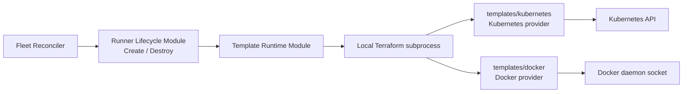

# Shaula v1 Template Profile Runtime Specification

- Status: Draft
- Date: 2026-09-04
- Native platform clients: none
- v1 bundled Template Platforms: Kubernetes and Docker
- IaC engine: Terraform required; OpenTofu gated by compatibility

This specification defines the platform-neutral seam between Shaula and infrastructure templates. It extends the [Multi-Fleet Runner Scale Set Controller Specification](0001-shaula-runner-scale-set.md). Platform details live in the [Kubernetes Runner Resource Specification](0003-kubernetes-runner-resource.md) and [Docker Runner Resource Specification](0006-docker-runner-resource.md), while profile publication is defined by the [Profile HTTP Control-Plane Specification](0005-profile-http-control-plane.md).

Related decisions are [ADR-0002](../ard/0002-run-immutable-runner-lifecycles-as-local-subprocesses.md), [ADR-0004](../ard/0004-allow-bootstrap-secrets-in-provisioning-state.md), [ADR-0008](../ard/0008-keep-platform-capabilities-in-terraform-template-profiles.md), [ADR-0009](../ard/0009-manage-profile-resources-through-http-and-sqlite.md), and [ADR-0010](../ard/0010-build-a-pure-rust-multi-crate-daemon-and-use-scaleset-as-an-oracle.md).

## 1. Outcome

Shaula is one pure-Rust daemon, not an infrastructure controller framework. Its production binary owns：

- clap process lifecycle and the HTTP control Interface；
- SQLite desired state, lifecycle ledger and artifact/workspace ownership；
- GitHub Scale Set access through the Rust/reqwest Scale Set Adapter, checked against the pinned `actions/scaleset` protocol oracle；
- capacity reconciliation, Create/Destroy orchestration and crash recovery；
- local Terraform/OpenTofu subprocess execution；
- Day 0 OpenTelemetry and correlated structured logging.

It does not own Kubernetes or Docker capability. The daemon imports no Kubernetes/Docker client, constructs no platform request, watches no platform event, and interprets no Pod, Secret or container schema. Platform behavior is executable infrastructure code inside a Template Profile.



## 2. Required invariants

1. Fleet Reconciler and Runner Lifecycle have no branch on Kubernetes/Docker object kinds.
2. The only mutating infrastructure Operations are Create and Destroy. Profile publication, validation, state inspection and read-only diagnosis are not Update primitives.
3. Every Runner Generation pins one immutable Template Profile Revision, artifact digest, normalized input digest, Workspace and state.
4. An uncertain Create result is never retried with a second apply. It enters `CleanupRequired` and proceeds through the same GitHub removal and Destroy safety path.
5. Destroy always uses the original artifact, inputs, Workspace and state. A newer Profile Revision never repairs or destroys an older Generation.
6. The daemon treats platform-specific declared outputs as protected opaque evidence. It persists them for recovery but does not reproduce platform reconciliation logic in Rust or expose their bodies through ordinary diagnostics.
7. Adding a Template Platform requires a conforming profile and test suite, not a new Fleet/Runner lifecycle method.
8. Provider administration credentials may enter the isolated IaC subprocess when the Profile declares them, but never the Runner Resource or workflow.
9. Runner readiness and busy safety are proven through GitHub inventory/removal semantics, not through platform-specific “running” status.
10. The artifact manifest is the sole authority for `platform` and `bindings_contract`. HTTP and SQLite representations derive those values from the verified artifact and cannot accept an independent platform selector.
11. A Template Profile Revision cannot become Active or advertised until a trusted external conformance attestation is bound to its exact compatibility tuple.

## 3. Template Profile Revision

A Template Profile Revision is an immutable tuple of：

- a content-addressed artifact containing Terraform source and vendored local modules；
- a checked-in dependency lock file and declared Terraform/Provider constraints；
- a versioned `shaula-profile` manifest；
- administrator-owned fixed bindings, including provider endpoint/configuration and schema-sensitive plaintext values stored in this Revision；external secret references are not a v1 storage mode；
- a schema for Fleet-supplied bounded inputs；
- a protected opaque binding commitment, carried under the wire name `bindings_digest`, that identifies the exact immutable binding Revision without exposing an offline credential verifier；
- the normalized digest of all non-credential material.

`bindings_digest` MUST NOT be an unkeyed digest of sensitive binding plaintext or permit a reader to validate secret guesses. It is a server-issued equality token for an immutable Revision；its exact keyed/opaque construction is fixed before implementation. If that non-verifier property cannot be met, the field and every containing subject/output are secret and cannot appear on read surfaces.

The trusted conformance attestation is a separate immutable record that references the Revision and its canonical compatibility subject. Attestation submission never mutates the Revision；the activation transaction freezes `active_attestation_id`, and each admitted Fleet/Generation pins both the Revision and that attestation.

The artifact root has a fixed, inspectable shape：

```text
profile.yaml
*.tf
.terraform.lock.hcl
schemas/parameters.schema.json
schemas/bindings.schema.json
```

The manifest declares protocol and plan shape, but cannot define custom commands or hooks：

```yaml
api_version: shaula.io/template-profile/v1
kind: RunnerTemplateProfile
platform: kubernetes
runtime:
  protocol: terraform-cli/v1
  engine: terraform
  root_module: .
  required_version: ">= 1.9, < 2.0"
bindings_contract: shaula.bindings.kubernetes/v1
schemas:
  bindings: schemas/bindings.schema.json
  parameters: schemas/parameters.schema.json

managed_resource_shape:
  - role: bootstrap
    terraform_type: kubernetes_secret_v1
    exact_count: 1
  - role: runner
    terraform_type: kubernetes_pod_v1
    exact_count: 1
```

This is a contract shape, not a serialization-library commitment. `platform`, `bindings_contract` and Terraform resource type strings are opaque policy/test metadata. `platform` exists only in this verified artifact manifest；Profile HTTP requests do not submit a second value. The core compares declared strings, action sets and cardinality without interpreting a Pod, Secret or container. The Observability Adapter derives its bounded platform label from this manifest value and maps future or unrecognized values to `other`.

The runtime writes exactly one protected tfvars JSON document whose sole top-level variable is `shaula`：

```json
{
  "shaula": {
    "contract_version": 1,
    "generation": {
      "fleet_key": "fleet-a",
      "scale_set_id": 123,
      "id": "generation-id",
      "runner_name": "deterministic-name"
    },
    "jit_config": "write-only value",
    "bindings_digest": "opaque-binding-revision-commitment",
    "bindings": {},
    "parameters": {}
  }
}
```

The root module must declare the whole variable sensitive. `bindings` contains values fixed by the Template Profile Revision；the opaque `bindings_digest` binds the envelope to that exact persisted revision without acting as a plaintext hash；`parameters` contains Fleet-supplied values accepted by its bounded schema. The Profile cannot rename or add system variables. Shaula never places the input document or JIT in its own argv or process environment.

The only output is `shaula_result` with a fixed provider-neutral envelope：

```json
{
  "contract_version": 1,
  "generation_id": "generation-id",
  "bindings_digest": "opaque-binding-revision-commitment",
  "resources": [
    {
      "role": "bootstrap",
      "id": "opaque-provider-id",
      "incarnation": "optional-opaque-value"
    },
    {
      "role": "runner",
      "id": "opaque-provider-id",
      "incarnation": "optional-opaque-value"
    }
  ]
}
```

The core verifies envelope version, echoed Generation ID, exact `bindings_digest`, declared roles/cardinality and bounded sizes. It stores the body as protected opaque evidence and does not interpret provider IDs or expose output values through normal HTTP/log/telemetry paths.

The Profile separates three input classes：

| Input class | Owner | Examples | Mutability |
| --- | --- | --- | --- |
| System input | Shaula | Fleet/Scale Set IDs, Runner name, Generation ID, JIT | Fixed per Generation |
| Profile binding | Profile publisher | namespace, kubeconfig, Docker host/socket, registry credential | Fixed by Profile Revision |
| Fleet input | Fleet manager | approved size/network/image alias | Bounded by manifest schema and fixed by Fleet Revision |

Raw scripts, provider blocks, executable paths, arbitrary environment names and arbitrary filesystem paths are never Fleet inputs. The Profile publisher is trusted to publish executable infrastructure code and has a separate authorization capability.
A trusted external conformance attestation is required before every Template activation. Its provider-neutral envelope binds the artifact/manifest digests, exact engine kind/version/binary digest, dependency lock and provider versions/checksums, protected `bindings_digest`, runtime/trust policy, executable or image digests declared by the Profile, manifest-derived `platform`/`bindings_contract` and conformance-suite revision. The runtime/trust policy records enforced handoff controls and accepted limitations；it does not imply same-Runner-Execution-Domain process isolation. Shaula verifies the attestation trust, envelope and exact digest/version equality without interpreting platform assertions. A changed member creates a different compatibility tuple and requires a new attestation.

The artifact manifest remains the sole source of `platform`. Profile publication may attach bindings but cannot attach an activation attestation, override platform identity or independently declare it. Only after the Candidate reaches `Ready` may a separate authorized attestation PUT create the immutable record and atomically activate by reference；it never creates or rewrites the Profile Revision.


## 4. Template Runtime Module

The Template Runtime Module is the single platform-neutral seam. Its external Interface is conceptually：

- validate an immutable Profile artifact without infrastructure mutation；
- Create one Runner Generation from a pinned Profile and normalized inputs；
- Destroy that same Generation from its original state；
- inspect state and run explicitly read-only diagnosis needed for recovery.

The exact Rust types, traits and method names are implementation details. Callers never supply Terraform argv, environment maps or platform manifests. The Module hides artifact materialization, secret files, environment allowlists, provider installation, locking, timeouts, saved-plan inspection, output parsing, redaction and state-empty verification. A Profile cannot add executable lifecycle hooks or redefine command names.

`Validate` MAY run `terraform init -backend=false` and `terraform validate` in an isolated candidate directory. Any command that can contact or mutate external infrastructure is asynchronous, explicitly classified and never executed in the HTTP request transaction.

Read-only diagnosis MAY use `terraform show -json` and a bounded normal plan with `-detailed-exitcode`. It MUST NOT run `terraform refresh`, apply a refresh-only or diagnostic plan, import an unowned object, recreate a missing object or repair drift. A Profile that cannot prove safe Destroy from its own state is incompatible with v1. Plan/state JSON is credential-grade even when Terraform marks values sensitive and is never logged or returned by HTTP.

Lifecycle-visible template failures use only the provider-neutral reason `TemplatePlanFailed` or `TemplateExecutionFailed` plus a bounded phase such as `create.plan`, `create.apply`, `inspect.plan`, `destroy.plan`, `destroy.apply` or `state.verify`. Provider text, platform-specific status and raw diagnostics remain protected details and are never parsed into core reason codes.

## 5. Saved-plan admission and provenance

Every mutating Terraform invocation applies a previously inspected saved plan, never a directory. The protected operation record stores the saved-plan file digest and binds it to the exact engine executable, kind/version/binary digest, artifact digest, protected-input digest, state lineage and serial or explicit empty-state sentinel, Generation ID and unique attempt ID.

Immediately before spawning apply, the Template Runtime re-hashes the plan, inputs and engine binary and re-reads the state lineage/serial. Any mismatch, missing member or changed engine/artifact rejects the plan. The plan file, inspection result and provenance record are credential-grade and never appear in HTTP or telemetry.

Saved-plan admission is fail closed：

1. `terraform show -json` must have a supported format major, `applyable=true`, `complete=true` and `errored=false`.
2. A missing or unknown action, mode, address, resource type or shape-critical value is rejected；provider-computed attribute values may remain unknown when they cannot alter resource identity, action or cardinality.
3. Deferred changes, importing, deposed instances, moved/`previous_address` entries and both replacement action orderings are rejected.
4. Create requires both the bound state snapshot and plan prior state to contain no managed instance. Every manifest-declared managed instance appears exactly once with `mode=managed` and `actions=["create"]`, and the role/type/cardinality is exact.
5. Destroy first accepts an already-empty bound state as success without apply. Otherwise every managed instance in that bound state appears exactly once with `mode=managed` and `actions=["delete"]`；the set may be a subset after a partial Destroy but may contain no new address or type.
6. Only `mode=data` entries may use exactly `["read"]` or `["no-op"]`. All other actions, modes and combinations are rejected.

A standalone Terraform `check` is advisory and cannot satisfy a lifecycle safety gate. Failed or errored checks reject plan admission when present, but every property required before mutation must also be expressed through a blocking mechanism such as an ordinary data source plus resource `lifecycle.precondition`.

## 6. Provider-neutral lifecycle

Create follows this platform-neutral sequence：

1. Persist Generation identity, exact Profile Revision, artifact and bindings digests, normalized parameters and Workspace before an external effect.
2. Materialize the exact artifact and run locked `terraform init` before obtaining short-lived JIT.
3. Re-check the Fleet/session mutation fences, durably persist `JITStarting` with the stable Runner name, exact Scale Set/Auth context, request digest and unique attempt, then issue the JIT request once and write a definite result into the exact protected input envelope. An unknown response is never retried for the same Generation and follows bounded stable-name recovery/removal before any fresh Generation.
4. Create, inspect and admit the saved Create plan under section 5.
5. Persist `ApplyStarting`, attempt identity, saved-plan digest and the complete provenance binding before starting the subprocess.
6. Re-check that binding, then run `terraform apply <saved-plan>` at most once for the Generation. Once apply might have started, no recovery path may apply that Generation again.
7. Validate `shaula_result`, including contract version, Generation ID, `bindings_digest`, roles and cardinality, then persist its protected opaque evidence without platform interpretation.
8. Keep the exact original protected input, including JIT, until Destroy succeeds with empty state；only then may retention cleanup remove it. GitHub inventory alone proves Runner readiness.

Destroy follows this sequence：

1. Complete the GitHub safe-removal gate and acquire the Generation mutation fence.
2. Re-open the original Profile Revision, artifact, protected input, Workspace and state. A missing required member quarantines rather than reconstructs it.
3. If the bound state is already empty, persist the terminal result and perform retention cleanup without invoking apply.
4. Otherwise create, inspect and admit a saved Destroy plan under section 5.
5. Persist `DestroyApplyStarting`, the unique Destroy attempt, saved-plan digest and complete provenance binding before spawning the child；re-check all members immediately before spawn.
6. Apply that plan at most once for the attempt. After a provably terminated partial/failed attempt, a new attempt may re-read state, create a new delete-only plan and retry.
7. Persist `Destroyed` and delete the protected inputs/plans/Workspace only after a zero execution classification and `terraform state list` is empty.

If the daemon cannot prove a possibly started child is dead or fenced from its Workspace, it waits or quarantines instead of running a concurrent operation. An uncertain Create enters `CleanupRequired` and is never re-applied. Missing/corrupt state with possible external resources enters `Quarantined`；native platform discovery, import and out-of-state/reconstructed-name deletion are forbidden.

## 7. Kubernetes v1 Profile

`templates/kubernetes` uses a pinned Kubernetes Terraform provider. All Kubernetes semantics live in HCL, the profile manifest and its tests：

- a user with `template.publish` authority selects the already-existing namespace through an HTTP-managed Profile binding；Fleet input cannot override it；
- each Generation manages exactly one immutable Secret and one Pod；
- it manages no Namespace, ServiceAccount, RBAC, Job, Deployment or other shared object；
- the Pod has no mounted ServiceAccount token；
- only the init container mounts the JIT Secret read-only and copies it into a `medium: Memory` `emptyDir`；the read-only Secret source remains until Pod/Secret Destroy. The runner mounts only the memory volume, and its pinned shim unlinks that staged copy before spawning `Runner.Listener` with the single bootstrap variable described below；
- Shaula persists a collision-resistant Generation name before external effects；the bundled Profile uses it as the exact Pod and Secret `metadata.name`, and Terraform outputs each exact target/namespace/kind/name key as protected evidence. Any normalized/truncated key collision fails before JIT or external mutation；
- the pinned HashiCorp provider deletes from exact original state by namespace/name. Target/namespace continuity and names are reserved until Destroy；repointing the target, recreating the namespace or replacing an object under the same name may cause deletion of the replacement, which is an accepted v1 risk rather than a UID-safety claim；
- missing/corrupt state never authorizes native discovery, reconstructed/out-of-state name deletion, import or adopt；
- an ordinary provider data source plus blocking resource `lifecycle.precondition` verifies the pre-created namespace；standalone `check` blocks are advisory only；

Shaula does not preflight the namespace with a Kubernetes client and does not inspect the Pod after apply. If the blocking data lookup/precondition makes Create planning fail, no plan is admitted or applied and core reports `TemplatePlanFailed` with phase `create.plan`. If JIT was already generated, the Generation follows `CleanupRequired` and Destroy. The external test harness MAY use `kubectl` or a Kubernetes client；that does not become daemon capability.

## 8. Docker v1 Profile

`templates/docker` uses a pinned `kreuzwerker/docker` Terraform provider and connects to the local Docker Engine through `unix:///var/run/docker.sock` by default. The socket path is a trusted Profile binding, not a Fleet input. The complete specialization is defined by the [Docker Runner Resource Specification](0006-docker-runner-resource.md).

The initial Docker Runner Resource has these constraints：

1. one generation-scoped `docker_container` is the only managed runtime object；the image is pre-pulled or read as shared data rather than owned by each Generation；
2. the image is selected by a finite alias and pinned digest；
3. the container uses `restart = "no"`, `must_run = false`, `rm = false` and runs one ephemeral Runner job；
4. its name is deterministic from the already-persisted Generation ID；
5. `docker_container.upload.content = var.shaula.jit_config` copies JIT to a fixed file before container start. The pinned shim consumes and unlinks it, then spawns `Runner.Listener` with the single bootstrap variable described below；the container layer and original protected input remain sensitive until state-empty Destroy, and memory-only handoff is not claimed；
6. GitHub App/PAT material and Docker registry credentials are not placed in the Runner container；
7. the default Profile never mounts `/var/run/docker.sock` into the Runner container；
8. Destroy removes the recorded container through original state and finishes only when state is empty.

Access to the Docker daemon is effectively host-administrative. When the daemon and IaC children use one OS identity, the socket is ambient authority available to every IaC child under that identity, not a credential isolated to the Docker provider process. The daemon identity, all such children, Workspaces and Profile publication capability therefore share one host-admin trust domain. The default Runner still receives no socket. A remote Docker endpoint requires mutually authenticated TLS or SSH and a separate accepted Profile Revision；plaintext TCP is rejected.

## 9. Security

Template artifact publication is equivalent to deploying code that can run provider plugins with infrastructure credentials. The HTTP authorization model separates `template.publish` from `fleet.write`, `auth.write` and read-only roles.

The Template Runtime uses a per-process environment allowlist, dedicated Workspace, restricted files, bounded output and redaction. It never forwards the daemon's full environment. Terraform state, plans, variable files, provider credentials, JIT, Docker registry credentials and sensitive Profile bindings are credential-grade data. JIT never enters Shaula/Terraform argv or environment, declarative Pod/container env/args/commands, ordinary inherited job environment, workflow context, HTTP reads, audit, logs or telemetry. Bundled Profiles prohibit secret-bearing argv. Their pinned shim may set only `ACTIONS_RUNNER_INPUT_JITCONFIG` on the spawned `Runner.Listener`; `CommandSettings` captures it into a private in-memory map and unsets the ordinary environment entry before `GetJitConfig()` reads that copy. Linux may retain initial exec environment through `/proc/<pid>/environ`, so v1 explicitly accepts possible JIT access by workflow code with process-inspection capability inside the same Runner Execution Domain. This is not an activation failure and no process-isolation or memory-zeroization claim is made. The exception is JIT-only；GitHub control-plane/derived tokens, provider credentials, sensitive Template bindings and Shaula HTTP/SQLite credentials never enter that domain.
Schema-sensitive Kubernetes/Docker bindings are write-only HTTP fields whose original plaintext is retained in the immutable Template Profile Revision. The SQLite main DB, WAL/SHM, online/migration copies, backups and crash dumps therefore share the credential boundary. Read APIs, audit, errors, logs, OTel and diagnostics expose only approved non-secret fields and bounded presence metadata, never a secret value or derived prefix/suffix/hash/length. Each sensitive binding is resolved only into the exact approved IaC child and never into the Runner/workflow.


The Kubernetes and Docker provider credentials are not GitHub Control-Plane Credentials. Neither class reaches the Runner. Workflow credentials such as per-job `GITHUB_TOKEN` remain a separate GitHub/workflow concern.

## 10. Day 0 observability

Generic spans cover Profile validation, artifact materialization, `init`, `apply`, read-only diagnosis, `destroy`, output classification and state-empty verification. Attributes include bounded engine/operation/result and safe Profile/Generation correlation in spans/logs. They do not contain argv, environment, Profile input values, output bodies, state or provider responses.

Metrics use finite operation/result dimensions. The Observability Adapter derives `platform` from the verified artifact manifest and maps it to `kubernetes`, `docker` or `other`; exact Profile keys, revisions, artifact digests, socket paths, namespaces and resource IDs are excluded.

## 11. Acceptance criteria

Implementation is incomplete until：

1. `cargo metadata`/`cargo tree` architecture tests prove the pure-Rust Shaula binary contains no Kubernetes or Docker client dependency and no platform object type crosses a core Interface.
2. The same fake-Profile contract suite exercises Create, Destroy, uncertain apply, crash recovery, redaction and state-empty verification without a platform branch in Fleet/Runner lifecycle.
3. Both bundled Profile artifacts pass manifest, containment, dependency-lock and Terraform validation, and carry a trusted attestation for the exact artifact, engine binary, provider lock, bindings, runtime policy, images, manifest contracts and suite tuple, before they become Active or selectable.
4. A real Kubernetes workflow passes the specialization's complete one-Pod/one-Secret lifecycle tests, including stable exact `metadata.name`, non-reuse/normalization-collision failure, original-state name-based Destroy, target/namespace continuity assumptions and object/namespace same-name replacement residual-risk scenarios.
5. A real Docker workflow creates one container through the Terraform provider and Docker socket, runs one job, safely unregisters, destroys the container and leaves empty state.
6. Neither real Runner can read Shaula's GitHub App/PAT, provider administration credential or sensitive Profile binding；GitHub control credentials never enter Terraform, while binding/provider secrets reach only the exact approved IaC child.
7. The default Docker Runner container has no Docker socket mount；an external inspection test proves it.
8. A malicious Fleet input cannot change provider endpoints, socket paths, namespaces outside the Profile schema, provider source, executable or artifact code.
9. Publishing a third fake platform Profile requires no change to Fleet Reconciler or Runner Lifecycle Interfaces.
10. OTel tests observe both platforms through the same generic span/metric names and bounded attributes.
11. Plan-policy tests cover unsupported format major, `applyable/complete/errored`, empty Create prior state, exact managed create/delete, data-only read/no-op, deferred/unknown shape, import, deposed, move and replacement rejection.
12. A crash after `ApplyStarting` never causes a second Create apply. Every Destroy apply has a durable `DestroyApplyStarting` attempt/provenance record, while a provably terminated partial Destroy is retryable only through a newly bound delete-only plan.
13. The exact protected input remains readable for recovery and Destroy until state is empty, then is removed under retention policy.
14. Engine binary replacement or binding/runtime-trust-policy changes fail the provenance/attestation gates rather than reuse prior approval；the policy explicitly records the accepted same-Execution-Domain JIT inspection limitation. The exposed `bindings_digest` cannot validate offline guesses of a sensitive binding.

15. Sensitive Kubernetes/Docker bindings survive restart from their exact plaintext SQLite Revision but are absent from every read response, audit, error, log, trace, metric and diagnostic；DB/WAL/SHM/copies/backups are tested as one credential boundary.
## 12. Open decisions

1. Should v1 additionally ship an explicitly high-trust Docker-building Profile that mounts `docker.sock` into its Runner? The bundled default Profile is settled: it never mounts the socket.
2. Must Docker execution use a separate OS identity or sandbox so only Docker IaC children can open the host-admin socket, or does v1 explicitly accept one ambient host-admin trust domain for all IaC children?
3. Must the Kubernetes namespace precondition complete before JIT acquisition? If yes, the fixed protocol needs a separate non-mutating preflight phase；the current flow may consume one JIT when Create planning fails.
4. Must the Docker JIT handoff be memory-only? If yes, provider upload into a verified `tmpfs` mount is a blocking compatibility spike.
5. Which exact Docker provider and Runner image versions form the first attested compatibility tuple?
6. Is a provider-backed normal plan sufficient read-only drift evidence for both bundled Profiles, or must uncertain identity always quarantine without further diagnosis?
