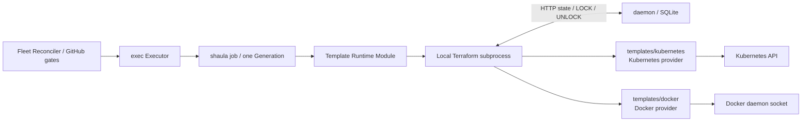

# Shaula v1 Template Profile Runtime Specification

- Status: Draft
- Date: 2026-09-04
- Platform APIs: no linked SDK; fixed host bootstrap CLI capability under spec 0020
- Bundled Template Platforms: Kubernetes, Docker and Proxmox (spec 0022)
- IaC engine: Terraform required; OpenTofu gated by compatibility

The operator-managed Proxmox VM image exception, NoCloud carrier and guest JIT environment
handoff are defined by [spec 0022](0022-proxmox-runner-template.md). Container image pins and
host bootstrap remain governed by spec 0020; a VM image contract does not enable container hooks.

This specification defines the platform-neutral seam between Shaula and infrastructure templates. It extends the [Multi-Fleet Runner Scale Set Controller Specification](0001-shaula-runner-scale-set.md). Platform details live in the [Kubernetes Runner Resource Specification](0003-kubernetes-runner-resource.md) and [Docker Runner Resource Specification](0006-docker-runner-resource.md), while profile publication is defined by the [Profile HTTP Control-Plane Specification](0005-profile-http-control-plane.md).

Worker ownership and the database state protocol are defined by [spec 0010](0010-lifecycle-worker-and-http-state-backend.md) and [ADR-0014](../ard/0014-run-lifecycle-workers-with-a-database-http-state-backend.md), which supersedes ADR-0002. Other related decisions are [ADR-0004](../ard/0004-allow-bootstrap-secrets-in-provisioning-state.md), [ADR-0008](../ard/0008-keep-platform-capabilities-in-terraform-template-profiles.md), [ADR-0009](../ard/0009-manage-profile-resources-through-http-and-sqlite.md), and [ADR-0010](../ard/0010-build-a-pure-rust-multi-crate-daemon-and-use-scaleset-as-an-oracle.md).

## 1. Outcome

Shaula is a pure-Rust daemon plus one Lifecycle Worker (`shaula job`) per Generation, not a platform-controller framework. The daemon owns Fleet/GitHub/capacity, worker supervision and the SQLite-backed HTTP state backend. The worker owns sequential Create/wait/Destroy and its Template Runtime; exec is the only v1 Executor Driver. Both use the same binary and Day 0 observability, but GitHub credentials remain in the daemon.

Terraform owns infrastructure creation/deletion. [Spec 0020](0020-official-container-runner-bootstrap.md) adds a fixed external bootstrap capability inside Template Runtime for official container images, using host Docker/kubectl tools after apply. It does not add a platform SDK, watch/controller, arbitrary hook or platform object type to Fleet/core. This explicitly amends the previous absolute platform-tool prohibition.



## 2. Required invariants

1. Fleet Reconciler and Runner Lifecycle have no branch on Kubernetes/Docker object kinds.
2. The only mutating infrastructure Operations are Create and Destroy. The fixed bootstrap from spec 0020 is part of Create, not an Update primitive. Profile publication, validation, state inspection and read-only diagnosis are not Update primitives.
3. Every Runner Generation pins one immutable Template Profile Revision, artifact digest, normalized input digest, Workspace and state.
4. An uncertain Create result is never retried with a second apply. It enters `CleanupRequired` and proceeds through the same GitHub removal and Destroy safety path.
5. Destroy always uses the original artifact/inputs/runtime tuple and that Generation's authoritative database state. An ordinary Workspace copy may be reconstructed after fencing; missing unique emergency state or original materials cannot. A newer Profile Revision never repairs or destroys an older Generation.
6. The daemon treats platform-specific declared outputs as protected opaque evidence. It persists them for recovery but does not reproduce platform reconciliation logic in Rust or expose their bodies through ordinary diagnostics.
7. Adding a Template Platform requires a conforming profile and test suite, not a new Fleet/Runner lifecycle method.
8. Provider administration credentials may enter the exact Revision's approved IaC and fixed bootstrap subprocesses, but never the Runner Resource or workflow.
9. Runner readiness and busy safety are proven through GitHub inventory/removal semantics, not through platform-specific “running” status.
10. The artifact manifest is the sole authority for `platform` and `bindings_contract`. HTTP and SQLite representations derive those values from the verified artifact and cannot accept an independent platform selector.
11. A current Template Profile Revision automatically becomes Active after successful static validation under [spec 0017](0017-automatic-template-activation.md). Claims of tested platform compatibility require independent conformance evidence for the exact tuple; Active alone does not establish that claim.

## 3. Template Profile Revision

A Template Profile Revision is an immutable tuple of：

- a content-addressed artifact containing Terraform source and vendored local modules；
- a checked-in dependency lock file and declared Terraform/Provider constraints；
- a versioned `shaula-profile` manifest；
- administrator-owned fixed bindings, including provider endpoint/configuration and schema-sensitive plaintext values stored in this Revision；external secret references are not a v1 storage mode；
- a schema for Fleet-supplied bounded inputs；
- a protected opaque binding commitment, carried under the wire name `bindings_digest`, that identifies the exact immutable binding Revision without exposing an offline credential verifier；
- the normalized digest of all non-credential material.

Before freezing a new artifact, its dependency lock must cover the OS/architecture
of the actual Terraform execution host, not only the publisher's workstation.
Generate the required provider checksums from verified upstream packages using
`terraform providers lock -platform=OS_ARCH` for each supported execution target;
the presence of some `zh:` entries or an `h1:` for another platform alone is not
runtime verification. Terraform's [platform lock options](https://developer.hashicorp.com/terraform/cli/commands/providers/lock)
prepare these hashes; its [dependency lock verification](https://developer.hashicorp.com/terraform/language/files/dependency-lock)
must remain enabled for provider installation.

Verify the candidate in an isolated directory on each claimed execution target:
locked `init -lockfile=readonly`, then actual `validate` and a plan without apply
under the approved runtime inputs and provider access. Confirm the lock remains
unchanged and that the installed provider can load; init exit zero alone does not
prove validate/plan can use it. Record any unavailable platform or live-plan check
as unverified. This is artifact authoring/release evidence, not a new synchronous
HTTP publication step or a claim that static activation proves runtime compatibility.
Correcting a lock creates a new artifact and Template Revision; an existing Fleet
adopts it explicitly under spec 0021. Historical artifacts, admitted Generation
materials and their lock/checksum protections remain unchanged.

`bindings_digest` MUST NOT be an unkeyed digest of sensitive binding plaintext or permit a reader to validate secret guesses. It is a server-issued equality token for an immutable Revision；its representation, exact-Revision/incarnation binding and compatibility freeze remain decision D4 in the [central register](../README.md#仍需决定或冻结). This revision does not introduce a new bd2/HMAC encoding or rewrite existing records. If that non-verifier property cannot be met, the field and every containing subject/output are secret and cannot appear on read surfaces.

The trusted conformance attestation is a separate immutable record that references the Revision and its canonical compatibility subject. Attestation submission never mutates the Revision, Profile head or activation ID. The automatic activation transaction freezes opaque activation provenance, and each admitted Fleet/Generation pins both the Revision and that identity. Legacy `active_attestation_id` and related wire/storage field names retain historical values and carry new activation IDs according to spec 0017; they do not imply a passing conformance record.

The artifact root has a fixed, inspectable shape：

```text
profile.yaml
*.tf
.terraform.lock.hcl
schemas/parameters.schema.json
schemas/bindings.schema.json
```

The manifest declares protocol and plan shape, but cannot define custom commands or hooks：

```yaml
api_version: shaula.io/template-profile/v1
kind: RunnerTemplateProfile
platform: kubernetes
runtime:
  protocol: terraform-cli/v1
  engine: terraform
  root_module: .
  required_version: ">= 1.9, < 2.0"
bindings_contract: shaula.bindings.kubernetes/v1
schemas:
  bindings: schemas/bindings.schema.json
  parameters: schemas/parameters.schema.json

managed_resource_shape:
  - role: bootstrap
    terraform_type: kubernetes_secret_v1
    exact_count: 1
  - role: runner
    terraform_type: kubernetes_pod_v1
    exact_count: 1
```

This is a contract shape, not a serialization-library commitment. `platform`, `bindings_contract` and Terraform resource type strings are opaque policy/test metadata. `platform` exists only in this verified artifact manifest；Profile HTTP requests do not submit a second value. The core compares declared strings, action sets and cardinality without interpreting a Pod, Secret or container. The Observability Adapter derives its bounded platform label from this manifest value and maps future or unrecognized values to `other`.

The runtime writes exactly one protected tfvars JSON document whose sole top-level variable is `shaula`：

```json
{
  "shaula": {
    "contract_version": 1,
    "generation": {
      "fleet_key": "fleet-a",
      "scale_set_id": 123,
      "id": "generation-id",
      "runner_name": "deterministic-name"
    },
    "jit_config": "write-only value",
    "bindings_digest": "opaque-binding-revision-commitment",
    "bindings": {},
    "parameters": {}
  }
}
```

The root module must declare the whole variable sensitive. `bindings` contains values fixed by the Template Profile Revision；the opaque `bindings_digest` binds the envelope to that exact persisted revision without acting as a plaintext hash；`parameters` contains Fleet-supplied values accepted by its bounded schema. The Profile cannot rename or add system variables. Shaula never places the input document or JIT in its own argv or process environment.

The only output is `shaula_result` with a fixed provider-neutral envelope：

```json
{
  "contract_version": 1,
  "generation_id": "generation-id",
  "bindings_digest": "opaque-binding-revision-commitment",
  "resources": [
    {
      "role": "bootstrap",
      "id": "opaque-provider-id",
      "incarnation": "optional-opaque-value"
    },
    {
      "role": "runner",
      "id": "opaque-provider-id",
      "incarnation": "optional-opaque-value"
    }
  ]
}
```

The core verifies envelope version, echoed Generation ID, exact `bindings_digest`, declared roles/cardinality and bounded sizes. It stores protected opaque evidence. The private fixed bootstrap adapter may interpret the contract-bound IDs/incarnations under spec 0020; no output body is exposed through normal HTTP/log/telemetry paths.

The Profile separates three input classes：

| Input class | Owner | Examples | Mutability |
| --- | --- | --- | --- |
| System input | Shaula | Fleet/Scale Set IDs, Runner name, Generation ID, JIT | Fixed per Generation |
| Profile binding | Profile publisher | namespace, kubeconfig, Docker host/socket, registry credential | Fixed by Profile Revision |
| Fleet input | Fleet manager | approved size/network/image alias | Bounded by manifest schema and fixed by Fleet Revision |

Raw scripts, provider blocks, executable paths, arbitrary environment names and arbitrary filesystem paths are never Fleet inputs. The Profile publisher is trusted to publish executable infrastructure code and has a separate authorization capability.
A trusted external conformance attestation supports claims that an exact Template runtime tuple passed its accepted suite; it is not an activation prerequisite. Its provider-neutral envelope binds the artifact/manifest digests, exact engine kind/version/binary digest, dependency lock and provider versions/checksums, protected `bindings_digest`, runtime/trust policy, executable or image digests declared by the Profile, manifest-derived `platform`/`bindings_contract` and conformance-suite revision. The runtime/trust policy records enforced handoff controls and accepted limitations；it does not imply same-Runner-Execution-Domain process isolation. Shaula verifies the attestation trust, envelope and exact digest/version equality without interpreting platform assertions. A changed member creates a different compatibility tuple and requires new evidence before claiming the same tested guarantee. Trust is authenticated OIDC submission under independent `template.attest` authority plus immutable audit/record storage, not a new signing PKI or a claim that the daemon reruns the harness; spec 0005 §5.1 owns this contract.

The artifact manifest remains the sole source of `platform`. Profile publication may attach bindings but cannot attach a conformance attestation, override platform identity or independently declare it. Publication authorizes automatic activation after validation under spec 0017. A separate authorized attestation PUT records immutable evidence without creating or rewriting the Profile Revision, head or activation provenance.


## 4. Template Runtime Module

The Template Runtime Module runs inside the Lifecycle Worker; it is not a daemon command queue or Executor Driver. Its platform-neutral Interface is conceptually：

- validate an immutable Profile artifact without infrastructure mutation；
- Create one Runner Generation from a pinned Profile and normalized inputs；
- Destroy that same Generation from its original state；
- inspect state and run explicitly read-only diagnosis needed for recovery.

The exact Rust types, traits and method names are implementation details. Callers never supply Terraform argv, environment maps or platform manifests. The Module hides artifact materialization, secret files, environment allowlists, provider installation, locking, timeouts, saved-plan inspection, output parsing, redaction, fixed official-container bootstrap and state-empty verification. A Profile cannot add executable lifecycle hooks or redefine command names.

`Validate` MAY run `terraform init -backend=false` and `terraform validate` in an isolated candidate directory. Any command that can contact or mutate external infrastructure is asynchronous, explicitly classified and never executed in the HTTP request transaction.

Read-only diagnosis MAY use `terraform show -json` and a bounded normal plan with `-detailed-exitcode`. It MUST NOT run `terraform refresh`, apply a refresh-only or diagnostic plan, import an unowned object, recreate a missing object or repair drift. A Profile that cannot prove safe Destroy from its own state is incompatible with v1. Plan/state JSON is credential-grade even when Terraform marks values sensitive and is never logged or returned by management HTTP. The only state-byte HTTP channel is the authenticated internal backend in spec 0010.

Lifecycle-visible template failures use only the provider-neutral reason `TemplatePlanFailed` or `TemplateExecutionFailed` plus a bounded phase such as `create.plan`, `create.apply`, `inspect.plan`, `destroy.plan`, `destroy.apply` or `state.verify`. Provider text, platform-specific status and raw diagnostics remain protected details and are never parsed into core reason codes.

## 5. Saved-plan admission and provenance

Operation Log 捕获、保留和安全内容归 [spec 0019](0019-workflow-jobs-and-operation-logs.md)；官方镜像的宿主 bootstrap 归 [spec 0020](0020-official-container-runner-bootstrap.md)。新 manifest 声明 `container_bootstrap_contract: shaula.container-bootstrap/v1`，继续使用 v1 input；旧 v2 `setup_info_contract` 仅供原 artifact 兼容，不能与新能力叠加。日志在 apply 后生成，不回写原 input/saved plan；bootstrap 是同次 Create 的固定尾部，不添加 Update 或第二次 apply。

Every mutating Terraform invocation applies a previously inspected saved plan, never a directory. The worker retains protected plan provenance in its exclusive Workspace: plan digest, exact engine executable/kind/version/binary digest, artifact/protected-input digests, backend Generation identity/revision and Terraform lineage/serial, Generation ID and current Worker Claim. This does not require a central per-command operation record or promise that Create resumes from an arbitrary saved plan after a crash.

Immediately before spawning apply, the Template Runtime re-hashes the plan, inputs and engine binary and re-reads the state lineage/serial. Any mismatch, missing member or changed engine/artifact rejects the plan. The plan file, inspection result and provenance record are credential-grade and never appear in HTTP or telemetry.

Saved-plan admission is fail closed：

1. `terraform show -json` must have a supported format major, `applyable=true`, `complete=true` and `errored=false`.
2. A missing or unknown action, mode, address, resource type or shape-critical value is rejected；provider-computed attribute values may remain unknown when they cannot alter resource identity, action or cardinality.
3. Deferred changes, importing, deposed instances, moved/`previous_address` entries and both replacement action orderings are rejected.
4. Create requires both the bound state snapshot and plan prior state to contain no managed instance. Every manifest-declared managed instance appears exactly once with `mode=managed` and `actions=["create"]`, and the role/type/cardinality is exact.
5. Destroy may skip apply for already-empty bound state only when spec 0010's trusted terminal classification is satisfied; an empty initial state after an uncertain Create is not proof of cleanup. Otherwise every managed instance in that bound state appears exactly once with `mode=managed` and `actions=["delete"]`；the set may be a subset after a partial Destroy but may contain no new address or type.
6. Only `mode=data` entries may use exactly `["read"]` or `["no-op"]`. All other actions, modes and combinations are rejected.

For an explicit `container_bootstrap_contract`, spec 0020 additionally validates known startup-gate, official-image and native Listener/JIT attributes after these generic checks and before `ApplyStarting`. This fixed capability check cannot be deferred to post-apply live inspection and does not add generic plan actions or hooks.

A standalone Terraform `check` is advisory and cannot satisfy a lifecycle safety gate. Failed or errored checks reject plan admission when present, but every property required before mutation must also be expressed through a blocking mechanism such as an ordinary data source plus resource `lifecycle.precondition`.

## 6. Provider-neutral lifecycle

The full sequence, process/side-effect gates, database locks and crash behavior are owned solely by [spec 0010 §2–8](0010-lifecycle-worker-and-http-state-backend.md). The Template Runtime implements the following local mechanisms, not a duplicate durable state machine:

- CoW/reflink materialization with ordinary-copy fallback; no writable hardlinks or shared working tree. Verify artifact content and containment before use; retain existing recovery evidence rather than deleting a previous directory.
- A reserved worker-owned backend configuration selects only the internal HTTP backend. Reject Profile-defined backends/overrides and reserved-file collisions. This fixed non-secret configuration is distinct from the immutable published artifact; it does not permit arbitrary generated Terraform code.
- Locked `terraform init -lockfile=readonly` precedes JIT; provider versions/checksums cannot implicitly upgrade. A missing execution-platform checksum is a candidate-artifact defect, not permission to rewrite the frozen lock or bypass checksum verification during Create/Destroy. Backend credentials use only the prescribed per-child `TF_HTTP_*` env, never HCL or `-backend-config` secrets.
- Saved-plan admission/provenance follows §5. The worker requests daemon JIT/Create-start/removal authority; no raw GitHub credential is passed into the Runtime.
- Output validation is the fixed envelope in §3; readiness/Busy classification comes from daemon GitHub observations, not provider object parsing.
- Original inputs and any emergency local state remain protected until the daemon acknowledges exact empty-state terminal completion and seals backend writes. Worker exit, backend failure or missing state never triggers unconditional cleanup.

Native platform discovery, import, out-of-state/reconstructed-name deletion and same-Generation Create re-apply remain forbidden. Worker recovery can regenerate a delete-only plan only after prior descendants are excluded and the original state/materials are trustworthy.

## 7. Kubernetes v1 Profile

`templates/kubernetes` uses a pinned Kubernetes Terraform provider. Kubernetes resource semantics live in HCL, the manifest and its tests; spec 0020 owns the fixed host bootstrap adapter：

- a user with `template.publish` authority selects the already-existing namespace through an HTTP-managed Profile binding；Fleet input cannot override it；
- each Generation manages exactly one Secret and one Pod; the fixed bootstrap freezes the initially mutable Secret before runner startup；
- it manages no Namespace, ServiceAccount, RBAC, Job, Deployment or other shared object；
- the Pod has no mounted ServiceAccount token；
- the official Runner uses native JIT Secret env input; a required missing `.setup_info` volume key prevents startup until host publication after apply. There is no init/sidecar/shim; the Secret is initially mutable and frozen by the single conditional bootstrap publish under spec 0020；
- Shaula persists a collision-resistant Generation name before external effects；the bundled Profile uses it as the exact Pod and Secret `metadata.name`, and Terraform outputs each exact target/namespace/kind/name key as protected evidence. Any normalized/truncated key collision fails before JIT or external mutation；
- the pinned HashiCorp provider deletes from exact original state by namespace/name. Target/namespace continuity and names are reserved until Destroy；repointing the target, recreating the namespace or replacing an object under the same name may cause deletion of the replacement, which is an accepted v1 risk rather than a UID-safety claim；
- missing/corrupt state never authorizes native discovery, reconstructed/out-of-state name deletion, import or adopt；
- an ordinary provider data source plus blocking resource `lifecycle.precondition` verifies the pre-created namespace；standalone `check` blocks are advisory only；

Shaula does not preflight namespace existence through a new platform client; the fixed bootstrap does inspect the exact Pod/Secret after apply under spec 0020. If the blocking data lookup/precondition makes Create planning fail, no plan is admitted or applied and core reports `TemplatePlanFailed` with phase `create.plan`. If JIT was already generated, the Generation follows `CleanupRequired` and Destroy. The external harness may use additional platform inspection; production kubectl usage is limited to the fixed bootstrap contract.

## 8. Docker v1 Profile

`templates/docker` uses a pinned `kreuzwerker/docker` Terraform provider and connects to the local Docker Engine through `unix:///var/run/docker.sock` by default. The socket path is a trusted Profile binding, not a Fleet input. The complete specialization is defined by the [Docker Runner Resource Specification](0006-docker-runner-resource.md).

The initial Docker Runner Resource has these constraints：

1. one generation-scoped `docker_container` is the only managed runtime object；the image is pre-pulled or read as shared data rather than owned by each Generation；
2. the image is selected by a finite alias and official `ghcr.io/actions/actions-runner` digest；
3. the container initially uses `start = false`, `restart = "no"`, `must_run = false`, `rm = false` and runs one ephemeral Runner job；
4. its name is deterministic from the already-persisted Generation ID；
5. the official Listener receives native JIT env input; the Runtime writes Setup Info from the completed apply archive to the stopped exact container and starts it under spec 0020. No custom image/shim or host Workspace mount is used；
6. GitHub App/PAT material and Docker registry credentials are not placed in the Runner container；
7. the default Profile never mounts `/var/run/docker.sock` into the Runner container；
8. Destroy removes the recorded container through original state and finishes only when state is empty.

Access to the Docker daemon is effectively host-administrative. When the daemon and IaC children use one OS identity, the socket is ambient authority available to every IaC child under that identity, not a credential isolated to the Docker provider process. The daemon identity, all such children, Workspaces and Profile publication capability therefore share one host-admin trust domain. The default Runner still receives no socket. A remote Docker endpoint requires mutually authenticated TLS or SSH and a separate accepted Profile Revision；plaintext TCP is rejected.

## 9. Security

New container Templates use spec 0020's host bootstrap and receive no log capability. The separately scoped Setup Info bearer remains permitted only for already retained v2 Generations under their original contract; it does not authorize new custom-image Create; it never grants management/control/state/SQLite access.

Template artifact publication is equivalent to deploying code that can run provider plugins with infrastructure credentials. The HTTP authorization model separates `template.publish` from `fleet.write`, `auth.write` and read-only roles.

The Template Runtime uses a per-process environment allowlist, dedicated Workspace, restricted files, bounded output and redaction. It never forwards the daemon's full environment. Terraform state, plans, variable files, provider credentials, JIT, Docker registry credentials and sensitive Profile bindings are credential-grade data. JIT never enters Shaula/Terraform argv or environment, container args/commands/labels, ordinary inherited job environment, workflow context, management reads, audit, logs or telemetry. The only declarative Runner env exception is the official `ACTIONS_RUNNER_INPUT_JITCONFIG` (Kubernetes uses a Secret reference); no arbitrary secret env keys are allowed. Official `CommandSettings` captures the value and removes the ordinary environment entry. Linux may retain initial exec environment through `/proc/<pid>/environ`, so v1 explicitly accepts possible JIT access by workflow code with process-inspection capability inside the same Runner Execution Domain. This is not an activation failure and no process-isolation or memory-zeroization claim is made. The exception is JIT-only；GitHub control-plane/derived tokens, provider credentials, sensitive Template bindings and Shaula HTTP/SQLite credentials never enter that domain.
Schema-sensitive Kubernetes/Docker bindings are write-only HTTP fields whose original plaintext is retained in the immutable Template Profile Revision. The SQLite main DB, WAL/SHM, online/migration copies, backups and crash dumps therefore share the credential boundary. Read APIs, audit, errors, logs, OTel and diagnostics expose only approved non-secret fields and bounded presence metadata, never a secret value or derived prefix/suffix/hash/length. Each sensitive binding is resolved only into the exact approved IaC and fixed bootstrap children and never into the Runner/workflow.


The Kubernetes and Docker provider credentials are not GitHub Control-Plane Credentials. Neither class reaches the Runner. Workflow credentials such as per-job `GITHUB_TOKEN` remain a separate GitHub/workflow concern.

## 10. Day 0 observability

[Spec 0019](0019-workflow-jobs-and-operation-logs.md) 增加独立已脱敏日志及受控读取，不把正文放入 spans/metrics。新容器由宿主生成/交付批准投影，无 Runner log capability；spec 0020 的 bootstrap 也必须过滤固定子进程输出。GitHub/provider/management/control/state/SQLite credentials 不进入 Runner。

Generic spans cover Profile validation, artifact materialization, `init`, `apply`, read-only diagnosis, `destroy`, output classification and state-empty verification. Attributes include bounded engine/operation/result and safe Profile/Generation correlation in spans/logs. They do not contain argv, environment, Profile input values, output bodies, state or provider responses.

Metrics use finite operation/result dimensions. The Observability Adapter derives `platform` from the verified artifact manifest and maps it to `kubernetes`, `docker`, `proxmox` or `other`; exact Profile keys, revisions, artifact digests, socket paths, namespaces and resource IDs are excluded.

## 11. Acceptance criteria

Implementation is incomplete until：

1. `cargo metadata`/`cargo tree` architecture tests prove the pure-Rust Shaula binary contains no Kubernetes or Docker client dependency and no platform object type crosses a core Interface; fixed bootstrap platform schemas stay private to Template Runtime.
2. The same fake-Profile contract suite exercises Create, Destroy, uncertain apply, crash recovery, redaction and state-empty verification without a platform branch in Fleet/Runner lifecycle.
3. Both bundled Profile artifacts pass the static validation and automatic activation contract in spec 0017 before becoming Active or selectable. Independent release conformance covers the exact artifact, engine binary, provider lock, bindings, runtime policy, images, manifest contracts and suite tuple; activation must not be reported as completion of that runtime suite.
4. A real Kubernetes workflow passes the specialization's complete one-Pod/one-Secret lifecycle tests, including stable exact `metadata.name`, non-reuse/normalization-collision failure, original-state name-based Destroy, target/namespace continuity assumptions and object/namespace same-name replacement residual-risk scenarios.
5. A real Docker workflow creates one container through the Terraform provider and Docker socket, runs one job, safely unregisters, destroys the container and leaves empty state.
6. Neither real Runner can read Shaula's GitHub App/PAT, provider administration credential or sensitive Profile binding；GitHub control credentials never enter Terraform, while binding/provider secrets reach only the exact approved IaC and fixed bootstrap children.
7. The default Docker Runner container has no Docker socket mount；an external inspection test proves it.
8. A malicious Fleet input cannot change provider endpoints, socket paths, namespaces outside the Profile schema, provider source, executable or artifact code.
9. Publishing a third fake platform Profile requires no change to Fleet Reconciler or Runner Lifecycle Interfaces.
10. OTel tests observe both platforms through the same generic span/metric names and bounded attributes.
11. Plan-policy tests cover unsupported format major, `applyable/complete/errored`, empty Create prior state, exact managed create/delete, data-only read/no-op, deferred/unknown shape, import, deposed, move and replacement rejection.
12. A crash after Create-start authorization never causes a second Create apply. Worker provenance, exec fencing and database state/lock tests pass spec 0010; a terminated partial Destroy retries only through a newly bound delete-only plan, without requiring a daemon per-command ledger.
13. The exact protected input remains readable for recovery and Destroy until state is empty, then is removed under retention policy.
14. Engine binary replacement or binding/runtime-trust-policy changes fail runtime provenance checks where an original execution is pinned and cannot reuse a prior conformance claim for a different tuple；the policy explicitly records the accepted same-Execution-Domain JIT inspection limitation. Automatic activation does not claim a passing runtime suite. The exposed `bindings_digest` cannot validate offline guesses of a sensitive binding.

15. Sensitive Kubernetes/Docker bindings survive restart from their exact plaintext SQLite Revision but are absent from every read response, audit, error, log, trace, metric and diagnostic；DB/WAL/SHM/copies/backups are tested as one credential boundary.
## 12. Open decisions

See the [central decision register](../README.md#仍需决定或冻结), especially D4 and R1/R3. Socket-enabled Runners, per-Profile OS isolation, pre-JIT provider preflight and memory-only Docker handoff are optional extensions to the accepted baseline. Read-only diagnosis may add evidence, but never replaces ownership, process fencing or the GitHub removal gate and never authorizes repair.
