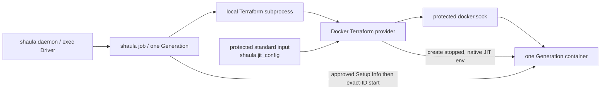

# Shaula v1 Docker Runner Resource Specification

- Status: Draft
- Date: 2026-09-04
- Template path: `templates/docker`
- Runtime provider: Terraform Docker provider through a local Unix socket

This document specializes the provider-neutral [Template Profile Runtime Specification](0004-template-profile-runtime.md) for Docker. [Spec 0020](0020-official-container-runner-bootstrap.md) adds one fixed host-side bootstrap capability inside Template Runtime: inspect the exact newly created stopped container, deliver Setup Info, then start it. Fleet/core remain provider-neutral; no Docker event controller or general platform mutation interface is added.

Worker/state ownership follows [spec 0010](0010-lifecycle-worker-and-http-state-backend.md). Related decisions are [ADR-0014](../ard/0014-run-lifecycle-workers-with-a-database-http-state-backend.md), [ADR-0004](../ard/0004-allow-bootstrap-secrets-in-provisioning-state.md), and [ADR-0008](../ard/0008-keep-platform-capabilities-in-terraform-template-profiles.md).

## 1. Outcome

Each Runner Generation is realized by one `docker_container` managed by the pinned Docker Terraform provider. Terraform runs as a child of the local Generation-specific `shaula job` worker and connects to an already-running Docker Engine through an approved Unix socket. Its target state ownership is the daemon's database HTTP backend; the current daemon-owned local-state composition remains recorded in implementation status. Docker names the Runner Resource platform, not an Executor Driver or native API; Target remains GitHub scope terminology.

## 2. Required resource shape

The bundled Profile and its conformance tests enforce all Docker-specific requirements:

1. A Generation manages exactly one `docker_container` and no shared image, network, volume or daemon configuration.
2. The image is selected through a bounded Fleet parameter and resolves to an official `ghcr.io/actions/actions-runner` digest under spec 0020; custom Runner builds are forbidden. It is pre-pulled or treated as shared read-only data, not owned by the Generation state.
3. The container name is deterministic from the already-persisted Generation ID and carries bounded Shaula ownership labels.
4. The container uses `start = false`, `restart = "no"`, `must_run = false` and `rm = false`. Docker never restarts or auto-removes it behind Shaula's lifecycle ledger.
5. The default Profile does not use privileged mode, host PID/IPC/network namespaces, host devices or the Docker socket inside the Runner container. Fleet parameters cannot enable them.
6. GitHub Control-Plane Credentials and Docker registry/provider credentials never enter the Runner container.
7. There is no platform adopt, repair or general in-place mutation; the sole bootstrap copy/start is part of the original Create under spec 0020. A pre-existing conflicting container makes Create fail and enter the normal cleanup/quarantine rules.

These constraints are profile data, Terraform plan policy and external-test assertions. Shaula core does not branch on Docker resource types beyond comparing the manifest's opaque declared strings and cardinality.

## 3. Profile bindings and trust boundary

The artifact manifest is the sole source of `platform: docker`, `bindings_contract: shaula.bindings.docker/v1` and `schemas/bindings.schema.json`. The admitted bindings document is bound exactly to the persisted opaque `bindings_digest` commitment；that value MUST NOT be an unkeyed digest/offline verifier for sensitive plaintext. Fleet HTTP and SQLite records reference the commitment but cannot assert or infer platform identity.

The v1 bundled Profile connects to `unix:///var/run/docker.sock`. The Terraform child may use that host socket to create the Generation container；the endpoint and any registry/provider credential are administrator-owned Profile bindings, not Fleet input. Schema-sensitive binding values are write-only plaintext in the immutable SQLite Template Revision and are resolved only into its exact approved IaC and fixed bootstrap children. Arbitrary socket paths, remote endpoints, TLS material, environment names and daemon options are rejected from Fleet requests.

Possession of the Docker daemon socket is effectively host-administrative. Every IaC child sharing the daemon's operating-system identity inherits ambient ability to open that socket, even when its own Profile bindings omit it. Shaula, every such IaC child, Template publication, the artifact store and Runner Workspaces therefore share one host-admin trust domain；per-Profile environment scoping is not an isolation boundary. The socket must be restricted to the dedicated Shaula identity or an equally narrow group.

Plaintext unauthenticated TCP access is outside v1. A later remote-Docker Profile requires a separately accepted transport and credential design. The bundled default Runner container never mounts `docker.sock`; whether to ship an additional explicitly high-trust Runner-socket Profile and whether to isolate IaC children with separate operating-system identities or a sandbox remain open decisions.

## 4. Official Runner JIT and Setup Info handoff

The Template Runtime obtains JIT after materialization and locked initialization and freezes it in the sensitive fixed `shaula.jit_config` input. Shaula/Terraform argv, ambient environment, logs and telemetry never carry it. The official Runner command receives the standard `ACTIONS_RUNNER_INPUT_JITCONFIG` through the container's initial declarative environment. This narrowly replaces the former upload/read/unlink shim contract; it does not permit secrets in command/args/labels, custom wrapper scripts or arbitrary environment names.

[Spec 0020](0020-official-container-runner-bootstrap.md) owns the stopped-container gate and external copy/start sequence. The approved apply projection is generated on the lifecycle host and best-effort copied to `/home/runner/.setup_info` before starting the exact output/state-bound container ID. Diagnostic file/copy failures may degrade; exact identity is revalidated before mandatory start, which cannot be skipped or reported successful on failure. The Runner image has no Shaula helper, download, wait loop or new package; no Runner callback capability is required.

The official Listener captures the JIT input and removes its ordinary environment entry. Conformance must prove job children do not inherit it; it cannot establish initial-environment or same-domain memory isolation. Docker inspect/config, Terraform state/input/plan and container metadata containing the initial JIT remain credential-grade. The accepted risk is explicit: initial declarative env persists at the Docker control plane until resource cleanup. It must never become an ordinary management API, audit, error or telemetry field.

GitHub control-plane credentials, provider/registry credentials, sensitive Template bindings and Shaula HTTP/SQLite credentials never enter the Runner Execution Domain. Old retained v1/v2 artifacts preserve their original input/image/bootstrap contracts for parsing, recovery and cleanup; they cannot be used for new Create; the new default does not rewrite them.

## 5. Create

The full worker sequence, GitHub gates and HTTP state protocol are owned by spec 0010; generic saved-plan checks are owned by spec 0004 §5. Docker adds only:

1. The manifest requires exactly one generation-scoped `docker_container` with `["create"]`; shared image data is not Generation-owned infrastructure.
2. The provider creates a stopped official-image container; after completed apply and validated output/state, the fixed Runtime bootstrap delivers Setup Info and starts its exact ID under spec 0020.
3. `shaula_result` uses the common envelope and opaque container evidence; authoritative Terraform state is stored by the database HTTP backend.
4. Readiness is determined by daemon GitHub inventory, not a Docker API client or worker process exit.

Docker `running` state is diagnostic evidence, not authoritative Runner readiness. A container that exits before GitHub reports the Runner online is retired through the normal GitHub removal and Destroy path.

## 6. Destroy and recovery

The daemon authorizes safe GitHub removal; the worker then uses original artifact/runtime/inputs and database state to Destroy the recorded container. Spec 0004 owns delete-only plan checks; spec 0010 owns descendant fencing, lock/CAS, retry and exact empty-state completion/seal before cleanup. An empty initial state or worker exit alone is not successful Destroy. Ordinary Workspace reconstruction is permitted only from complete retained materials and DB state; emergency local state cannot be discarded.

A possibly started Create is never applied again. Missing/corrupt original state with a possible external container causes `Quarantined`；Shaula never scans Docker, imports by name or issues native delete. A normal plan is allowed only for bounded read-only drift diagnosis and is never applied. Exact live absence and security shape belong to the external conformance harness.

## 7. Security and observability

Template publication can execute Terraform providers with Docker host authority and is isolated behind the high-trust `template.publish` capability. The subprocess receives a minimal environment and exact Profile bindings；the daemon environment is not forwarded wholesale. This reduces accidental exposure but does not isolate same-identity IaC children from the ambient host-admin socket capability.
Docker endpoint, registry/provider credentials and other schema-sensitive binding bytes are absent from every read response, audit, error, log, span, metric and diagnostic. Because their plaintext lives in the immutable Template Revision, SQLite main DB, WAL/SHM, online/migration copies, backups and crash dumps all remain inside the credential boundary. These bindings never enter the Runner container or workflow.

Generic Day 0 spans cover artifact validation/materialization, `init`, Create plan, saved-plan admission, apply, Inspect, Destroy plan/apply and state-empty proof. The `platform` attribute is derived solely from the admitted artifact manifest. Bounded attributes may identify operation, engine, phase, result and provider-neutral reason. Socket paths, image references, container IDs/names, Profile keys, JIT, inputs, plan/state bodies, provider responses and error bodies never become metric labels；credential-bearing values never enter logs or spans.

Template failures expose only `TemplatePlanFailed` or `TemplateExecutionFailed` plus a bounded phase. Provider strings are sanitized diagnostics, never reason values or API contracts.

The fixed bootstrap requires the host Docker CLI and approved socket; external conformance may use additional read-only Docker diagnostics. Neither path exposes a general Docker API through the Fleet/core interface.

## 8. Failure behavior

| Failure | Required behavior |
| --- | --- |
| Docker socket absent or permission denied during plan | `TemplatePlanFailed`, phase `create.plan`；do not broaden permissions |
| Image digest unavailable during plan | `TemplatePlanFailed`, phase `create.plan`；never silently select a tag or another image |
| Conflicting container name | Report `TemplatePlanFailed` or `TemplateExecutionFailed` with the actual bounded phase；never adopt, rename or delete the unknown container |
| Apply result uncertain | `TemplateExecutionFailed`, phase `create.apply`, then `CleanupRequired`；never apply the Generation again |
| Container exits before GitHub online | Safely remove any GitHub registration, then Destroy |
| Runner is Busy | Do not Destroy；surface bounded blocked status and retry GitHub removal later |
| State missing with possible container | Quarantine；require operator recovery, never native discovery/delete |
| Destroy partly succeeds | Fence prior descendants, re-read state and re-plan delete-only; unresolved outcome still blocks terminal completion |
| OTel exporter unavailable | Continue lifecycle and retain bounded local diagnostics |

## 9. Acceptance criteria

Implementation is incomplete until:

1. Dependency inspection proves the core Interface contains no Docker type and only the fixed Runtime bootstrap owns production Docker CLI calls.
2. A real local Docker Engine test creates exactly one generation container via Terraform, runs one GitHub job, safely unregisters, destroys the container and leaves empty state.
3. A passing conformance attestation binds the exact engine version/binary digest, provider lock versions/checksums, Profile artifact digest, protected `bindings_digest`, runtime/trust policy including accepted limitations, official Runner image digest and host bootstrap CLI tuple and suite revision before claiming tested Docker capability. Activation and Fleet selection instead follow automatic static validation under [spec 0017](0017-automatic-template-activation.md); Active alone does not prove Docker runtime conformance.
4. The bundled default Runner container has no Docker socket, GitHub App/PAT, provider/registry credential, sensitive Profile binding or host API credential；only the approved Terraform and fixed bootstrap children receive the socket/bindings needed for Create.
5. External inspection proves an initially stopped container, `restart=no`, `must_run=false`, `rm=false`, official pinned image digest, bounded ownership labels and all forbidden privilege/host settings.
6. JIT appears only in the approved initial `ACTIONS_RUNNER_INPUT_JITCONFIG` environment; it is absent from argv, args/command/labels, ordinary inherited job environment, workflow context, management reads, audit, logs and telemetry. The report records Docker configuration retention and same-Execution-Domain process inspection as accepted risks, without a memory-zeroization claim.
7. Create-plan tests cover every generic header/shape rejection and require empty prior state plus one exact create.
8. Destroy-plan tests cover empty-state success, exact deletes, every ambiguous-form rejection and partial-delete recovery.
9. Worker/daemon crashes, backend outages and lock races pass spec 0010; no second Create apply or unfenced Destroy retry occurs. Exact inputs/emergency state remain until trusted empty-state completion; lost authoritative state with possible resources quarantines.
10. Malicious Fleet input cannot change the socket, provider source, image outside the allowlist, privilege/host settings, executable, filesystem paths or artifact code.
11. Docker-specific bootstrap refusal tests cover wrong IDs/labels, already-running containers, optional copy degradation, mandatory start errors, uncertainty and lost admission; core lifecycle/recovery tests remain provider-neutral.
12. OTel failure, generic-reason, manifest-platform and redaction tests cover every Docker lifecycle stage from the first release.
13. Conformance explicitly records that every same-identity IaC child shares the ambient Docker host-admin trust domain.
14. Sensitive Docker bindings survive restart from the exact plaintext SQLite Template Revision but are absent from every read/audit/diagnostic/telemetry surface；database, WAL/SHM, copies and backups are tested as one credential boundary.

A placeholder `.terraform.lock.hcl` is not a compatibility pin. Release requires real provider versions/checksums and passing engine/provider/image/GitHub/HTTP-backend tests; the checked-in artifact's evidence status is recorded in [implementation status](../IMPLEMENTATION_STATUS.md).

## 10. Open decisions

The [central decision register](../README.md#仍需决定或冻结) distinguishes R1/R3 release configuration from optional hardening. A Runner-socket Profile, memory-only JIT and separate OS identities/sandboxing are not default guarantees; the accepted baseline remains no Runner socket mount, official native JIT input, host-owned bootstrap and one ambient host-admin trust domain. Static activation follows spec 0017; runtime claims require passing exact-tuple evidence.
