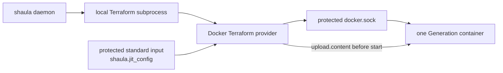

# Shaula v1 Docker Runner Resource Specification

- Status: Draft
- Date: 2026-09-04
- Template path: `templates/docker`
- Runtime provider: Terraform Docker provider through a local Unix socket

This document specializes the provider-neutral [Template Profile Runtime Specification](0004-template-profile-runtime.md) for Docker. It does not add Docker capability to the Shaula daemon. The production binary imports no Docker client, invokes no Docker CLI, interprets no container schema and watches no Docker event.

Related decisions are [ADR-0002](../ard/0002-run-immutable-runner-lifecycles-as-local-subprocesses.md), [ADR-0004](../ard/0004-allow-bootstrap-secrets-in-provisioning-state.md), and [ADR-0008](../ard/0008-keep-platform-capabilities-in-terraform-template-profiles.md).

## 1. Outcome

Each Runner Generation is realized by one `docker_container` managed by the pinned Docker Terraform provider. Terraform runs as a local Shaula child process and connects to an already-running local Docker Engine through an administrator-approved Unix socket. Docker is the Runner Resource realization platform, not Shaula's execution environment or native API；Target remains GitHub scope terminology.

## 2. Required resource shape

The bundled Profile and its conformance tests enforce all Docker-specific requirements:

1. A Generation manages exactly one `docker_container` and no shared image, network, volume or daemon configuration.
2. The image is selected through a bounded Fleet parameter and resolves to a pinned digest. It is pre-pulled or treated as shared read-only data, not owned by the Generation state.
3. The container name is deterministic from the already-persisted Generation ID and carries bounded Shaula ownership labels.
4. The container uses `restart = "no"`, `must_run = false` and `rm = false`. Docker never restarts or auto-removes it behind Shaula's lifecycle ledger.
5. The default Profile does not use privileged mode, host PID/IPC/network namespaces, host devices or the Docker socket inside the Runner container. Fleet parameters cannot enable them.
6. GitHub Control-Plane Credentials and Docker registry/provider credentials never enter the Runner container.
7. There is no platform adopt, repair or in-place mutation. A pre-existing conflicting container makes Create fail and enter the normal cleanup/quarantine rules.

These constraints are profile data, Terraform plan policy and external-test assertions. Shaula core does not branch on Docker resource types beyond comparing the manifest's opaque declared strings and cardinality.

## 3. Profile bindings and trust boundary

The artifact manifest is the sole source of `platform: docker`, `bindings_contract: shaula.bindings.docker/v1` and `schemas/bindings.schema.json`. The admitted bindings document is bound exactly to the persisted opaque `bindings_digest` commitment；that value MUST NOT be an unkeyed digest/offline verifier for sensitive plaintext. Fleet HTTP and SQLite records reference the commitment but cannot assert or infer platform identity.

The v1 bundled Profile connects to `unix:///var/run/docker.sock`. The Terraform child may use that host socket to create the Generation container；the endpoint and any registry/provider credential are administrator-owned Profile bindings, not Fleet input. Schema-sensitive binding values are write-only plaintext in the immutable SQLite Template Revision and are resolved only into the exact approved IaC child. Arbitrary socket paths, remote endpoints, TLS material, environment names and daemon options are rejected from Fleet requests.

Possession of the Docker daemon socket is effectively host-administrative. Every IaC child sharing the daemon's operating-system identity inherits ambient ability to open that socket, even when its own Profile bindings omit it. Shaula, every such IaC child, Template publication, the artifact store and Runner Workspaces therefore share one host-admin trust domain；per-Profile environment scoping is not an isolation boundary. The socket must be restricted to the dedicated Shaula identity or an equally narrow group.

Plaintext unauthenticated TCP access is outside v1. A later remote-Docker Profile requires a separately accepted transport and credential design. The bundled default Runner container never mounts `docker.sock`; whether to ship an additional explicitly high-trust Runner-socket Profile and whether to isolate IaC children with separate operating-system identities or a sandbox remain open decisions.

## 4. JIT file handoff

The Template Runtime obtains JIT only after artifact materialization and locked initialization. It writes JIT as the sensitive fixed input `shaula.jit_config`, without placing it in Shaula or Terraform argv/environment, logs or telemetry. The Docker Profile sets `docker_container.upload.content = var.shaula.jit_config` to copy the value to a fixed file before container start；it does not depend on a host source-file path.

A reviewed bootstrap shim:

1. reads the fixed JIT file exactly once;
2. unlinks the file before starting the pinned `Runner.Listener`;
3. passes no secret-bearing argv and sets only `ACTIONS_RUNNER_INPUT_JITCONFIG` on that spawned Runner process;
4. relies on Runner `CommandSettings` startup to capture the value into its private in-memory argument map and unset the ordinary environment entry；`GetJitConfig()` later reads that captured value;
5. exits rather than starting an unregistered Runner when the file is absent or malformed.

JIT is absent from declarative container environment, args, command, labels and metadata, and conformance proves it absent from process argv, the consumed staged file, ordinary inherited job environment, workflow context, HTTP reads, audit, logs and telemetry. Runner environment unsetting is not `/proc` or memory isolation；v1 accepts possible JIT access by workflow code with process-inspection capability inside the same Runner Execution Domain, and this does not block activation. No process-isolation or memory-zeroization claim is made. The container, Workspace, Terraform plan/state and exact original protected input remain credential-grade artifacts through successful Destroy and empty-state proof. A memory-only claim requires verified provider upload into `tmpfs` and is not part of the default contract. GitHub App/PAT/derived control-plane tokens, provider credentials, sensitive Template bindings and Shaula HTTP/SQLite credentials never enter the Runner Execution Domain.

## 5. Create

The generic Template Runtime lifecycle applies with these Docker-specific checks:

1. Persist Generation identity, exact Profile artifact and Revision, exact `bindings_digest`, Workspace and state lineage/serial, then materialize the artifact.
2. Verify the exact compatibility attestation and run locked Terraform initialization before issuing JIT.
3. Write the exact protected input and create a saved plan.
4. Apply the complete provider-neutral gate: supported JSON major, `applyable=true`, `complete=true`, `errored=false`, empty managed prior state, exactly one `docker_container` with exact `["create"]`, and only data-resource `["read"]`/`["no-op"]`. Reject unknown shape/action/mode/address/type, deferred changes, import, deposed instances, moves and replacements.
5. Bind the saved-plan digest to exact engine kind/version/binary digest, artifact/input digests, state lineage/serial or empty sentinel, Generation ID and attempt ID. Re-hash the plan and engine binary, persist `ApplyStarting` and provenance, then apply that exact plan at most once.
6. Validate the fixed `shaula_result` envelope and echoed `bindings_digest`, then store container identity only as opaque protected evidence.
7. Treat the Runner as online only when GitHub inventory reports the expected Shaula runner identity.

Docker `running` state is diagnostic evidence, not authoritative Runner readiness. A container that exits before GitHub reports the Runner online is retired through the normal GitHub removal and Destroy path.

## 6. Destroy and recovery

Destroy starts only after GitHub's safe-removal gate permits it and always uses the exact original Profile artifact, protected input, Workspace and state. Already-empty state succeeds without plan or apply.

For non-empty state, the saved plan must pass the full generic format/shape gate, give every remaining managed instance exact `["delete"]`, and allow only data-resource `["read"]`/`["no-op"]`. Import, deposed, move, replacement, deferred and unknown forms fail closed.

Before apply, Shaula binds and re-hashes the plan with the same provenance fields as Create and durably persists `DestroyApplyStarting`. A retry creates a new plan and attempt only after the previous subprocess is proven terminated. Completion requires successful apply and empty state；only then may the exact protected input be erased.

A possibly started Create is never applied again. Missing/corrupt original state with a possible external container causes `Quarantined`；Shaula never scans Docker, imports by name or issues native delete. A normal plan is allowed only for bounded read-only drift diagnosis and is never applied. Exact live absence and security shape belong to the external conformance harness.

## 7. Security and observability

Template publication can execute Terraform providers with Docker host authority and is isolated behind the high-trust `template.publish` capability. The subprocess receives a minimal environment and exact Profile bindings；the daemon environment is not forwarded wholesale. This reduces accidental exposure but does not isolate same-identity IaC children from the ambient host-admin socket capability.
Docker endpoint, registry/provider credentials and other schema-sensitive binding bytes are absent from every read response, audit, error, log, span, metric and diagnostic. Because their plaintext lives in the immutable Template Revision, SQLite main DB, WAL/SHM, online/migration copies, backups and crash dumps all remain inside the credential boundary. These bindings never enter the Runner container or workflow.

Generic Day 0 spans cover artifact validation/materialization, `init`, Create plan, saved-plan admission, apply, Inspect, Destroy plan/apply and state-empty proof. The `platform` attribute is derived solely from the admitted artifact manifest. Bounded attributes may identify operation, engine, phase, result and provider-neutral reason. Socket paths, image references, container IDs/names, Profile keys, JIT, inputs, plan/state bodies, provider responses and error bodies never become metric labels；credential-bearing values never enter logs or spans.

Template failures expose only `TemplatePlanFailed` or `TemplateExecutionFailed` plus a bounded phase. Provider strings are sanitized diagnostics, never reason values or API contracts.

The Profile's external integration suite may use Docker APIs or CLI and emit separate test diagnostics. Those dependencies are not linked into the daemon.

## 8. Failure behavior

| Failure | Required behavior |
| --- | --- |
| Docker socket absent or permission denied during plan | `TemplatePlanFailed`, phase `create.plan`；do not broaden permissions |
| Image digest unavailable during plan | `TemplatePlanFailed`, phase `create.plan`；never silently select a tag or another image |
| Conflicting container name | Report `TemplatePlanFailed` or `TemplateExecutionFailed` with the actual bounded phase；never adopt, rename or delete the unknown container |
| Apply result uncertain | `TemplateExecutionFailed`, phase `create.apply`, then `CleanupRequired`；never apply the Generation again |
| Container exits before GitHub online | Safely remove any GitHub registration, then Destroy |
| Runner is Busy | Do not Destroy；surface bounded blocked status and retry GitHub removal later |
| State missing with possible container | Quarantine；require operator recovery, never native discovery/delete |
| Destroy partly succeeds | Re-plan, re-check delete-only actions and retry until state is empty |
| OTel exporter unavailable | Continue lifecycle and retain bounded local diagnostics |

## 9. Acceptance criteria

Implementation is incomplete until:

1. Dependency inspection proves the Shaula binary has no Docker client/library and the core Interface contains no Docker type.
2. A real local Docker Engine test creates exactly one generation container via Terraform, runs one GitHub job, safely unregisters, destroys the container and leaves empty state.
3. A passing activation attestation binds the exact engine version/binary digest, provider lock versions/checksums, Profile artifact digest, protected `bindings_digest`, runtime/trust policy including accepted limitations, Runner/shim image digest and suite revision；without it the Profile cannot become `Active` or advertise Docker capability.
4. The bundled default Runner container has no Docker socket, GitHub App/PAT, provider/registry credential, sensitive Profile binding or host API credential；only the approved Terraform child receives the socket/bindings needed to create it.
5. External inspection proves `restart=no`, `must_run=false`, `rm=false`, pinned image digest, bounded ownership labels and all forbidden privilege/host settings.
6. JIT is absent from declarative env/args/command/metadata, process argv, the consumed staged file, ordinary inherited job environment, workflow context, HTTP reads, audit, logs and telemetry；the shim uses only `ACTIONS_RUNNER_INPUT_JITCONFIG`, Runner startup captures then unsets it, and tests record rather than deny the accepted same-Execution-Domain process-inspection risk without making a memory-zeroization claim.
7. Create-plan tests cover every generic header/shape rejection and require empty prior state plus one exact create.
8. Destroy-plan tests cover empty-state success, exact deletes, every ambiguous-form rejection and partial-delete recovery.
9. Crashes after `ApplyStarting` or `DestroyApplyStarting` never repeat Create apply or reuse a Destroy attempt；the exact protected input remains until empty-state proof, and lost/corrupt state with possible resource is quarantined.
10. Malicious Fleet input cannot change the socket, provider source, image outside the allowlist, privilege/host settings, executable, filesystem paths or artifact code.
11. Docker-specific live assertions exist only in the Profile conformance harness；production lifecycle/recovery tests pass without Docker capability in Shaula core.
12. OTel failure, generic-reason, manifest-platform and redaction tests cover every Docker lifecycle stage from the first release.
13. Conformance explicitly records that every same-identity IaC child shares the ambient Docker host-admin trust domain.
14. Sensitive Docker bindings survive restart from the exact plaintext SQLite Template Revision but are absent from every read/audit/diagnostic/telemetry surface；database, WAL/SHM, copies and backups are tested as one credential boundary.

## 10. Open decisions

1. Should v1 additionally ship an explicitly high-trust Docker-building Profile that mounts `docker.sock` into its Runner? The bundled default Profile is settled: it forbids the mount.
2. Must Docker JIT be memory-only? If yes, verified provider upload into `tmpfs` is a release-blocking compatibility spike.
3. Must Docker-capable IaC children run under a separate operating-system identity or sandbox, rather than accepting one ambient host-admin trust domain for every IaC child of the daemon?

Selecting exact engine/provider/Profile bindings/runtime policy/Runner versions is release configuration, not an unresolved architecture choice；only a passing attested tuple may be activated.
