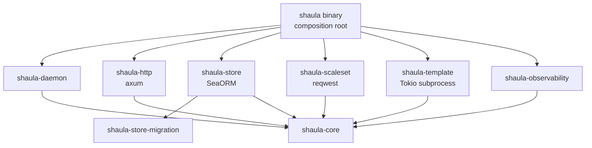

# Shaula v1 Rust Workspace Architecture Specification

- Status: Draft
- Date: 2026-09-04
- Production language: Rust
- Async runtime: Tokio
- CLI: clap
- HTTP server: axum
- Persistence adapter: SeaORM with SQLite
- Serialization: serde
- Outbound HTTP: reqwest
- Production Go dependency: none
- Scale Set compatibility oracle: pinned `github.com/actions/scaleset` Go SDK and `internal/testserver`

This specification maps Shaula's accepted domain and Module boundaries onto a Rust Cargo workspace. It extends the [Multi-Fleet Runner Scale Set Controller Specification](0001-shaula-runner-scale-set.md), [ADR-0010](../ard/0010-build-a-pure-rust-multi-crate-daemon-and-use-scaleset-as-an-oracle.md), and [ADR-0011](../ard/0011-expose-v1-http-through-loopback-and-an-authenticating-proxy.md). It describes package ownership and dependency rules, not implementation code.

## 1. Outcome

Shaula ships one Rust binary, `shaula`. One Tokio runtime supervises the Axum server, Profile workers, per-Fleet listeners/reconcilers, global operation scheduler, subprocesses and bounded OpenTelemetry export. Blocking or externally mutable work never runs inside an Axum request transaction.

The Cargo workspace contains deep crates with one-way dependencies. A crate exists only when it hides a substantial policy or external mechanism；shared `utils`, transport-shaped domain types and one-type crates are rejected.

```text
crates/
  shaula/                    # binary composition root; clap + startup/shutdown
  shaula-core/               # domain model, invariants, state machines and ports
  shaula-daemon/             # use cases, supervisors, reconcile and scheduling
  shaula-http/               # axum adapter and strict HTTP DTOs
  shaula-store/              # SeaORM SQLite adapter; entities stay private
  shaula-store-migration/    # bundled forward migrations and schema checks
  shaula-scaleset/           # reqwest GitHub/Actions Service adapter + listener
  shaula-template/           # artifact/workspace and Terraform subprocess runtime
  shaula-observability/      # OTel/tracing setup, exporters and redaction policy
```

Kubernetes and Docker do not get production crates. Their implementation remains Terraform artifacts under `templates/`; platform-aware conformance harnesses are test-only and outside the `shaula` normal/build dependency closure.

## 2. Dependency direction



`shaula-core` owns domain vocabulary and caller-facing ports. `shaula-daemon` implements inbound use cases and calls injected outbound ports. Adapters implement those ports；they do not call one another or reach through an adjacent adapter. The binary is the only location that sees all concrete implementations.

Forbidden normal/build dependency edges include：

- `shaula-core` or `shaula-daemon` to Axum, SeaORM, reqwest, clap, a Kubernetes/Docker client, or a Terraform provider API；
- `shaula-http` directly to `shaula-store`；
- `shaula-scaleset` or `shaula-template` directly to SeaORM；
- production crates to the Go oracle, platform conformance harnesses or `references/`；
- any adapter DTO/entity/wire model crossing a core port.

CI inspects `cargo metadata` and `cargo tree -p shaula --edges normal,build` to enforce these rules. Adding a third Template Platform must require no production crate or core state-machine change.

## 3. Crate responsibilities

### 3.1 `shaula`

The binary crate is intentionally shallow. It uses clap derive for `shaula serve`, loads and validates daemon bootstrap configuration, initializes local structured logging and OpenTelemetry before migrations or remote effects, constructs concrete adapters, acquires the data-directory ownership lock, starts the daemon, handles signals and enforces bounded shutdown ordering.

It contains no Fleet reconciliation, SQL, HTTP handler, GitHub protocol or Terraform plan logic. v1 has no local Create/Destroy/Update command；future management subcommands are HTTP clients only.

### 3.2 `shaula-core`

This crate owns Fleet/Profile/Auth/Generation value types, stable reason codes, lifecycle states, mutation fences, capacity arithmetic, idempotency semantics and port contracts. It must remain deterministic under injected clock/ID/randomness and fake ports.

Serde is permitted only on deliberately versioned domain/durable envelopes. Secret-bearing types have redacted `Debug`, do not implement ordinary response serialization and cannot be accidentally converted into metric attributes. Axum request types, SeaORM models and Actions Service JSON types are mapped at adapter boundaries.

### 3.3 `shaula-daemon`

This crate owns Fleet and Profile application services, one supervisor task per active Fleet, Auth rollout, listener ingestion, level-triggered reconcile, the fair global Create/Destroy scheduler, operation leases, reaper/recovery scans and graceful shutdown. It depends on core ports, not concrete adapters.

Tokio tasks are supervised；detached fire-and-forget tasks are forbidden. Every loop has cancellation, bounded backoff/jitter and a persisted retry/checkpoint when correctness depends on future execution. A panic or failure in one Fleet task is classified and restarted without terminating healthy Fleet tasks.

### 3.4 `shaula-http`

This crate owns the loopback-only Axum listener, Router, extractors, trusted reverse-proxy actor-context validation, authorization middleware, request limits, ETag/idempotency handling, strict Serde DTOs, pagination and conversion between domain errors and sanitized HTTP problem responses. It calls only inbound core/application ports and never receives a SeaORM connection. A configured non-loopback address fails startup；native TLS, mTLS and OIDC verification are outside v1.

Mutation DTOs reject unknown fields. Every management request, proxied or direct loopback, must validate the selected trusted actor assertion/backend context；loopback never synthesizes an actor, and missing/invalid context is rejected. Caller-supplied identity headers are stripped by the required proxy and cannot directly define the actor；the exact trusted assertion/backend-auth format is a pending wire choice. Request bodies, Authorization, idempotency keys and secret values are excluded from tracing middleware. Route templates rather than raw paths identify OTel server spans.

### 3.5 `shaula-store` and `shaula-store-migration`

`shaula-store` is the sole SeaORM boundary. It hides entities, relations, SQLite pragmas, transaction retry, lease queries, canonical encodings and plaintext credential/sensitive-binding columns behind typed core repositories/unit-of-work ports. No `DatabaseConnection`, entity or ORM error escapes the crate.

One daemon owns the database and one logical writer path serializes mutations. WAL, foreign keys, busy timeout, durability settings and backup consistency are explicit startup checks. Transactions atomically commit revision/change/audit/outbox/idempotency facts before external effects.

`shaula-store-migration` contains bundled forward migrations and schema-version probes. Because migration failure or process loss must not leave a partly accepted control plane, every migration is restart-tested on SQLite and startup fails closed until its pre/postconditions are satisfied. The binary does not expose a second standalone schema authority.

### 3.6 `shaula-scaleset`

This crate is the only GitHub/Actions Service wire adapter. It reuses bounded reqwest clients and implements：

- GitHub App JWT/installation authentication and PAT authentication；
- registration/admin-token discovery and refresh；
- runner group and Scale Set lookup/create-or-adopt operations required by core；
- message session create/refresh/delete, long polling, `X-ScaleSetMaxCapacity`, ACK and job acquisition；
- JIT generation, Runner inventory and safe removal；
- strict Serde wire DTOs, trusted endpoint validation, status/error classification, retry budgets and redaction.

It exposes only the core-owned Scale Set port. It does not expose general Update/Delete Scale Set methods simply because the upstream SDK contains them. Reqwest redirect following is disabled for credential-bearing calls；timeouts, response/body limits, TLS roots, proxy policy and accepted hosts are explicit. Production target parsing only produces `github.com` organization/repository URLs；test-only endpoint injection cannot be enabled in a release configuration.

The listener exposes poll, ACK and acquire operations across a durability-aware port instead of reproducing `listener.Run` callbacks. Before ACK, the daemon atomically compare-and-sets the exact current session epoch while persisting the latest statistics, idempotent observations, a processed-but-not-yet-acknowledged message fact, ACK authorization and any acquisition intent. If commit fails, it does not ACK；an ACK failure leaves durable retry work, and redelivery is idempotent. Individual job observations nevertheless remain hints because responses can be truncated, reassigned, duplicated or absent；capacity still derives from `TotalAssignedJobs`, inventory and reapers.

Installing/replacing a session takes the exclusive side of a per-Fleet session-effect gate, drains or durably classifies old-epoch outbound effects, then atomically advances the persisted monotonic epoch and records initial `TotalAssignedJobs`. ACK and Acquire take an epoch-scoped shared permit；while holding it, each re-authorizes the exact current epoch immediately before the HTTP call. Acquire additionally persists `AcquireStarting` with that epoch before calling, and its result/uncertain outcome is classified against the same epoch before the permit is released. Demand/observation writes also compare-and-set the epoch. A stale task can only no-op：it cannot ACK, acquire, overwrite demand or wake lifecycle. Cancellation alone is never the fence, and no SQLite transaction spans the network call.

### 3.7 `shaula-template`

This crate owns content-addressed artifact validation/materialization, isolated per-Generation Workspace/state, environment allowlists, Tokio child-process supervision, exact engine-binary hashing, Terraform initialization, saved-plan JSON policy, apply/destroy classification, fixed `shaula`/`shaula_result` protocol, protected files and state-empty proof.

It has no Kubernetes/Docker client or platform dispatch. The artifact manifest is the sole authority for the bounded opaque `platform` and `bindings_contract` labels；resource type strings are used only for policy equality/cardinality. Platform artifacts and external conformance harnesses own actual object semantics. Every Template activation requires a durable conformance attestation bound to the exact artifact digest, dependency lock, IaC engine binary/provider, protected `bindings_digest`, runtime/trust policy including accepted limitations, Runner image, manifest contracts and suite version；static validation alone only reaches `Ready`.

### 3.8 `shaula-observability`

This crate initializes the Rust `tracing`/OpenTelemetry bridge, SDK providers, OTLP exporters, in-memory test exporters, metric instruments, propagation and bounded shutdown. It centralizes the attribute allowlist and redaction layer. Export failure never blocks lifecycle correctness；local structured logs remain available and correlated.

Other crates may depend on narrow tracing/instrumentation facades or a core telemetry port, but do not construct exporters or invent unbounded metric dimensions.

## 4. Scale Set Go oracle

The upstream oracle is pinned by immutable commit, module version and source checksum. CI never tests against a floating branch. The upstream repository is fetched into an isolated test cache；a small test-only wrapper is compiled inside that module boundary so it can legally use `internal/testserver`. It is not copied into a production crate or launched by `shaula serve`.

Each compatibility scenario drives the Go SDK and Rust adapter against equivalent scripted handlers. The harness normalizes timestamps, nonces, JWTs, request IDs and User-Agent build fields, then compares：

- method, path, query encoding, required headers and sanitized request body；
- PAT/App bootstrap, derived token refresh and expiry behavior；
- organization/repository configuration URL behavior；
- Scale Set lookup/create, JIT, inventory/removal and session operations；
- long-poll `202`, message ID, max-capacity, ACK/acquire and error behavior；
- JSON optional/unknown/null fields and typed error classification.

Intentional differences are explicit golden exceptions, not silent drift. Rust's local-persist-before-ACK ordering is one such application-level difference；wire requests must still satisfy the service contract. The oracle testserver only supplies token scaffolding and delegated handlers, so a real `github.com` 2 × 2 App/PAT × organization/repository matrix remains mandatory.

An upstream oracle upgrade requires：reviewing the Go source diff, regenerating/approving normalized goldens, running the full Rust adapter suite, the real GitHub matrix, event-loss/recovery tests and security/redaction tests. A failed gate keeps the prior pin.

## 5. Rust-specific safety rules

- Workspace `Cargo.lock` is committed；Rust toolchain/MSRV and all security-relevant feature flags are pinned by release policy.
- Unsafe Rust is forbidden by default. A crate requiring `unsafe` needs a separate ADR and isolated audit boundary.
- Secret wrappers redact `Debug`/error output and minimize clones. Plaintext SQLite remains accepted for PAT/App keys and schema-sensitive Template bindings, but serialization derives must not turn either into response/log/telemetry values. Main DB, WAL/SHM, copies, backups, migration artifacts and crash dumps share the credential boundary.
- Panics do not represent expected network, SQL, validation or lifecycle errors. Task panics are caught at supervision boundaries and become sanitized degraded state.
- Blocking filesystem/archive work is bounded and moved off async executor threads when necessary；Terraform uses Tokio process supervision, never a shell string.
- Cancellation is cooperative and never interpreted as proof that a child process or remote mutation did not start.
- Error types preserve stable reason codes while keeping reqwest, SeaORM, Terraform and provider bodies behind protected diagnostic boundaries.

## 6. Verification and acceptance criteria

Implementation is incomplete until：

1. `cargo tree` proves the production binary is Rust-only and contains no Go bridge/FFI, Kubernetes client or Docker client.
2. Architecture tests reject forbidden adapter-to-adapter and framework-to-core dependencies.
3. clap exposes `shaula serve` and no local Runner mutation primitive.
4. Axum mutation handlers make no GitHub/Terraform call before the SeaORM transaction commits.
5. SQLite transaction/crash tests cover revision, Change, audit, outbox, idempotency, leases, migration interruption and credential-bearing DB/WAL/SHM/copy/backup handling.
6. Strict Serde and redaction tests cover every HTTP, persistence, Scale Set and Template envelope, including unknown fields, PAT/App keys, schema-sensitive bindings and malicious secret-shaped values.
7. Reqwest tests enforce no credential-bearing redirects, trusted hosts, TLS/proxy policy, timeouts, body bounds and sanitized errors.
8. The complete pinned Go-oracle differential suite passes, and intentional differences are reviewed fixtures.
9. The real `github.com` App/PAT × organization/repository lifecycle matrix passes against the same Rust adapter.
10. Persist-before-ACK, duplicate delivery, truncated/missing events, `202` polls, acquire uncertainty and session restart all converge without event counting.
11. Tokio task, subprocess and exporter failure injection proves Fleet isolation and bounded shutdown.
12. In-memory OTel tests observe HTTP, SQL/use-case boundaries, Scale Set, reconcile and Template lifecycle without secrets or unbounded labels.
13. A Template Profile cannot become Active unless every required external safety claim has a current conformance attestation for its exact immutable compatibility tuple.
14. Axum startup rejects every non-loopback bind；tests accept only a validated trusted actor context for proxied or direct management requests, reject forged/missing context and prove the production binary has no native inbound HTTP TLS/mTLS/OIDC serving path.

## 7. Delivery order

1. Freeze Rust toolchain/crate features, core ports, wire fixtures and pinned upstream oracle commit.
2. Establish Cargo workspace, architecture tests, common redaction fixtures and in-memory OTel test pipeline.
3. Implement core/domain plus SeaORM repositories/migrations and Axum desired-state APIs.
4. Implement `shaula-scaleset` bottom-up against oracle tests, then pass real GitHub auth/scope tests.
5. Implement Template Runtime and generic lifecycle recovery, then bundled Profile conformance.
6. Run multi-Fleet, crash, backup/restore, exporter outage and complete end-to-end gates.

## 8. Open decisions

1. Which exact stable Rust toolchain/MSRV and dependency versions/features form the first compatibility pin?
2. Which audited crates implement GitHub App RS256/PEM handling and in-memory secret wrappers/zeroization?
3. Is SeaORM's SQLx SQLite backend or its rusqlite backend the supported v1 path after WAL/concurrency/crash tests?
4. Is the upstream oracle stored as a checksummed source archive, Git submodule or CI-fetched immutable commit?
5. Are platform conformance tools separate test workspace members or external harnesses with no Cargo dependency edge?
6. Which authority may submit a Template Conformance Attestation, and what canonical signed or equivalently integrity-protected envelope represents its subject and evidence?

## 9. References

- [actions/scaleset README](https://github.com/actions/scaleset)
- [actions/scaleset internal/testserver](https://github.com/actions/scaleset/tree/main/internal/testserver)
- [clap documentation](https://docs.rs/clap/latest/clap/)
- [Axum documentation](https://docs.rs/axum/latest/axum/)
- [SeaORM documentation](https://www.sea-ql.org/SeaORM/docs/)
- [Serde documentation](https://serde.rs/)
- [reqwest documentation](https://docs.rs/reqwest/latest/reqwest/)
- [Tokio documentation](https://tokio.rs/)
- [OpenTelemetry Rust](https://github.com/open-telemetry/opentelemetry-rust)
