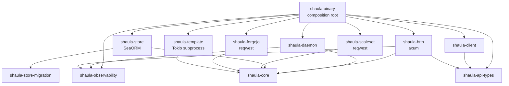

# Shaula v1 Rust Workspace Architecture Specification

- Status: Draft
- Amended by: [spec 0018](0018-github-app-only-authentication.md) (GitHub App only) and [spec 0039](0039-user-access-tokens-and-cli.md). `shaula-api-types` owns shared transport contracts; `shaula-client` depends only on transport/runtime libraries, not daemon/store/core implementations. Remote CLI dispatch does not initialize `serve`.
- Related backend design: [spec 0026](0026-forgejo-runner-backend.md) remains Draft; documenting the existing Forgejo adapter below does not change its acceptance status.
- Date: 2026-09-04
- Production language: Rust
- Async runtime: Tokio
- CLI: clap
- HTTP server: axum
- Persistence adapter: SeaORM with SQLite
- Serialization: serde
- Outbound HTTP: reqwest
- Production Go dependency: none
- Scale Set compatibility oracle: pinned `github.com/actions/scaleset` Go SDK and `internal/testserver`

This specification maps Shaula's accepted domain and Module boundaries onto a Rust Cargo workspace. It extends the [Multi-Fleet Runner Scale Set Controller Specification](0001-shaula-runner-scale-set.md), [ADR-0010](../ard/0010-build-a-pure-rust-multi-crate-daemon-and-use-scaleset-as-an-oracle.md), and [ADR-0013](../ard/0013-require-openid-connect-for-all-http-access.md). [Spec 0009](0009-mandatory-openid-connect.md) defines management OIDC; [spec 0010](0010-lifecycle-worker-and-http-state-backend.md) / [ADR-0014](../ard/0014-run-lifecycle-workers-with-a-database-http-state-backend.md) define the worker/internal-HTTP revision. This specification describes package ownership and dependency rules, not implementation code.

## 1. Outcome

Shaula ships one Rust binary. Its remote management subcommands are HTTP clients under spec 0039; `serve` owns management, Runner Backend access, SQLite and supervision. The **target lifecycle execution model** from spec 0010 additionally has the exec Driver start one internal `job` process per Generation, with its own Tokio runtime and sequential lifecycle. A waiting worker is not an occupied Terraform command-budget slot. Blocking/external work never runs inside an Axum/SQLite transaction, and the daemon does not mirror each worker command as a durable operation.

The `job` role and private worker/state wiring below remain spec 0010 requirements, not a claim that the current `serve` path launches those workers. Production integration and migration progress are tracked only in [implementation status](../IMPLEMENTATION_STATUS.md). The remote CLI is independent of that integration and must not initialize `serve`.

The Cargo workspace contains deep crates with one-way dependencies. A crate exists only when it hides a substantial policy or external mechanism；shared `utils`, transport-shaped domain types and one-type crates are rejected.

```text
crates/
  shaula/                    # binary composition root; remote CLI + serve startup/shutdown
  shaula-api-types/          # portable management HTTP contracts; no server/domain dependencies
  shaula-client/             # independent async management HTTP client
  shaula-core/               # domain model, invariants, state machines and ports
  shaula-daemon/             # serve/job use cases, supervision, exec Driver, gates
  shaula-http/               # management OIDC + separate private worker/state HTTP
  shaula-store/              # SeaORM SQLite adapter; entities stay private
  shaula-store-migration/    # bundled forward migrations and schema checks
  shaula-scaleset/           # reqwest GitHub/Actions Service adapter + listener
  shaula-forgejo/            # separate Forgejo Runner Backend wire adapter
  shaula-template/           # worker's CoW/copy Workspace, Terraform/backend client setup
  shaula-observability/      # OTel/tracing setup, exporters and redaction policy
```

Kubernetes, Docker, Proxmox, AWS, Tencent Cloud and Alibaba Cloud are Template Platforms, not Runner Backends, and do not get production crates. The Forgejo backend crate does not change this boundary. Their implementation remains Terraform artifacts under `templates/`; platform-aware conformance harnesses are test-only and outside the `shaula` normal/build dependency closure.

## 2. Dependency direction



`shaula-core` owns domain vocabulary and caller-facing ports. `shaula-daemon` implements inbound use cases and calls injected outbound ports. Adapters implement those ports；they do not call one another or reach through an adjacent adapter. The binary is the only location that sees all concrete implementations. `shaula-api-types` is the explicit spec 0039 transport boundary shared by HTTP and the remote client; its DTOs do not become core domain types.

Forbidden normal/build dependency edges include：

- `shaula-core` or `shaula-daemon` to Axum, SeaORM, reqwest, clap, a Kubernetes/Docker client, or a Terraform provider API；
- `shaula-http` directly to `shaula-store`；
- `shaula-scaleset`, `shaula-forgejo` or `shaula-template` directly to SeaORM；
- `shaula-client` or `shaula-api-types` to daemon, store, core implementations or server startup；
- production crates to the Go oracle, platform conformance harnesses or `references/`；
- any adapter DTO/entity/wire model crossing a core port.

CI inspects `cargo metadata` and `cargo tree -p shaula --edges normal,build` to enforce these rules. Adding another Template Platform must require no production crate or core state-machine change.

## 3. Crate responsibilities

### 3.1 `shaula`

The binary crate is intentionally shallow. It uses clap derive for `shaula serve`, loads and validates daemon bootstrap configuration and required OIDC Provider/client settings from CLI/env, initializes local structured logging and OpenTelemetry before migrations or remote effects, constructs concrete adapters, acquires the data-directory ownership lock, starts the daemon, handles signals and enforces bounded shutdown ordering. It awaits the HTTP Adapter's OIDC discovery/JWKS initialization before binding the listener or starting resource workers; missing/invalid settings or initialization failure exit nonzero.

In the target spec 0010 integration, the internal `shaula job` command receives a protected Generation/Claim handoff and wires worker use cases to the Template Runtime and private control client. It does not load OIDC/GitHub credentials, open SQLite, own the daemon data directory or accept arbitrary template/argv inputs. Direct invocation without valid daemon authority fails closed. `serve` initializes management OIDC and internal backend before launching jobs.

Remote commands dispatch through `shaula-client` without loading daemon bootstrap/OIDC client secrets, opening SQLite, acquiring the data-directory lock or constructing the Terraform runtime. CLI arguments, credential-file handling, rendering and exit codes belong to the binary; reusable HTTP contracts and request behavior belong to `shaula-api-types` and `shaula-client`.

The binary contains no reconciliation, SQL, server handler, backend wire or plan logic. `job` is not an operator Create/Destroy/Update command; existing and future management subcommands remain HTTP clients only.

### 3.2 `shaula-core`

This crate owns Fleet/Profile/Auth/Generation value types, stable reason codes, lifecycle states, mutation fences, capacity arithmetic, idempotency semantics and port contracts. It must remain deterministic under injected clock/ID/randomness and fake ports.

Serde is permitted only on deliberately versioned domain/durable envelopes. Secret-bearing types have redacted `Debug`, do not implement ordinary response serialization and cannot be accidentally converted into metric attributes. Axum request types, SeaORM models and Actions Service JSON types are mapped at adapter boundaries.

### 3.3 `shaula-daemon`

This crate owns Fleet/Profile use cases, Fleet supervisors, Auth rollout, listener ingestion, capacity, worker/command budgets, reaper/recovery and shutdown. Its job-side module sequences one Generation through core Template/control ports without raw GitHub/SQLite access. Daemon-side worker/state services authorize claims, GitHub requests and atomic completion through Store ports; no per-Terraform-command ledger is required.

The small `exec` Driver may live in a cohesive internal executor module here, hiding Tokio/OS launch, protected handoff and descendant fencing behind the core Executor Interface. It does not choose a Template Platform or interpret Terraform. No new one-type driver/backend crate is required. Exact module names are implementation details; no platform client or remote Driver is added to v1.

Tokio tasks are supervised；detached fire-and-forget tasks are forbidden. Every loop has cancellation, bounded backoff/jitter and a persisted retry/checkpoint when correctness depends on future execution. A panic or failure in one Fleet task is classified and restarted without terminating healthy Fleet tasks.

### 3.4 `shaula-http`

This crate owns the loopback-only management Axum listener, Router, extractors, mandatory OIDC discovery/token verification, login/callback/session/CSRF/logout, authorization middleware, request limits, ETag/idempotency handling, strict Serde DTOs, pagination and conversion between domain errors and sanitized HTTP problem responses. OIDC implementation stays in cohesive internal modules using established Rust protocol/crypto libraries; no new crate is required solely for a wrapper. It calls only inbound core/application ports and never receives a SeaORM connection. A configured non-loopback address fails startup; native inbound TLS/mTLS remains outside v1, while OIDC verification is mandatory.

Mutation DTOs reject unknown fields. A default authentication guard protects UI documents, embedded assets, all API/health routes and fallback before resource/cache handling; only exact login/callback GET routes are anonymous. The Adapter maps verified `(iss, sub)` and server-authorized scopes into core actor facts. Legacy backend tokens and identity/scopes headers cannot establish identity; debug/development uses the same contract. Request bodies, Authorization, cookies, login codes, CSRF, OIDC tokens/client secrets and idempotency keys are excluded from tracing middleware. Route templates rather than raw paths identify OTel server spans. Session stores are bounded and in-memory; their loss requires reauthentication, without altering durable Fleet/Profile state.

Spec 0039 adds owner-bound Shaula personal access tokens on API/health routes through the same authorization boundary. They are not GitHub PATs, do not grant UI access and do not remove mandatory OIDC startup/browser login. Token issuance and management retain spec 0039's primary-identity restrictions.

In the target worker integration, a separate private listener implements spec 0010's capability-authenticated worker control and standard Terraform state/LOCK/UNLOCK wire protocol. It calls core application ports, not SeaORM or GitHub directly. Its bounded private control client is wired only into `job`; Basic state credentials and control bearer tokens are not management identities or OIDC exceptions on the public Router. Default-deny, body/response redaction and route separation are independently tested.

### 3.5 `shaula-store` and `shaula-store-migration`

`shaula-store` is the sole SeaORM boundary. It hides entities, relations, SQLite pragmas, transaction retry, lease queries, canonical encodings and plaintext credential/sensitive-binding columns behind typed core repositories/unit-of-work ports. No `DatabaseConnection`, entity or ORM error escapes the crate.

One daemon owns the database and one logical writer path serializes mutations. WAL, foreign keys, busy timeout, durability settings and backup consistency are explicit startup checks. Transactions atomically commit revision/change/audit/outbox/idempotency facts before external effects. The same writer discipline owns Generation/Claim/state/lock facts: LOCK uniqueness, owner/epoch/ID checks, versioned state writes, UNLOCK and terminal seal must be atomic. There is no check-lock-then-write gap and no expiry-based worker takeover. Claim recovery and local-state migration follow spec 0010.

`shaula-store-migration` contains bundled forward migrations and schema-version probes. Because migration failure or process loss must not leave a partly accepted control plane, every migration is restart-tested on SQLite and startup fails closed until its pre/postconditions are satisfied. The binary does not expose a second standalone schema authority.

### 3.6 `shaula-scaleset`

This crate is the only GitHub/Actions Service wire adapter. It reuses bounded reqwest clients and implements：

- schema 2 GitHub App JWT/installation authentication and account routing under specs 0011/0018; GitHub PAT authentication is retired；
- registration/admin-token discovery and refresh；
- runner group and Scale Set lookup/create-or-adopt operations required by core；
- message session create/refresh/delete, long polling, `X-ScaleSetMaxCapacity`, ACK and job acquisition；
- JIT generation, Runner inventory and safe removal；
- strict Serde wire DTOs, trusted endpoint validation, status/error classification, retry budgets and redaction.

It exposes only the core-owned Scale Set port. It does not expose general Update/Delete Scale Set methods simply because the upstream SDK contains them. Reqwest redirect following is disabled for credential-bearing calls；timeouts, response/body limits, TLS roots, proxy policy and accepted hosts are explicit. Production target parsing only produces `github.com` organization/repository URLs；test-only endpoint injection cannot be enabled in a release configuration.

The listener exposes poll, ACK and acquire operations across a durability-aware port instead of reproducing `listener.Run` callbacks. Before ACK, the daemon atomically compare-and-sets the exact current session epoch while persisting the latest statistics, idempotent observations, a processed-but-not-yet-acknowledged message fact, ACK authorization and any acquisition intent. If commit fails, it does not ACK；an ACK failure leaves durable retry work, and redelivery is idempotent. Individual job observations nevertheless remain hints because responses can be truncated, reassigned, duplicated or absent；capacity still derives from `TotalAssignedJobs`, inventory and reapers.

Installing/replacing a session takes the exclusive side of a per-Fleet session-effect gate, drains or durably classifies old-epoch outbound effects, then atomically advances the persisted monotonic epoch and records initial `TotalAssignedJobs`. ACK and Acquire take an epoch-scoped shared permit；while holding it, each re-authorizes the exact current epoch immediately before the HTTP call. Acquire additionally persists `AcquireStarting` with that epoch before calling, and its result/uncertain outcome is classified against the same epoch before the permit is released. Demand/observation writes also compare-and-set the epoch. A stale task can only no-op：it cannot ACK, acquire, overwrite demand or wake lifecycle. Cancellation alone is never the fence, and no SQLite transaction spans the network call.

### 3.7 `shaula-template`

This crate owns artifact validation, CoW/copy materialization, exclusive Workspaces, protected inputs/emergency state, child env/supervision, exact engine hashing, Terraform initialization, saved-plan policy, output classification and state-empty proof. Under the target spec 0010 integration, Generation lifecycles run inside `job`; Profile static validation may still call its isolated, non-mutating validation Interface from the daemon. Authoritative state is not its local file store: Terraform uses spec 0010's HTTP backend, configured through a fixed worker-owned backend file and minimal `TF_HTTP_*` env.

It has no linked Kubernetes/Docker SDK or general platform dispatch. [Spec 0020](0020-official-container-runner-bootstrap.md) permits fixed host bootstrap adapters private to this crate; no platform schema crosses the core interface. The artifact manifest is the sole authority for the bounded opaque `platform` and `bindings_contract` labels；resource type strings are used only for policy equality/cardinality. Platform artifacts, the fixed bootstrap contract and external conformance harnesses own object semantics. Under [spec 0017](0017-automatic-template-activation.md), static validation automatically activates the current Template candidate with durable activation provenance. Independent conformance evidence binds the exact artifact digest, dependency lock, IaC engine binary/provider, protected `bindings_digest`, runtime/trust policy including accepted limitations, Runner image, manifest contracts and suite version; Active alone makes no conformance claim.

### 3.8 `shaula-observability`

This crate initializes the Rust `tracing` subscriber, the local structured JSON sink and the optional bounded OTLP/HTTP exporters for metrics and traces (spec 0001 §13, [ARD-0032](../ard/0032-process-telemetry-uses-otlp-http.md)). It centralizes the finite attribute allowlist and redaction layer. Export failure never blocks lifecycle correctness；local structured logs remain available and correlated, and degraded export is reported through an in-process counter.

Other crates may depend on the narrow tracing/instrumentation facade (`TelemetryHandle`, finite `MetricOperation`/`MetricResult` labels) from `shaula-daemon`, `shaula-http` or the binary, but do not construct exporters or invent unbounded metric dimensions. The crate depends on no other workspace crate and deliberately links NO HTTP client (the export is a bounded plain-HTTP POST over Tokio, with TLS at the collector boundary) — that is what keeps `reqwest` out of the daemon's dependency tree, which §2's gate enforces. The former core telemetry port is gone ([ARD-0032](../ard/0032-process-telemetry-uses-otlp-http.md)).

### 3.9 `shaula-api-types` and `shaula-client`

`shaula-api-types` owns portable management HTTP DTOs, versioned response/error envelopes and transport serialization. It does not depend on core, daemon, store, Axum, Tokio or reqwest. `shaula-client` depends on these contracts and transport/runtime libraries, not on server implementations. It owns bounded authenticated requests, conditional/idempotent mutations and typed responses under spec 0039. Remote CLI use must not imply access to SQLite, Terraform or local daemon state.

### 3.10 `shaula-forgejo`

This crate owns the Forgejo Runner Backend protocol adapter: scoped token access, demand/inventory observations, registration/removal and exact task-result reads. It implements core ports without reusing GitHub Scale Set/JIT semantics or importing a Template Platform SDK. Its presence does not establish every spec 0026 capability or real-platform acceptance; those boundaries remain in [implementation status](../IMPLEMENTATION_STATUS.md).

## 4. Scale Set Go oracle

The upstream oracle is pinned by immutable commit, module version and source checksum. CI never tests against a floating branch. The upstream repository is fetched into an isolated test cache；a small test-only wrapper is compiled inside that module boundary so it can legally use `internal/testserver`. It is not copied into a production crate or launched by `shaula serve`.

Each compatibility scenario drives the Go SDK and Rust adapter against equivalent scripted handlers. The harness normalizes timestamps, nonces, JWTs, request IDs and User-Agent build fields, then compares：

- method, path, query encoding, required headers and sanitized request body；
- GitHub App bootstrap, derived token refresh and expiry behavior; retired GitHub PAT rejection is covered separately under spec 0018；
- organization/repository configuration URL behavior；
- Scale Set lookup/create, JIT, inventory/removal and session operations；
- long-poll `202`, message ID, max-capacity, ACK/acquire and error behavior；
- JSON optional/unknown/null fields and typed error classification.

Intentional differences are explicit golden exceptions, not silent drift. Rust's local-persist-before-ACK ordering is one such application-level difference；wire requests must still satisfy the service contract. The oracle testserver only supplies token scaffolding and delegated handlers, so the real `github.com` GitHub App × organization/repository matrix, including spec 0011 multi-account routing, remains mandatory. GitHub PAT success cases are no longer a release gate; legacy formats must be rejected under spec 0018.

An upstream oracle upgrade requires：reviewing the Go source diff, regenerating/approving normalized goldens, running the full Rust adapter suite, the real GitHub matrix, event-loss/recovery tests and security/redaction tests. A failed gate keeps the prior pin.

## 5. Rust-specific safety rules

- Workspace `Cargo.lock` is committed；Rust toolchain/MSRV and all security-relevant feature flags are pinned by release policy.
- Unsafe Rust is forbidden by default. A crate requiring `unsafe` needs a separate ADR and isolated audit boundary.
- Secret wrappers redact `Debug`/error output and minimize clones. Plaintext SQLite remains within the accepted boundary for GitHub App keys, Forgejo credentials, retained historical credential bytes and schema-sensitive Template bindings, but serialization derives must not turn these into response/log/telemetry values. Shaula-issued personal access-token secrets follow spec 0039's verifier-only storage contract, not this plaintext credential allowance. Main DB, WAL/SHM, copies, backups, migration artifacts and crash dumps share the credential boundary.
- Panics do not represent expected network, SQL, validation or lifecycle errors. Task panics are caught at supervision boundaries and become sanitized degraded state.
- Blocking filesystem/archive work is bounded and moved off async executor threads when necessary；Terraform uses Tokio process supervision, never a shell string.
- Cancellation is cooperative and never interpreted as proof that a child process or remote mutation did not start.
- Error types preserve stable reason codes while keeping reqwest, SeaORM, Terraform and provider bodies behind protected diagnostic boundaries.

## 6. Verification and acceptance criteria

Implementation is incomplete until：

1. `cargo tree` proves the production binary is Rust-only and contains no Go bridge/FFI, Kubernetes client or Docker client.
2. Architecture tests reject forbidden adapter-to-adapter and framework-to-core dependencies.
3. Remote management commands operate through `shaula-client` without initializing `serve`. Completion of spec 0010 additionally requires authenticated internal `job`; an arbitrary manual `job` invocation cannot bypass Fleet/Claim admission or obtain material/credentials.
4. Axum mutation handlers make no GitHub/Terraform call before the SeaORM transaction commits.
5. SQLite transaction/crash tests cover revision, Change, audit, outbox, idempotency, leases, migration interruption and credential-bearing DB/WAL/SHM/copy/backup handling.
6. Strict Serde and redaction tests cover every HTTP, persistence, Scale Set and Template envelope, including unknown fields, GitHub App/Forgejo credentials, retained legacy secrets, Shaula personal access tokens, schema-sensitive bindings and malicious secret-shaped values.
7. Reqwest tests enforce no credential-bearing redirects, trusted hosts, TLS/proxy policy, timeouts, body bounds and sanitized errors.
8. The complete pinned Go-oracle differential suite passes, and intentional differences are reviewed fixtures.
9. The real `github.com` GitHub App × organization/repository lifecycle matrix passes against the same Rust adapter, including spec 0011 routing; spec 0018 tests reject retired GitHub authentication formats.
10. Persist-before-ACK, duplicate delivery, truncated/missing events, `202` polls, acquire uncertainty and session restart all converge without event counting.
11. Tokio task, exec worker/descendant, backend outage and exporter failure injection proves Fleet isolation and spec 0010's fencing/state/lock/recovery/shutdown contract; worker exit alone never releases capacity.
12. In-memory OTel tests observe HTTP, SQL/use-case boundaries, Scale Set, reconcile and Template lifecycle without secrets or unbounded labels.
13. A current Template candidate automatically becomes Active after static validation under spec 0017. Required external safety claims still need conformance evidence for the exact immutable compatibility tuple; Active alone does not establish them.
14. Axum startup rejects every non-loopback bind and missing/invalid CLI/env OIDC configuration or failed discovery initialization. Tests enforce spec 0009 as amended by spec 0039 across proxied/direct requests, UI/assets/API/health/fallback, CSRF, session expiry, both permitted API Bearer credential types and forged legacy headers. The production binary must include OIDC verification and must not expose native inbound HTTP TLS/mTLS serving.

## 7. Delivery order

1. Freeze Rust toolchain/crate features, core ports, wire fixtures and pinned upstream oracle commit.
2. Establish Cargo workspace, architecture tests, common redaction fixtures and in-memory OTel test pipeline.
3. Implement core/domain plus SeaORM repositories/migrations and Axum desired-state APIs.
4. Implement `shaula-scaleset` bottom-up against oracle tests, then pass real GitHub auth/scope tests.
5. Implement exec `job`, private control/state HTTP, atomic backend CAS and worker-owned Runtime/recovery/migration, then bundled Profile conformance.
6. Run multi-Fleet, crash, backup/restore, exporter outage and complete end-to-end gates.

## 8. Open decisions

The [central decision register](../README.md#仍需决定或冻结) owns R1/R2 (release toolchain/features, source pins and oracle/harness acceptance). Current build selections live in Cargo.toml/Cargo.lock; a manifest choice is not crash/compatibility proof. Conformance harnesses stay outside the production dependency closure. The attestation authority and protected submission contract are normative in spec 0005 §5.1, not an additional signing-PKI workstream.

## 9. References

- [actions/scaleset README](https://github.com/actions/scaleset)
- [actions/scaleset internal/testserver](https://github.com/actions/scaleset/tree/main/internal/testserver)
- [clap documentation](https://docs.rs/clap/latest/clap/)
- [Axum documentation](https://docs.rs/axum/latest/axum/)
- [SeaORM documentation](https://www.sea-ql.org/SeaORM/docs/)
- [Serde documentation](https://serde.rs/)
- [reqwest documentation](https://docs.rs/reqwest/latest/reqwest/)
- [Tokio documentation](https://tokio.rs/)
- [OpenTelemetry Rust](https://github.com/open-telemetry/opentelemetry-rust)
