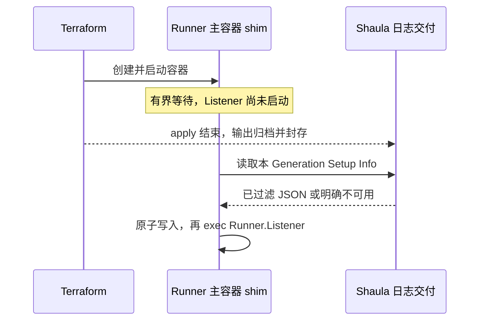

# Workflow Jobs and retained operation logs

Status: accepted, 2026-09-09. 本文定义目标契约；Jobs、持久 Operation Log 和 runner 日志交付尚未实现，不能以本次文档交付宣称可用。选择理由见 [ARD-0023](../ard/0023-retain-operation-logs-and-present-workflow-jobs.md)，术语见 [CONTEXT.md](../../CONTEXT.md)。

## 1. Scope and ownership

Web UI 增加 **Jobs**，以 GitHub Actions **Workflow Job** 为主对象。每个 job 可查看已观测执行状态、实际服务它的 Runner Generation，以及该 Generation 的 Apply / Destroy 日志；基础设施销毁后日志仍保留供 debug。预热、未被领取和创建失败的 Generation 也必须能查到日志。

本规范拥有 Jobs 读模型、Operation Log 捕获/保留/读取和 Setup Info 交付契约。它扩展 [spec 0008](0008-embedded-web-ui.md) 的 UI 与 [spec 0004](0004-template-profile-runtime.md) 的受控日志发布；不改变 Create/Destroy-only、一次 Create apply、Busy-safe removal、state-empty proof、Worker Claim 或 Occupancy 规则。后者继续由 specs [0001](0001-shaula-runner-scale-set.md)、[0004](0004-template-profile-runtime.md)、[0010](0010-lifecycle-worker-and-http-state-backend.md) 维护。

v1 展示 Shaula 从已管理 Scale Set 收到并保存的 job 观测，不宣称是 GitHub 全部 workflow 的完整历史。不新增 workflow rerun/cancel、Terraform 手动重跑、浏览器直接访问平台、raw credential 日志下载或 workflow step 日志镜像。完整 workflow 日志链接到 GitHub。

## 2. Jobs identity and GitHub evidence

### 2.1 Workflow Job and assignment observations

每个 Jobs 记录拥有 Shaula 生成的 opaque `id`。非空 Scale Set `jobId` 作为 opaque string 保存；观测身份由 **Fleet incarnation、Scale Set incarnation/remote identity、jobId** 共同确定，关联的 GitHub Target 也必须一致。Session Epoch 是消息来源，不是 job 身份；重连不能为同一 job 创建新行。不同 Fleet/Scale Set 的记录不凭名称合并。

`runnerRequestId` 标识分配请求证据，必须与 jobId 一起保留；同一 job 的多次分配保留独立观测，不能把每次分配取消都创建成一个新 Workflow Job。不能从 request ID、job 显示名称或时间相近推断 GitHub job 身份。空 jobId 先保存为未解析的 request observation；同 scope/request 后续提供一致的非空 jobId 才能提升为 Jobs 记录。冲突保留并标记 `ambiguous`，不把所有空值合并。

一次 assignment episode 不等于一个 request ID：上游不保证重分配一定更换 `runnerRequestId`。只有相容的 runner identity、assignment timestamps 等可信证据足以区分同次执行、不同分配与先后时才归组/排序；证据不足就保留独立观测并标 unknown/ambiguous。不得按消息到达顺序、request 数值大小或本地时间猜测哪次分配最新。

Workflow 重跑、matrix 同名 job 和同一 run 下的不同 job 不按名称或 workflowRunId 合并。若复用的协议身份出现不同 run/repository 等矛盾证据，保留冲突记录而不覆盖；缺少 run attempt 时不宣称已完整区分全部重跑。没有可靠跨 Fleet 身份证据时不做去重；不把仍缺失的 GitHub REST 身份猜出来。

扩展现有 Scale Set DTO 和持久 observation，保存下列已在 pinned oracle 定义的展示字段；缺失保持 null，不以空串、0 或当前时间冒充有效值：

| 字段 | 用途与约束 |
| --- | --- |
| `jobId`, `runnerRequestId` | scoped opaque job 身份与分配请求；均不是 Actions REST numeric job ID |
| `ownerName`, `repositoryName` | 仓库展示；按字段校验/限长，不作为新的授权来源 |
| `jobDisplayName`, `jobWorkflowRef` | job 标题和 workflow ref；ref 不是 workflow YAML 的 `name` |
| `workflowRunId`, `eventName` | run 与触发事件；positive run ID 才能生成 run 链接 |
| `queueTime`, `scaleSetAssignTime`, `runnerAssignTime`, `finishTime` | 源端时间；另存本地 `observed_at`，两者不能互换 |
| Started/Completed 的 `runnerId`, `runnerName` | Runner 关联证据，numeric ID 不得再在持久化时丢弃 |
| Completed 的 `result` | 分配/执行报告的 `reported_result`，不是自动确认的 workflow 最终结论 |

不公开 `acquireJobUrl`、message queue URL/token、完整消息 body 或认证信息。新读模型仅投影批准字段。展示字段的缺失不应破坏既有安全处理；身份冲突或不兼容 wire 类型沿既有协议失败/重放规则处理，不静默伪造值。

`actions_job_id`、`workflow_run_attempt`、`github_conclusion` 在没有权威来源时为 null；不默认 attempt=1，不把 Scale Set string jobId 转为 REST ID。只有合法 owner/repository/positive workflowRunId 足够时构造 `https://github.com/{owner}/{repo}/actions/runs/{id}`；job 级链接要求真实 Actions job ID。名称与 URL 必须按文本/路径分别转义。

v1 不要求新的 GitHub Actions REST enrichment 或 `workflow_job` webhook，也不扩大现有 App installation 权限。将来补最终 conclusion/REST job ID 时，需要单独实现 repository 身份与 `Actions: read` 授权、幂等、限流和错配防护；不能假设 organization runner write 已授予仓库 Actions 读取权限。

### 2.2 Status and reordering

Jobs 同时保存 `observed_status`、`reported_result`、来源/时间和 `freshness`。UI 以「已观测」说明状态来源，不能用 Terraform exit code 推导 workflow 结果。

| 证据 | 可展示状态 |
| --- | --- |
| Available / Assigned，尚无已验证执行证据 | 排队中 / 已分配 |
| 与 exact Runner 相符的 Started | 运行中 |
| 与 exact Runner、已确认执行 episode 相符的 Completed | 运行结束；可另显示 Runner 报告的结果 |
| 分配在 Runner 领取前 Completed/canceled | 分配已撤回，等待后续观测；不显示 workflow 已取消 |
| 缺失、来源中断、身份冲突或无法确定当前分配 | 状态未知 / 观测过期 / 关联冲突，并保留最后已知事实 |

同一次 request/执行的晚到 Started 不覆盖其 Completed；上一分配的取消不覆盖另一分配的 Started/Completed。新的分配可以使 job 再次进入已分配或运行中，因此禁止对整个 job 用单一 enum 排序做“永不倒退”合并。无法排序的冲突显示 unknown/ambiguous，不以最后到达者获胜。

缺少 Started 且不能证明 Completed 属于实际执行时，只显示该分配的结束报告，`observed_status` 保持 unknown；不能因为存在 runnerId 或 result 就越过“未领取而重新分配”的歧义。

保留现有 ingest 的 session fence、同消息 changed-payload 检查、先持久化再 ACK 和 demand/outbox 原子边界。Available 也必须保存 job 观测。Jobs 投影可异步从已提交观测构建；投影失败、UI 断线或 GitHub 元数据不足不触发重复 Acquire 或阻塞安全清理。重放重建应幂等。

Scale Set 消息是可能重复、乱序、缺失和批次截断的提示。页面明确说明历史覆盖从本功能启用/保留窗口开始，不把没有记录解释为 GitHub 没有 job；不由最后收到一条消息的时间证明 listener 健康。

### 2.3 Linking Runner Generations

只在同一已验证 GitHub Target / Scale Set ownership 下，Started 或 Completed 的正数 `runnerId` 唯一匹配 Generation 持久化的 GitHub Runner ID 时建立关联；双方有 name 时也必须一致。缺少 identity、仅剩名字的旧历史或多重匹配分别保持 unverified/ambiguous。新证据可以补齐关联，但不能悄悄改绑已有冲突记录。

禁止按扩容触发事件、Acquire 顺序、同 Fleet、创建时间、容量缺口或最早 idle Runner 配对。一个短生命周期 Generation 至多关联一个实际执行的 Workflow Job；一个 job 可以保留多个有证据的分配/Runner 关联，不能假设严格一对一。

预热 Runner 在关联前就有 Apply 日志；从未领取 job 或 provisioning 失败的 Generation 仍有自己的历史与 Destroy 日志。Jobs 页面提供次级入口 **Unassigned runners**，并从 Fleet 详情链接到同一记录。它不是虚构的 Workflow Job 列表。

## 3. Operation Log records

日志首先属于 **Runner Generation + Execution Attempt**，通过已验证关联出现在 Jobs 详情，不复制到每个 job。UI 将 Create 显示为 **Apply**，Destroy 显示为 **Destroy**；存储继续使用既有 Create/Destroy operation 语义。

每次 Runtime invocation 开始时分配独立 `invocation_id`，包括 init/plan 失败、未启动 apply 或 Destroy already-empty 的尝试。已获准副作用的 `effect_attempt_id` 引用现有 provenance attempt；它在 apply 未获准时可以为 null。Destroy 重试创建新 invocation，不覆盖前次输出，也不以一个可变 `attempts` 计数替代历史。

每条 invocation 至少保存：

- Generation/Fleet incarnation、operation、attempt ordinal、相关 worker/operation/provenance 引用；保留 exact Template Revision/artifact 的非 secret 历史标识。
- 各 command 的有限 `phase`（init、plan、apply）、command ordinal、启动/结束时间、实际 exit code/termination、是否根本未 spawn；不保存 argv/env 作为日志 metadata。
- Runtime result 与日志 `capture_status` 分开。前者为 running/succeeded/failed/interrupted/unknown/skipped；后者为 capturing/complete/partial/withheld/unavailable/expired，另带有限原因码。
- 已保存区间、截断/丢失计数、sanitization policy version、封存时间与内容版本；数值只描述日志，不泄露 secret 长度/指纹。
- Setup Info 的 publication/delivery 状态独立记录；下载响应成功不等于文件已写入或 job 已展示。

init/plan/apply 的 stdout 与 stderr 都捕获；Destroy 是 delete-only saved plan 的 `terraform apply`，不是新增未经检查的 `terraform destroy`。`terraform show -json`、`output -json`、`state pull` 的数据 body、tfvars/plan/state 文件不进入日志流。允许有 phase/outcome 元数据，不能借 debug 把这些材料公开。

进程输出按流顺序保存，每个已接收 chunk 使用 invocation/command/stream/sequence identity；跨流展示只承诺采集顺序，不宣称恢复真实写入时间。对相同 chunk 的重试幂等，identity 相同但内容不同拒绝。光有 EOF、exit 0 或封存完成不等于 workflow 成功或 Generation Destroyed。

## 4. Capture and publication

### 4.1 Runtime capture

在 Template Runtime 的 subprocess pipe drain 捕获日志，不从 tracing/OTel、UI 请求或销毁后的 Workspace 拼凑。human-readable init/plan/apply 使用 `-no-color`；保持 saved-plan、process-tree fence、超时、两个 pipe 并发排空及 cancellation 行为。

必须在 `require_success` 消耗结果前保存成功/非零退出的输出；timeout、reader failure、cancel/daemon crash 保留已经 durable 的前缀并标记 partial/interrupted。禁止为补日志重新执行 Create，或把一次失败的 Destroy 日志改写成后一次成功内容。already-empty 记录 skipped 与原因，不伪造 apply 输出。

捕获使用有界队列，磁盘/网络慢或失败时不能反压到 Terraform pipe 直至卡死，也不能无限内存缓存。满队列、超限或失败后继续 drain，记录 gap/丢失与有限原因，不把日志错误变成 RunnerOperation 失败、Destroy 授权或释放 Occupancy。日志最后 flush 也有 deadline。

可丢弃的队列必须位于跨边界 sanitizer **之后**；head/tail 裁切、quota 和公开 gap/byte 计数也作用于已脱敏序列。若原始读取自身断裂、sanitizer 无法跟上或恢复时丢失未决片段，屏蔽整条未决记录及其匹配窗口，直到可证明安全的记录边界；不把断裂 raw 片段拼接后继续发布，避免 secret 的前后缀逃过完整值匹配。此时继续 drain 并标 withheld/partial。

### 4.2 Safe persistent text

v1 持久保存**经过脱敏的 stdout/stderr 文本**，保留非 secret 的资源过程、警告、错误和结束输出，不能只存成功摘要。Operator Log 与 Runner Setup Info 是两个发布受众；向 workflow 公开的内容必须经过其独立发布策略，不能因为 operator 能读就自动给 Runner。

原始 pipe bytes 只在受控、有界处理内存中存在；不新增可从 Web/Runner 取回的 raw 档案，不以“管理员可看”为理由写入已知 credentials。现有 state/input/emergency evidence 仍按原契约保护，此功能不改变其存储与恢复用途。

脱敏覆盖本次 execution 已知的 JIT、其解码凭据、provider credential、schema-sensitive bindings/parameters、setup capability 和已知编码形式；不可记录 argv/env/state body，不通过字符串 Debug 绕过规则。匹配必须跨 pipe-read/chunk 和多行边界，不能逐个网络 chunk 独立替换后便声称完整。超长/无法安全处理记录以可见省略项替代。

已知值替换不是识别任意未知 secret 的保证。受信 Template/runtime policy 必须约束 provider/provisioner 的可发布输出，默认拒绝任意 secret-bearing diagnostic dump；无法判定安全的片段使用固定占位并标记 withheld，发布失败不能回退 raw。可以用 Terraform `-json` 的批准字段构造相同文本投影，但不能直接转发全部 JSON、未知事件或 `@message` 并把 JSON 视为天然脱敏。

记录策略版本、过滤/缺失状态；不暴露被替换 secret 的长度、hash 或命中值。过滤前后与 malformed UTF-8、ANSI、换行、极长行都应有明确测试。UI 纯文本转义，不执行 HTML、ANSI 或 workflow commands；Setup Info 使用固定单行 Group，并规范化会干扰 Runner 日志显示的控制标记。

若发布策略后来被撤销，先停止读取受影响制品并显示 withheld，再按受控流程重生成/清理；禁止静默在同一内容版本上改字节使已有 cursor 串读。

## 5. Durable storage, recovery and retention

Operation Log 独立于可清理的 Runner Workspace。SQLite 保存 Jobs/observations/关联、invocation、chunk/制品索引与完整性 metadata；已脱敏文本放 daemon 管理的 `data_dir/logs`，不进入 immutable Template Artifact、Profile、Terraform state 或 `shaula_result`。存储逻辑端口归 core，具体文件/SQLite 由 store 隐藏。

以生成的内部 ID 派生目录，禁止 caller path、symlink/path escape；文件只供 daemon identity 访问。chunk/制品先 flush 并原子发布，再提交 SQLite 引用。活跃日志只公开已经 durable 且登记的 chunk；未登记临时文件可按 grace period 清理。已引用文件缺失/损坏必须显示 unavailable/corrupt，不能成功返回空日志。

orphan scan 也覆盖已 rename 为最终名但 SQLite 提交失败的未登记制品；必须超过 grace period 且确认没有 in-flight writer 后才能回收。全局 quota 统计实际占用，包含临时文件、未登记制品、独立受众投影与 worker spool，不能只统计已登记正文；跨文件发布/索引/GC 使用明确 writer ownership 防止删掉正在提交的 chunk。

当前 daemon-owned Runtime 可直接调用同一日志端口。将来下沉 Lifecycle Worker 时，沿 spec 0010 的 current Claim 增加仅写本 Generation/invocation 的受限日志交付；chunk ACK 只确认已 durable。worker 可在受保护、有限 spool 中暂存已脱敏日志，重传去重；log write 不获得 state/control 权限。无需为先实现本功能声称完整 worker/HTTP-state 架构已落地。

重启按 durable manifest 恢复 Jobs 与日志；sealed 内容可继续读，悬挂 capture 依据进程/operation 证据标记 partial/unknown。心跳过期或 EOF 不证明原 child 已死。若只丢最后日志结果而生命周期有完成证据，可分别显示已完成 + 日志不完整。

日志 writer 已停止或被 fence 后可以独立封存 capture 为 partial，保留 `execution_outcome=unknown`；日志封存不等待 GitHub 最终结论或资源销毁。保留期从 `capture_sealed_at` 起算，缺少可信 runtime ended_at 不使日志永久不可 GC；尚活跃 writer 只能按预算停止新增/截断，不凭心跳过期清掉其记录。

普通 Workspace cleanup、Generation Destroyed、Fleet Decommission 或 Profile retirement **不 cascade 删除日志**。日志保留最小不可执行的历史快照，不延长 live Profile/credential execution 引用；查看历史不重新授权旧 Profile 或恢复资源。

下表冻结本功能的设计默认值；不是已验证性能数据。配置可下调或上调至硬上限，并在启动验证；不替代其他功能尚未冻结的 D2/D3。

| 限额 | 默认 | 硬上限/规则 |
| --- | --- | --- |
| 每 invocation 持久文本，含 stdout/stderr 与各 phase | 32 MiB | 256 MiB；保留有界 head/tail，明确中间 gap |
| 每 child 捕获队列 | 1 MiB | 8 MiB；满后继续排空并标记丢失 |
| durable chunk / 日志响应页 | 64 KiB / 256 KiB | 256 KiB / 1 MiB；cursor 绑定内容版本 |
| 日志 flush interval / final flush deadline | 1 秒 / 5 秒 | 5 秒 / 10 秒；超时标 partial |
| Operation Log / Setup Info 保留期 | capture 封存后 30 天 | 1–365 天；全局 quota 可以提前回收 |
| Job / invocation / tombstone metadata | job 与关联 Generation 全部终结后 90 天 | 1–3650 天，且不短于日志期；无终局证据记录在最后观测后 90 天且无 active Generation/捕获时可按历史过期，不合成 GitHub conclusion |
| 全局日志制品预算 | 10 GiB | 至少容纳一个 invocation 上限与活跃捕获预留；启动须有有限正值 |
| 单次 Setup Info JSON | 1 MiB | 4 MiB；包含现存条目后的总文件也受限 |

quota 先回收过期日志，再回收最旧 sealed 历史，留下 `expired`/`evicted` metadata；仍无空间时停止新增日志持久捕获并标 partial/quota_exceeded，继续安全生命周期。被 bootstrap 读取的版本在有界 lease 内不主动 GC，预算必须覆盖该预留；配额不能删除 Terraform state、inputs、artifact、emergency evidence 或解锁 Workspace。

日志文件与索引应有一致备份/恢复方案；只有 DB 的备份不能宣称包含 Operation Log。日志丢失允许退化、恢复证据不允许因此缺失。记录安全的存储错误指标；整个存储不可用时只能在恢复后补记缺口，不承诺磁盘故障期间仍保存每个字节。

## 6. Management API and Jobs UI

所有路径均为新的目标接口，遵循现有 OIDC、Problem responses、private/no-store、授权先于读取和有限分页。Jobs metadata 使用现有 `fleet.read`，正文还需独立授予 `logs.read`；写权限不隐含日志读取。当前全局 operation scopes 不等于 per-Fleet ACL，UI 不宣称实现了后者。

| GET 路径 | 内容 |
| --- | --- |
| `/api/v1/jobs` | 按 observed status、Fleet、repository、job name、时间过滤的已观测 Jobs；默认 50、最多 200 条 |
| `/api/v1/jobs/{id}` | job 批准字段、分配/执行观测、来源与 freshness、Generation 关联状态、运行时间与 nullable 结果 |
| `/api/v1/generations?association=unassigned` | 无已验证 job 关联的预热/失败/清理记录；可按 Fleet 和状态筛选 |
| `/api/v1/generations/{id}` | 历史身份与实际生命周期状态、关联 job，以及日志可用性 |
| `/api/v1/generations/{id}/invocations` | Apply/Destroy 的全部 retained attempts、outcome、capture/publication 状态 |
| `/api/v1/invocations/{id}/logs?cursor=...` | 已脱敏文本页，含 phase/stream、内容版本、序号、gap 与下页 cursor；可按有限 phase/stream 过滤 |

列表 cursor 绑定过滤条件与稳定排序；日志 cursor 绑定 invocation、流过滤、内容版本和位置。正文接口先验证日志 permission 与记录可见性，再解析 cursor；不能借另一个 invocation 的 cursor 越权。unknown ID 返回 404；已知执行但未产生、被过滤、过期、损坏或暂不可用用明确 availability 表达，不伪装成“没有执行”。

Jobs 主导航与 `/jobs`、`/jobs/{id}` 深链接以 Workflow Job 为中心。行显示 job 标题（缺失则用 opaque ID）、仓库、workflow ref/run、已观测状态、耗时、Fleet、Runner 与 cleanup 状态；缺失字段显示 Unknown，不能展示 Terraform operation 名字冒充 workflow job 名称。

详情将 **Job**、**Runner**、**Apply**、**Destroy** 分开：Job 保留分配/执行时间线与 GitHub run 链接；Runner 显示实际 Generation 状态；Apply/Destroy 可选择每次 attempt、查看实时已持久前缀、切换流、复制当前批准文本。Job 已运行结束而 Destroy 失败时同时呈现两件事，不用一个 Success/Failed badge 覆盖所有结果。

Unassigned runners 作为 Jobs 的次级入口，同时在 Fleet 详情可达；关联稍后确认时原 Generation/日志链接不变。历史 Destroyed 记录在保留期内仍能打开。无 `logs.read` 时可看允许的 metadata 与“无日志读取权限”，不能自动请求正文。

活跃页面默认每 5 秒轮询，后台隐藏时暂停、失败指数退避至 60 秒；不强制引入 WebSocket/SSE。分页有界，刷新保留筛选、选择和滚动位置，不一次把全部日志载入 DOM。UI 明确显示 loading、empty、stale、withheld、partial/gap、expired、unavailable 和关联冲突。退出登录/终局 401 清除内存缓存；不把日志存入 localStorage、service worker、analytics 或错误上报。

## 7. Delivering Apply to the Runner

### 7.1 Ordering and transport

Setup Info 是该 Generation 的 **Create apply 阶段**安全投影，包含已确认 exit/partial 信息；不是 Destroy 日志，也不把 plan/state/JIT 数据混入。apply 进程结束、pipe 已 drain 并完成有界归档后封存可发布副本；apply 失败/中断也可封存已有安全内容，不把发布成功当作 Create 成功。

Runner 在 Terraform apply 创建容器的过程中可能已经启动。必须由 pinned bootstrap shim 在 `exec Runner.Listener` **之前**等待并获取副本，原子写入 `<runner_root>/.setup_info`，然后按原 JIT 规则启动 Listener。不能等 GitHub Started 事件后才写，也不能把整个 generation Workspace 挂进容器。



新增专用 loopback delivery listener，经受信 reverse proxy 暴露 Runner 可达的 **HTTPS** origin；只转发 `/runner/v1/generations/{id}/setup-info`，不暴露管理或内部 state/control listener。启用交付时必须配置/验证 advertised origin、证书验证、路由和独立速率/并发上限；不提供跳过 TLS 验证选项。管理 listener 的 OIDC 规则不变。

URL 只能由 daemon 受信配置与 Generation identity 生成，不能来自 Fleet 参数或 provider output。shim 禁止自动跟随 HTTP redirect，避免 bearer 离开固定 origin；响应为 JSON，使用 private/no-store/nosniff，不进入 proxy body/access credential logs。默认每 capability 每秒 2 次请求、burst 4、全局最多 64 个并发请求；可配置但必须有有限上限，超限返回 429/Retry-After 且仍受 shim 总 deadline 限制。

GET 使用 daemon 生成的独立高熵 bearer capability，仅能读该 Generation 的 Create 投影，不能列举其他日志、读 Destroy、写日志或访问 JIT/state/control/管理接口。身份先验证再查 body；所有其他方法/route 拒绝。不要复用 OIDC、worker control 或 state token；这是本规范新增的窄化 Runner-readable 能力，不是把 spec 0010 内部权限交给 Runner。

capability 的认证记录只保存 verifier 与 scope/expiry；明文通过 protected input/bootstrap 文件交付，不放 URL/query、argv、declarative env、普通 workflow env 或访问日志。明文也可能随原 protected input、平台 bootstrap Secret、Terraform state 和备份留存，仍按其 credential-grade 恢复契约保护，不能为了删 token 改写 frozen inputs/state。默认有效 1 小时、最大 24 小时，到期或 Generation 终结撤销授权，不等于物理擦除所有副本；重新部署不借读取签发新 token。GET 幂等且可重试，不能第一次 GET 就消费 token。下载后清除本地 staged capability 文件和继承环境；同 Runner Execution Domain 的进程检查仍不被宣称隔离。

| GET 结果 | shim 行为 |
| --- | --- |
| 200：sealed `.setup_info` 数组 | 校验大小/格式、合并并原子落盘；重复读取同版本相同内容 |
| 202 + Retry-After：仍在捕获/封存 | 在总 deadline 内退避重试 |
| unavailable/withheld 的安全条目，或 timeout/网络/401/404/410/5xx | 有界重试适用的暂态错误；最后写固定 unavailable 条目或保留原文件，继续正常 JIT 启动 |

默认总等待 60 秒、最大 300 秒；每请求 timeout 5 秒且受剩余总 budget 限制。capability/正文限流与请求并发有界。等待、下载、JSON、写盘失败使用独立降级分支，不能落进原 JIT fatal 分支；真正的 JIT 验证/unlink 失败仍按原规则拒绝启动。

降级必须诚实：无法同时保证任意慢 apply 的完整日志、零启动延迟和永不阻塞 Runner。v1 保证有限等待后继续；错过首 job 后不在正在读取的文件上追写。持久 Operation Log 仍可稍后在 Web 查询。若 provision 根本没产生 Runner，就不会出现对应 GitHub Set up job 日志。

### 7.2 File and Template contract

输出是 JSON 对象数组，键为 `Group` / `Detail`，例如：

```json
[{"Group":"Terraform apply (runner provisioning)","Detail":"docker_container.runner: Creating...\nApply complete! Resources: 1 added, 0 changed, 0 destroyed."}]
```

Group 固定且不以 `_internal_` 开头。用 JSON serializer 编码 UTF-8，不能通过 shell 拼字符串。默认 bundled image 的 root 是 `/home/runner`；实际路径由 pinned shim/镜像安装位置确定，不能使用 `_work` 或 daemon workspace。固定临时文件在同目录写入、校验、原子替换并保留 Runner 可读权限；不跟随任意 symlink。

已存在合法 `.setup_info` 时保留其他条目，仅替换 Shaula 自己的固定组，重试不重复追加；原文件损坏/超限时不无条件覆盖镜像信息，降级继续。总字节/行数受限，head/tail 截断有可见说明。普通 JSON/读写错误可降级不等于任意尺寸内容都无性能影响。

交付支持由新 immutable Template Revision 的 manifest 显式声明 `setup_info_contract: shaula.setup-info/v1`，并声明 `input_contract_version: 2`。缺省仍为 v1、无交付；未知版本拒绝。v2 保留原输入字段，增加 system-owned `setup_info`（disabled 或包含固定 URL、capability、expiry/wait budget）；不允许 Fleet 参数覆盖这些值。v1 Template 始终收到原 v1 envelope；缺乏交付能力显示 unsupported，不静默升级原 Generation。

v2 protected input 及 bootstrap 材料继续是 credential-grade，参与原 inputs/provenance 检查；Setup Info 内容本身在 apply 结束后生成，不回写已冻结 tfvars、不改变 saved plan。`shaula_result` 仍沿用原 output contract。若交付未配置，v2 使用 disabled，不把日志依赖变成 Create 的前置网络条件。

Docker 通过现有 provider upload 在 start 前加入 bootstrap 元数据文件；Kubernetes 通过同一个 generation bootstrap Secret 与 init 拷贝到 memory volume。**等待必须放在 runner 主容器的 shim，不能放在 init container**：pinned Kubernetes provider 等 Pod Running，init 等 apply 结束会形成循环等待。Docker 不开启依赖 Listener 健康的 `wait`；后续 startup/liveness/readiness/外部 Create gate 不能形成等待 Listener online/Setup Info 与 apply 互相依赖的环。

不添加 daemon Docker/Kubernetes client、`docker cp`、`kubectl exec`、第二次 apply 或 provider-managed 更新来补文件。两个 bundled Template 保持原 managed resource shape。发布新的 image/artifact/runtime policy，按 spec 0017 静态校验；旧 exact pin 保留原 Create/Destroy/recovery 能力，完整交付声明需要新的 exact-tuple conformance。

## 8. Implementation and rollout boundaries

当前 `engine.rs` 每流只保留前 1 MiB，`runtime.rs` 在 apply success 检查后丢弃输出；没有 Operation Log archive。`port_jobs.rs` 未保留完整 workflow metadata/result，store 写 observation 时丢弃 numeric runner ID。`serve` 仍用 daemon-owned local-state Runtime；不能把尚未接线的 spec 0010 worker/state listener 当作现成 Runner 交付端。

实现按模块职责分配：core 拥有 Jobs/关联/日志端口；scaleset 映射批准 wire 字段；store 保存观察、投影与日志；template 捕获执行输出；daemon 组合生命周期/日志与交付；http 提供管理读取和独立 delivery；web 只呈现读模型；pinned image shim 完成容器内写入。具体 Rust 类型、物理表与文件拆分可按这些接口设计，不引入每个平台的 core 分支。

迁移只增加可版本化的观察/日志记录和索引，不重写已运行 Generation 的输入、provenance 或资源。旧 job observation 的缺失字段保持 null，旧 invocation 没有日志显示 not_recorded；不得运行 Terraform 生成历史日志。新流程不被迁移自动重新执行。

先实现持久捕获、Jobs 关联/API/UI，再发布支持 delivery 的新 Template/image；operator 日志保存不依赖 Runner delivery。Schema 与 rollback 必须保留既有 ledger/recovery 语义；旧 binary 不理解新 contract 时拒绝新 Create，不能拿 v1 去处理已固定 v2 输入的资源。实施进度和真实验收单独记入 [IMPLEMENTATION_STATUS.md](../IMPLEMENTATION_STATUS.md)。

## 9. Acceptance

1. 真实或忠实 oracle fixtures 覆盖所有 workflow metadata、Available 持久化、numeric runner ID、result/null 值；opaque jobId 不被转成 REST job ID。
2. 同 job 多次 Assigned → Completed/canceled → 再 Assigned/Started 不显示最终取消；覆盖相同 request ID 的不同分配、缺少 timestamps、旧取消跨 session 晚到。重复、乱序、丢消息和 changed payload 不造成重复 Acquire、job 合并或状态覆盖。
3. 同名/matrix/rerun/不同 Fleet/Scale Set 的 job 不串联；warm Runner、provision failure、仅名字旧记录、runner ID/name 冲突不被猜测关联。晚到可靠证据可补关联。
4. Jobs 以 workflow job 展示；完成 job + Destroy 失败、运行结束但 conclusion unknown、unassigned failed Create 均可独立发现并查看正确日志。
5. Create 与至少两次 Destroy attempt 保存独立 stdout/stderr、非零结果和 phase；init/plan 失败及 already-empty 可见；Destroy 后和重启后仍可读。
6. 超 1 MiB、长行、UTF-8 分片、交错流、超时/cancel、child crash、pipe reader error、满队列/满磁盘不阻塞 Terraform或改变安全清理；缺口与真实 execution outcome 分开。
7. 在 chunk/多行、被丢块及重启边界注入假 JIT、解码 credential、binding、token 及编码值，验证持久文本、API、浏览器、Setup Info 和 telemetry 不含秘密或残片；withheld 不回退 raw，HTML/ANSI/UI 标记不被执行。
8. 文件发布/索引提交每个 crash 窗口、重传 changed chunk、备份缺文件、seal 中断、GC 与 reader lease 竞争，均产生可解释 availability，不丢 lifecycle/state 证据。
9. OIDC/scopes、不同 invocation cursor、过期/跨 Generation capability、正文上限、TLS/代理路由隔离经验证；Runner 凭据读不到 Destroy、管理、JIT 或 state。
10. Docker 与 Kubernetes 真实 pinned Runner 均在首 job 的 **Set up job** 显示正确 apply 组；Kubernetes 主容器等待不阻塞 provider Running，测试故意将慢 apply 跨过 shim 启动。
11. disabled/unsupported、delivery断网/超时/坏JSON、既有setup条目、总文件超限/写失败均在deadline内继续原Runner启动；JIT失败不被吞掉。没有Runner时不宣称GitHub已展示日志。
12. retention/quota、Destroyed/Fleet Decommission/retirement、登录到期、UI分页/轮询/退避/深链接、旧记录迁移均有验证。只通过 unit tests 或 `.setup_info` 静态源码审查不能替代真实 GitHub/平台冒烟。

## 10. Evidence

- [Pinned Scale Set job fields](https://github.com/actions/scaleset/blob/cb0405b2d874500e75ae34eff8d582ab75956b45/types.go#L21-L62) 与 [assignment/requeue semantics](https://github.com/actions/scaleset/blob/cb0405b2d874500e75ae34eff8d582ab75956b45/README.md#job-reassignment)。该协议还说明响应消息可能按最大批量截断，因此不是完整 job 历史。
- [Runner InitializeJob / Setup Info](https://github.com/actions/runner/blob/602c0085328df8cb595fc2641d69f640a11377a4/src/Runner.Worker/JobExtension.cs#L106-L148) 与 [SetupInfo path](https://github.com/actions/runner/blob/602c0085328df8cb595fc2641d69f640a11377a4/src/Runner.Common/HostContext.cs#L510-L514)。普通显示机制早于 v2.331.0；[PR 4186](https://github.com/actions/runner/pull/4186) 增加的是 internal telemetry 分流。
- [Runner Output/SecretMasker](https://github.com/actions/runner/blob/602c0085328df8cb595fc2641d69f640a11377a4/src/Runner.Worker/ExecutionContext.cs#L1099-L1120)：只保护 Runner 已登记的值；Shaula 不能靠 Detail 中的 `::add-mask::` 去登记 provider secrets。
- [Terraform apply options](https://developer.hashicorp.com/terraform/cli/commands/apply) 与 [machine-readable UI](https://developer.hashicorp.com/terraform/internals/machine-readable-ui)：`-no-color` 是终端格式选项，JSON UI 是可处理事件流，两者都不是任意输出的脱敏保证。
- [Kubernetes provider v2.33.0 Pod Running wait](https://github.com/hashicorp/terraform-provider-kubernetes/blob/v2.33.0/kubernetes/resource_kubernetes_pod_v1.go#L99-L115)；[Docker provider v3.0.2 create/start](https://github.com/kreuzwerker/terraform-provider-docker/blob/v3.0.2/internal/provider/resource_docker_container_funcs.go#L460)。
